## FOREWORD

▐ Thank you very much for purchasing our tractor which will give you many years of reliable service.

▐ The introduction in this manual sets out the correct manner of operating, maintaining and checking the tractor to ensure long-term durability.

▐ Please ensure correct operation of the tractor as incorrect can cause substantial mechanical damage as well as cause accidents with the associated injuries.

▐ Please note that in some cases differences can exist between this manual and your tractor due to the manufacture’s policy of constant product improvement.

▐ In the event that you encounter a problem not covered by this manual, please contact your nearest dealer who will assist you in resolving your problem.

CALIFORNIA PROPOSITION 65 WARNING

The engine exhaust from this product contains chemicals known to the state of California to cause cancer, birth defects or other reproductive harm.

The following warning signs in this manual draw additional attention to items of importance for the safe and correct operation of the tractor.

<table><tr><td rowspan=1 colspan=1>SIGNS</td><td rowspan=1 colspan=1>MEANING OF THE SIGN</td></tr><tr><td rowspan=1 colspan=1>DANGER</td><td rowspan=1 colspan=1>This indicates that a condition may result in harm, serious injury or death toyou or other persons if the warning is not heeded.Follow the advice provided with the warning signs.</td></tr><tr><td rowspan=1 colspan=1>WARNING</td><td rowspan=1 colspan=1>Hazard or unsafe practice that can lead to severe injury or death.</td></tr><tr><td rowspan=1 colspan=1>CAUTION</td><td rowspan=1 colspan=1>Hazard or unsafe practice that can lead in injury or death.</td></tr><tr><td rowspan=1 colspan=1>0IMPORTANT</td><td rowspan=1 colspan=1>Instructions for the correct operation of the machine which, if followed, willensure that it performs at its best.</td></tr></table>

All information, illustrations and specifications in this manual are based on latest information available at the time of publication. The right is reserved to make change at any time without a notice.

A. GENERAL INFORMATION A  
B. SAFETY PRECAUTIONS B  
C. TRACTOR INSTRUMENTS  
D. OPERATION D  
E. MAINTENANCE E  
F. TOUCH MONITOR F  
G. TELEMATICS G  
H. TROUBLESHOOTING H  
I. STANDARD FOR FARMWORK  
J. APPENDIX  
K. INDEX K

## TABLE OF CONTENTS

## GENERAL INFORMATION

1. EXTERIOR VIEW 〮 〮 〮 〮 〮 〮 〮 〮 〮 〮 〮 〮 〮 〮 〮 〮 〮 〮 〮 〮 〮 〮 〮 〮 A – 2   
2. TRACTOR IDENTIFICATION 〮 〮 〮 〮 〮 〮 〮 〮 〮 〮 〮 〮 〮 A – 5   
3. ABOUT THIS MANUAL 〮 〮 〮 〮 〮 〮 〮 〮 〮 〮 〮 〮 〮 〮 〮 〮 〮 〮 A – 6   
4. INTRODUCTION & DESCRIPTION 〮 〮 〮 〮 〮 〮 〮 A – 7   
5. OWNER ASSISTANCE 〮 〮 〮 〮 〮 〮 〮 〮 〮 〮 〮 〮 〮 〮 〮 〮 〮 〮 〮 A – 9   
6. ROPS (ROLL OVER PROTECTIVE   
STRUCTURES) 〮 〮 〮 〮 〮 〮 〮 〮 〮 〮 〮 〮 〮 〮 〮 〮 〮 〮 〮 〮 〮 〮 〮 〮 A – 10   
7. SEAT ADJUSTMENT 〮 〮 〮 〮 〮 〮 〮 〮 〮 〮 〮 〮 〮 〮 〮 〮 〮 〮 〮 A – 12

## SAFETY PRECAUTIONS

1. SAFETY INSTRUCTIONS 〮 〮 〮 〮 〮 〮 〮 〮 〮 〮 〮 〮 〮 〮 〮 〮 B – 2   
2. SAFE OPERATION OF TRACTOR 〮 〮 〮 〮 〮 〮 〮 〮 B – 15   
3. DOs & DON’Ts 〮 〮 〮 〮 〮 〮 〮 〮 〮 〮 〮 〮 〮 〮 〮 〮 〮 〮 〮 〮 〮 〮 〮 〮 B – 22   
4. SAFETY DECALS 〮 〮 〮 〮 〮 〮 〮 〮 〮 〮 〮 〮 〮 〮 〮 〮 〮 〮 〮 〮 〮 〮 B – 24   
5. UNIVERSAL SYMBOLS 〮 〮 〮 〮 〮 〮 〮 〮 〮 〮 〮 〮 〮 〮 〮 〮 〮 B – 29

## TRACTOR INSTRUMENTS

1. SWITCHES 〮 〮 〮 〮 〮 〮 〮 〮 〮 〮 〮 〮 〮 〮 〮 〮 〮 〮 〮 C – 2   
2. CLUSTER & GAUGES 〮 〮 〮 〮 〮 〮 〮 〮 〮 〮 〮 〮 〮 〮 〮 〮 〮 〮 〮 C – 8   
3. CONTROL INSTRUMENTS 〮 〮 〮 〮 〮 〮 〮 〮 〮 〮 〮 〮 〮 C – 19   
4. THREE POINT LINKAGE〮 〮 〮 〮 〮 〮 〮 〮 〮 〮 〮 〮 〮 〮 〮 〮 C – 39   
5. CABIN 〮 〮 〮 〮 〮 〮 〮 〮 〮 〮 〮 〮 〮 〮 〮 〮 〮 〮 〮 〮 C – 44

## OPERATION

1. START & STOP OF ENGINE〮 〮 〮 〮 〮 〮 〮 〮 〮 〮 〮 〮 〮 〮 D – 2   
2. OPERATING THE TRACTOR 〮 〮 〮 〮 〮 〮 〮 〮 〮 〮 〮 〮 〮 D – 4   
3. OPERATION OF PTO 〮 〮 〮 〮 〮 〮 〮 〮 〮 〮 〮 〮 〮 〮 〮 〮 〮 〮 〮 D – 7   
4. OPERATION OF DPF 〮 〮 〮 〮 〮 〮 〮 〮 〮 〮 〮 〮 〮 〮 〮 〮 〮 〮 〮 D – 9   
5. IMPLEMENTS 〮 〮 〮 〮 〮 〮 〮 〮 〮 〮 〮 〮 〮 〮 〮 〮 〮 〮 〮 〮 〮 〮 〮 〮 〮 D – 11   
6. TOWING THE TRACTOR 〮 〮 〮 〮 〮 〮 〮 〮 〮 〮 〮 〮 〮 〮 〮 D – 12   
7. CHECKS DURING DRIVING 〮 〮 〮 〮 〮 〮 〮 〮 〮 〮 〮 〮 〮 D – 14   
8. WORK PROCEDURES 〮 〮 〮 〮 〮 〮 〮 〮 〮 〮 〮 〮 〮 〮 〮 〮 〮 〮 D – 16   
9. OPERATION TIPS 〮 〮 〮 〮 〮 〮 〮 〮 〮 〮 〮 〮 〮 〮 〮 〮 〮 〮 〮 〮 〮 D – 22

## MAINTENANCE

1. MAINTENANCE SCHEDULE〮 〮 〮 〮 〮 〮 〮 〮 〮 〮 〮 〮 〮 〮 E – 2   
2. OPENING COVERS 〮 〮 〮 〮 〮 〮 〮 〮 〮 〮 〮 〮 〮 〮 〮 〮 〮 〮 〮 〮 E – 4   
3. CHECK & SERVICING FOR EACH PART 〮 〮 〮 E – 5   
4. GREASING EACH PART 〮 〮 〮 〮 〮 〮 〮 〮 〮 〮 〮 〮 〮 〮 〮 〮 E – 25   
5. INSPECTING ELECTRO HYDRAULIC   
SYSTEM 〮 〮 〮 〮 〮 〮 〮 〮 〮 〮 〮 E – 26   
6. STORING THE TRACTOR〮 〮 〮 〮 〮 〮 〮 〮 〮 〮 〮 〮 〮 〮 〮 E – 31

## TOUCH MONITOR

1. BEFORE USING THE PRODUCT 〮 〮 〮 〮 〮 〮 〮 〮 〮 〮 F – 2   
2. UTILIZATION OF APP 〮 〮 〮 〮 〮 〮 〮 〮 〮 〮 〮 〮 〮 〮 〮 〮 〮 〮 〮 F – 5   
3. PHONE CALL FUNCTIONS〮 〮 〮 〮 〮 〮 〮 〮 〮 〮 〮 〮 〮 〮 〮 F – 9   
4. STATUS OF THE TRACTOR 〮 〮 〮 〮 〮 〮 〮 〮 〮 〮 〮 〮 〮 F – 13   
5. SYSTEM SETTING 〮 〮 〮 〮 〮 〮 〮 〮 〮 〮 〮 〮 〮 〮 〮 〮 〮 〮 〮 〮 〮 F – 18

## TELEMATICS

1. INTRODUCTION 〮 〮 〮 〮 〮 〮 〮 〮 〮 〮 〮 〮 〮 〮 〮 〮 〮 〮 〮 〮 〮 〮 〮 G – 2   
2. SIGN UP & LOGIN 〮 〮 〮 〮 〮 〮 〮 〮 〮 〮 〮 〮 〮 〮 〮 〮 〮 〮 〮 〮 〮 〮 G – 3   
3. HOME MENU 〮 〮 〮 〮 〮 〮 〮 〮 〮 〮 〮 〮 〮 〮 〮 〮 〮 〮 〮 〮 〮 〮 〮 〮 〮 G – 10   
4. STATUS OF MACHINE 〮 〮 〮 〮 〮 〮 〮 〮 〮 〮 〮 〮 〮 〮 〮 〮 〮 G – 18   
5. MACHINE MANAGEMENT 〮 〮 〮 〮 〮 〮 〮 〮 〮 〮 〮 〮 〮 〮 G – 22   
6. WORK SHEET 〮 〮 〮 〮 〮 〮 〮 〮 〮 〮 〮 〮 〮 〮 〮 〮 〮 〮 〮 〮 〮 〮 〮 〮 〮 G – 25   
7. MENU (MORE) 〮 〮 〮 〮 〮 〮 〮 〮 〮 〮 〮 〮 〮 〮 〮 〮 〮 〮 〮 〮 〮 〮 〮 〮 G – 29

## TROUBLESHOOTING

1. ENGINE TROUBLESHOOTING〮 〮 〮 〮 〮 〮 〮 〮 〮 〮 〮 H – 2   
2. BRAKE TROUBLESHOOTING 〮 〮 〮 〮 〮 〮 〮 〮 〮 〮 〮 〮 H – 5   
3. CLUTCH TROUBLESHOOTING 〮 〮 〮 〮 〮 〮 〮 〮 〮 〮 H – 5   
4. STEERING WHEEL TROUBLESHOOTING 〮 H – 6   
5. HYDRAULIC SYSTEM   
TROUBLESHOOTING 〮 〮 〮 〮 〮 〮 〮 〮 〮 〮 〮 〮 〮 〮 〮 〮 H – 6   
6. ELECTRIC INSTRUMENTS   
TROUBLESHOOTING 〮 〮 〮 〮 〮 〮 〮 〮 〮 〮 〮 〮 〮 H – 7   
7. AIR CONDITIONER TROUBLESHOOTING〮 H – 8

## TABLE OF CONTENTS

STANDARD FOR FARMWORK K INDEX   
1. STANDARD FOR FARMWORK〮 〮 〮 〮 〮 〮 〮 〮 〮 〮 〮 〮 〮 I – 2 1. INDEX 〮 〮 〮 〮 〮 K – 2

## APPENDIX

1. SPECIFICATIONS 〮 〮 〮 〮 〮 〮 〮 〮 〮 〮 〮 〮 〮 〮 〮 〮 〮 〮 〮 〮 〮 〮 〮 J – 2   
2. TRAVELLING SPEED 〮 〮 〮 〮 〮 〮 〮 〮 〮 〮 〮 〮 〮 〮 〮 〮 〮 〮 〮 〮 J – 4   
3. MAJOR CONSUMABLES 〮 〮 〮 〮 〮 〮 〮 〮 〮 〮 〮 〮 〮 〮 〮 〮 〮 J – 5   
4. EMISSION SYSTEM WARRANTY 〮 〮 〮 〮 〮 〮 〮 〮 〮 〮 J – 6   
5. STATEMENTS 〮 〮 〮 〮 〮 〮 〮 〮 〮 〮 〮 〮 〮 〮 〮 〮 〮 〮 〮 〮 〮 J – 9

## A. GENERAL INFORMATION

1. EXTERIOR VIEW 〮 〮 〮 〮 〮 A – 2   
2. TRACTOR IDENTIFICATION 〮 〮 〮 〮 〮 〮 〮 〮 〮 〮 〮 〮 A – 5   
3. ABOUT THIS MANUAL 〮 〮 〮 〮 A – 6   
4. INTRODUCTION & DESCRIPTION 〮 〮 〮 〮 〮 〮 〮 〮 A – 7   
5. OWNER ASSISTANCE 〮 〮 A – 9   
6. ROPS (ROLL OVER PROTECTIVE   
STRUCTURES) 〮 〮 A – 10   
7. SEAT ADJUSTMENT 〮 〮 〮 〮 〮 〮 〮 〮 〮 〮 〮 〮 〮 〮 A – 12

## 1. EXTERIOR VIEW

## ▶ RIGHT SIDE OF THE TRACTOR

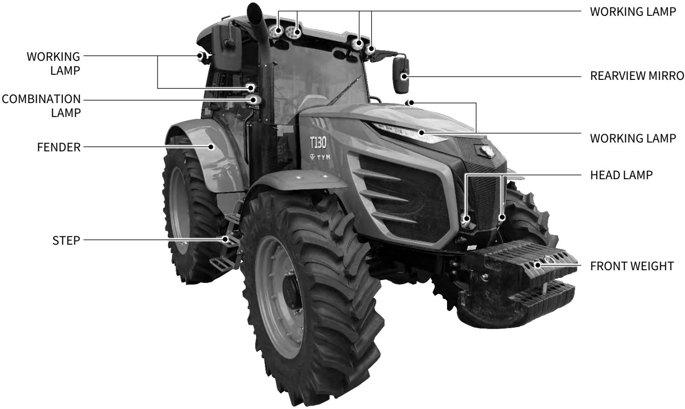

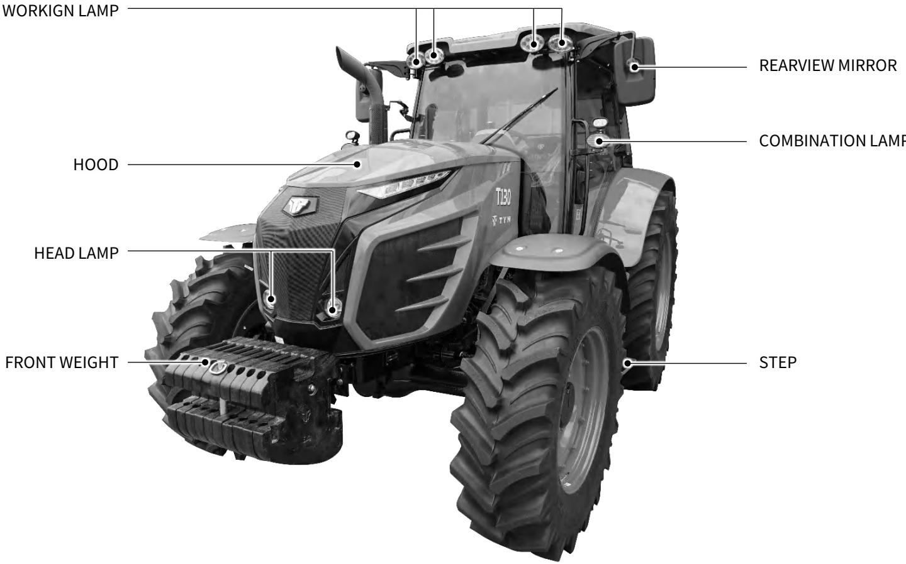

## ▶ BACK SIDE OF THE TRACTOR

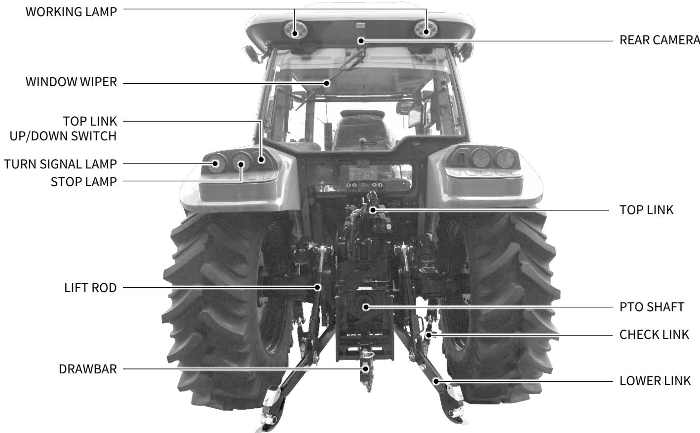

## 2. TRACTOR IDENTIFICATION

## ▶ SERIAL NUMBER OF ENGINE & MACHINE

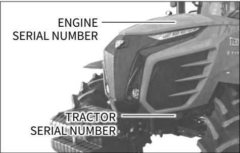  
The engine and tractor number are stamped as shown in the drawing above.

## ▶ WARRANTY OF THE PRODUCT

The manufacturer warrants this product and full details of the warranty are provided on a separate warranty schedule.

## ▶ SERVICE & PARTS

## • SERVICE

Service is available from any TYM dealer in the country.

## • PARTS

To obtain spare parts please contact your nearest dealer and give him the details listed below.

• Tractor model

• Tractor serial number

• Tractor engine number

• Part number and description

• Quantity required

## 3. ABOUT THIS MANUAL

This manual has been prepared to assist you in following/adopting the correct procedure for running-in operation and maintenance of your new TYM CO., LTD tractor.

Your tractor has been designed and built to give maximum performance, with good fuel economy and ease of operation under a wide variety of operating conditions.

Prior to delivery, the tractor was carefully inspected, both at the factory and by your TYM Dealer/Distributor, to ensure that it reaches you in optimum conditions.

To maintain this condition and ensure trouble free performance, it is important that the routine services, as specified in this manual, are carried out at the recommended intervals.

Read this manual carefully and keep it in a convenient place for future reference.

If at any time you require advice concerning your tractor, do not hesitate to contact your authorized TYM dealer / distributor.

He has trained personnel, genuine parts and necessary equipment to undertake all your service requirements.

Manufacturer’s policy is one of continuous improvement, and the right to change prices, specifications or equipment at any time without notice is reserved.

All data given in this book is subject to production variations.

Dimensions & weight are approximate only and the illustrations do not necessarily show tractors in standard condition.

For exact information about any particular tractor, please consult your TYM dealer / distributor.

## 4. INTRODUCTION & DESCRIPTION

The word, ’tractor’ has been derived from ‘traction’ which means pulling. A tractor is required to pull or haul an equipment, implement or trolley which are coupled to the tractor body through suitable linkage.

A tractor can also be used as a prime mover as it has a power outlet source which is also called Power Take or PTO shaft.

In this book the operating, maintenance and storage instructions for all models of TYM diesel tractors has been complied. This material has been prepared in detail to help you in the better understanding of maintenance and efficient operation of the machine.

If you need any information not given in this manual, or require the services of a trained mechanic, please get in touch with the TYM dealer / distributor in your locality.

Dealer / distributors are kept informed of the latest methods of servicing tractors.

They stock genuine spare parts and are backed by the company’s full support.

Through this manual, the use of the terms LEFT, RIGHT, FRONT and REAR must be understood, to avoid any confusion when following the introductions.

The LEFT and RIGHT means left and right sides of the tractor when facing forward in the driver’s seat, reference to the FRONT indicates the radiator end of the tractor, while the REAR, indicates the drawbar end.

When spare parts are required, always specify the tractor and engine serial number when ordering these parts. This will facilitate faster delivery and help ensure that the correct parts for your particular tractor is received.

The tractor serial number is punched on a plate attached to the left hand side of the engine body.

For easy reference, we suggest you to write the number in the space provided in the owner’s personal data.

RIGHT TURN (CLOCKWISE)

LEFT TURN (COUNTER-CLOCKWISE)

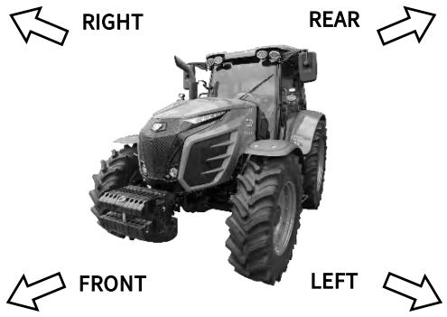

## ▶ DESCRIPTION

## • GENERAL CONSTRUCTION

The transmission case, clutch, clutch housing, engine and front axle support are bolted together to form a rigid unit.

## • FRONT AXLE & WHEEL

The 4WD front axle is a center-pivot, reverse elliot type.

The front wheel drive mechanism is incorporated as a part of the axle. The front wheel drive power is taken off the rear transmission and transmitted to the differential in the front axle where the power is divided into right and left and to the respective final cases.

In the final cases, the transmitted   
revolution is reduced by the level gears to drive the front wheel.   
The 4WD mechanism with level gears provides wider steering and greater durability.

## • ENGINE

The tractors are fitted with fuel efficient turbo charged engines with 4 cylinders designed by DEUTZ engine company.

## • CLUTCH & TRANSMISSION

A multi-plate wet clutch pack is used for each direction (forward and reverse). Tractor with IPTO (independent power take off) are fitted with hydraulic clutch assy.

The transmission gear box has 36 forward & reverse speeds with main shift, sub shift and creep shift levers. Presently TYM tractors are fitted with partial synchro mesh type gears.

## • BRAKES

TYM tractors are provided with hydraulically operated wet disc brakes.

Use parking brake lever in case of parking the tractor.

## • REAR AXLE & WHEELS

This is mounted on ball bearings and is enclosed in removable housing which are bolted to the transmission case. The rim & disc fitted with rear tires are bolted to the outer flange of rear axle.

• HYDRAULIC SYSTEM & LINKAGES TYM tractors are fitted with live independent, very touch of hydraulic system.

Three point linkages can be used for category 2 type of implements.

## • STEERING

It consists of hydrostatic power steering system, which has a hydraulic cylinder and tandem type hydraulic pump.

## • ELECTRICAL SYSTEM

A 12 volt lead acid propylene battery is used to activate the engine through the starter motor and the electrical system comprising horn, head lamp. Side indicator lamps, plough lamp, brake light, gauge lamp, hazard lamp. Generator or alternator, fuse box also from part of the electrical system.

## WARNING

When operating the tractor at high speed, do not attempt to make sharp turns by using the brakes. This may result in overturning of the tractor causing serious injury or death.

We at TYM and your TYM dealer / distributor want you to be completely satisfied with your investment.

Normally any problems with your   
equipment will be handled by your dealer / distributor’s service   
departments, however,   
misunderstanding can occur.   
If you feel that your problem has not been handled to your satisfaction, we suggest the following. Contact the owner or general manager of the dealership, explain the problem, and request assistance.   
When additional assistance is needed, your dealer / distributor has direct   
access to your office.

If you cannot obtain satisfaction by doing this, contact the TYM office and provide us with;

• Your name, address and telephone number

• Model and tractor serial number

• Dealer / distributor name & address

• Machine purchase date and hours used

• Nature of problem

Before contacting TYM office, be aware that your problem will likely to be resolved in the dealership using the dealer’s / distributor’s facilities, equipment and personnel. So it is important that your initial contact be with the dealer / distributor.

## 6. ROPS (ROLL OVER PROTECTIVE STRUCTURE)

## ▶ ROPS

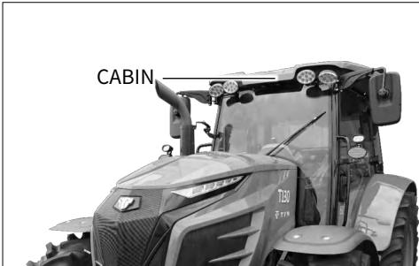

TYM tractors are equipped with a frame for the protection of operators. In the case of cab tractors the frame is incorporated in the cab structure. The objective of the frame or cab structure is to protect the operator in the event of a roll over and they are designed to support the entire weight of the tractor in that event.

Each TYM ROPS frame or cab structure is designed and has been tested to meet industry and or government standards. Included in these tests were all mounting bases and bolts or other fasteners.

On some models the ROPS frame has a fold down feature, which can be used to enter low buildings etc.

Take care when lowering the upper section of the ROPS frame and take extreme care while driving the tractor with the ROPS frame lowered.

Do not wear the seat belt with the ROPS lowered and please remember that the fold down facility is for special circumstances only and must not be lowered for general use.

## DANGER

For ROPS frames to be effective and protect the operator, the seat belt provided must be worn in order to keep operators within the ROPS protected area in the event of a roll over. Failure to use the seat belt can still cause serious injury or death.

## ▶ USE OF TRACTOR WITH ROPS LOWERED CAN CAUSE FATAL INJURIES

As the ROPS frame or cab together with the seat belt was designed to meet certain standards, they must be maintained in good order and condition. To achieve this objective, both the structure and the seat belt should be inspected on a regular basis. (Every time the tractor is serviced)

In the event that the seat belt is damaged or frayed, it should be replaced and in the event that the ROPS frame or any part of the mounting structure is damaged or cracked, the faulty component must be replaced with a new unit.

Such a unit must meet all of the test criteria of the original unit. Fitment of an inferior item or items affects the certification of the entire ROPS structure and the effectiveness of the structure in the event of an accident. Drilling or welding of the ROPS is forbidden.

## ▶ DAMAGE OF ROPS

If the tractor has rolled over or the ROPS has damaged (such as striking an overhead object during transport), it must be replaced to provide the original protection.

After an accident, check for damages to

• ROPS

• SEAT

• SEAT BELT & SEAT MOUNTINGS

Before you operate a tractor, replace all damaged parts.

## WARNING

 Do not weld, drill or straighten the ROPS.

 Always wear your seat belt if the tractor is equipped with ROPS.

## WARNING

If the ROPS is removed or replaced, make certain that the proper hardware is used to replace the ROPS and the recommended torque values are applied to the attaching bolts.

## WARNING

Never attach chains, ropes to the ROPS for pulling purposes.   
This will cause the tractor to tip   
backwards.   
Always pull from the tractor drawbar.

Be careful when driving through door opening or under low overhead objects. Make sure there is sufficient overhead clearance for the ROPS fatal injuries.

## ▶ CABIN TYPE

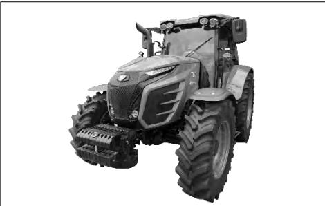

## 7. SEAT ADJUSTMENT

## ▶ SEAT SLIDING

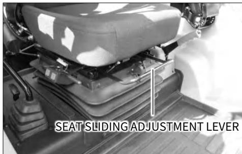

## Before operating a tractor it is

important to adjust the seat to the most comfortable position & check whether it is properly locked in its position.

## IMPORTANT

Do not use solvents to clean the seat. Use warm water with a little detergent added.

## WARNING

Do not put a hand between the seat and the slides when adjusting the seat position.

You can get injured unexpectedly.

To select seat position, move adjusting lever and slide seat closer to or away from dash panel and controls.

## DANGER

Check whether the seat properly locked in its position before driving the tractor.

 Always use the seat belt when the ROPS is installed.

Do not use the seat belt if a foldable ROPS is down or there is no ROPS. Check the seat belt regularly and replace if frayed or damaged.

## ▶ SEAT BACK ANGEL, CUSHION STRENGTH ADJUSTMENT

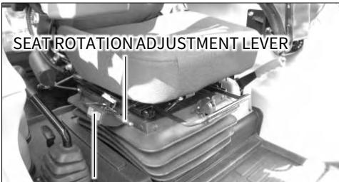

## SEAT HEIGHT ADJUSTMENT SWITCHES

## • SEAT HEIGHT ADJUSTMENT

Use seat height adjustment switches to up or down a height of the seat.

## • SEAT ROTATION ADJUSTMENT

Seat can be rotated using seat rotating adjustment lever.

Set the best position of the seat before the operation of the tractor.

## B. SAFETY PRECAUTIONS

1. SAFETY INSTRUCTIONS · · · · · · · · · · · · · · · · · · · B – 2   
2. SAFE OPERATION OF TRACTOR · · · · · · · · · · B – 15   
3. DOs & DON’Ts · · · · · · · · · · · · · · · · · · B – 22   
4. SAFETY DECALS · · · · · · · · · · · · · · · · B – 24   
5. UNIVERSAL SYMBOLS · · · · · · · · · · · · · · · · · · · · B – 29

## SAFETY PRECAUTIONS

## 1. SAFETY INSTRUCTIONS

## ▶ ENSURE SAFETY INFORMATION

  
This symbol means

‘Attention! Your safety is involved.

The message that follows the symbol contains important information about safety.

Carefully read the message.

## ▶ SIGNAL SIGNS

## The signal signs

‘DANGER, WARNING or CAUTION’

are used with safety alert symbol.

DANGER identifies the most serious   
hazards.   
Safety symbols with signal signs   
‘DANGER or WARNING’ are typically near specific hazards.   
General precautions are listed on   
‘CAUTION’ safety signs.

## ▶ READ SAFETY INSTRUCTION

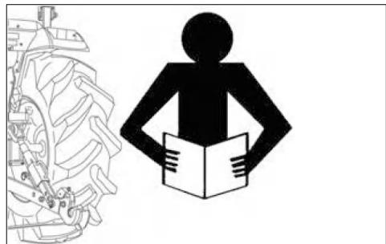

Carefully read all safety instructions given in this manual for your safety. Tempering with any of the safety devices can cause serious injuries or death.

Keep all safety signs in good condition. Replace missing or damaged safety signs.

Keep your tractor in proper condition and do not allow any unauthorized modifications to be carried out on the tractor, which may impair the function / safety and affect tractor life.

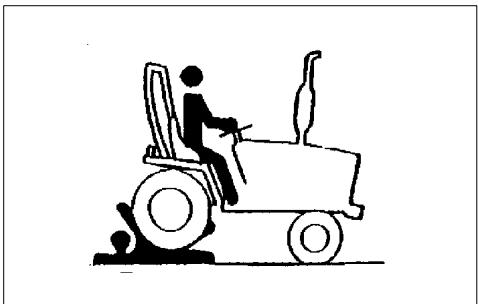

Keep children and others away from the tractor while operating.

Before you reverse

• Look behind tractor for children.

• Do not let children to ride on tractor or any implement.

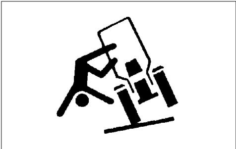

The Roll Over Protective Structure(ROPS) has been certified to industry and / or government standard.

Any damage or alternation to the ROPS, mounting hardware or seat belt voids the certification and will reduce or eliminate protection for the operator in the event of a roll-over.

The ROPS, mounting hardware and seat belt should be checked after the first 100 hours of use and every 500 hours thereafter for any evidence of damage, wear or cracks.

In the event of damage or alternation, the ROPS must be replaced prior to further operation of the tractor.

The seat belt must be worn during machine operation when the machine is equipped with a certified ROPS.

Failure to do so will reduce or eliminate protection for the operator in the event of a roll-over.

## SAFETY PRECAUTIONS

## ▶ PRECAUTION TO AVOID TIPPING

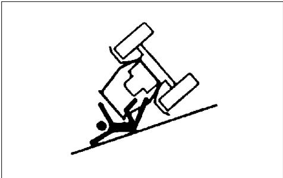

Do not drive where the tractor could slip or tip.

Stay alert for holes and rocks in the terrain and other hidden hazards.

Slow down before you make a sharp turn.

Driving forward out of a ditch or mired condition could cause tractor to tip over backward.

Back out of these situations if possible.

## ▶ PARK TRACTOR SAFELY

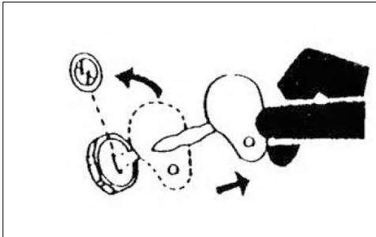

Before working on the tractor:

• Lower all equipment to the ground.

• Stop the engine and keep the smart key safely.

## ▶ KEEP RIDERS OFF TRACTOR

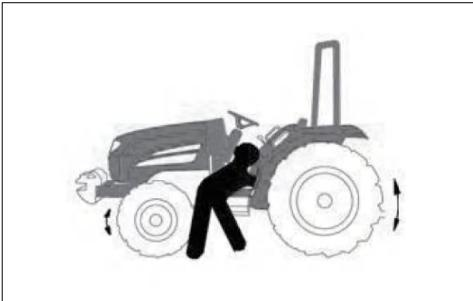  
Do not allow riders on the tractor.

Riders on tractor are subject to injury such as being stuck by foreign objects and being thrown off of the tractor.

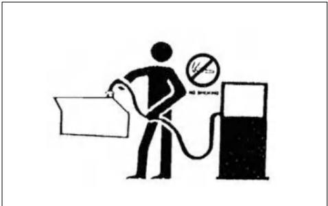

Handle fuel with care.   
It is highly flammable.

Do not refuel the tractor while smoking or near open flame or sparks.

Always stop engine before refueling tractor.

Always keep your tractor clean of accumulated grease and debris. Always clean up spilled fuel.

Entanglement in rotating shaft can cause serious injury or death.

Keep PTO shield in place at all the time.

Wear fitting clothing.

Stop the engine and be sure PTO drive is stopped before making adjustments, connections or cleaning out of PTO driven equipment.

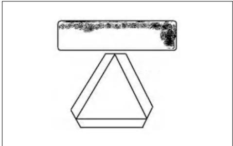

Use of hazard warning lights and turn signals are recommended when towing equipment on public roads unless prohibited by state or local regulations.

Use slow moving vehicle(SMV) sign when driving on public road during both day& night time unless prohibited by law.

## SAFETY PRECAUTIONS

## ▶ PRACTICE SAFE MAINTENANCE

Understand service procedure before doing work.

• Keep the surrounding area of the tractor clean and dry.

• Do not attempt to service tractor when it is in motion.

• Keep body and equipment to the ground.

• Stop the engine.

• Remove the key.

• Allow tractor to cool before any work repair is caused on it.

• Securely support any tractor elements that must be raised for service work.

• Keep all parts in good condition and properly installed.

• Replace worn or broken parts.

• Replace damaged / missing decals.

• Remove any build-up of grease or oil from the tractor.

• Disconnect battery ground cable ⊖ before making adjustments on electrical systems or welding on tractor.

## ▶ AVOID HIGH PRESSURE FLUIDS

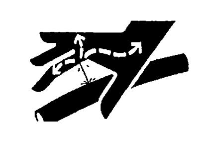

Escaping fluid under high pressure can penetrate the skin causing serious injury. Keep hands and body away from pin holes and nozzle which eject fluids under high pressure.

If any fluid is injected into the skin, consult your doctor immediately.

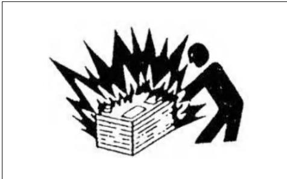

Keep sparks, lighted matches and open flame away from the top of battery. Battery gas can explode.

Never check battery charge by placing a metal object across the poles.

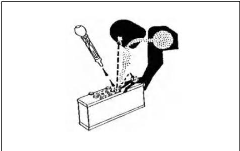

Sulfuric acid in battery electrolyte is poisonous.

It is strong enough to burn skin, cause holes in clothing and cause blindness if found entry into eyes.

For adequate safety always:

• Fill batteries in a well-ventilated area.

• Wear eye protection and acid proof hand gloves.

• Avoid breathing direct fumes when electrolyte is added.

• Do not add water to electrolyte as it may splash off causing severe burns.

2. Get medical attention immediately.

## SAFETY PRECAUTIONS

## ▶ BATTERY DISCONNECTION

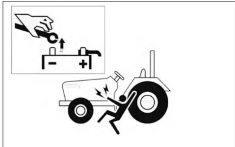

When working with your tractor electrical components, you must first disconnect the battery cables.

To ensure that there are no accidents from sparks, you must first disconnect the negative battery cable.

## ▶ SERVICE TRACTOR SAFELY

Do not wear a necktie, scarf or loose clothing when you work near moving parts.   
If these items were to get caught, severe injury could result.

Remove rings and other jewelry to prevent electrical shorts and entanglement in moving parts.

## ▶ WORK IN VENTILATED AREA

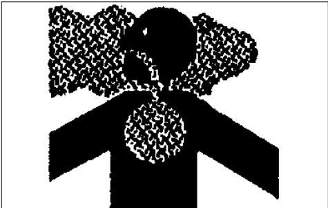

Do not start the tractor in an enclosed building unless the doors & windows are open for proper ventilation as tractor fumes can cause sickness or death.

If it is necessary to run an engine in an enclosed area remove the exhaust fumes by connecting exhaust pipe extension.

Engine start with transmission engaged can cause tractor to runaway resulting serious injury to the people standing nearby the tractor.

For additional safety keep the pull to stop knob (fuel shut off control) in fully pulled out position.

Transmission in neutral position, foot brake engaged and PTO lever in disengaged position while attending to Safety Starter Switch or any other work on tractor.

Safety Starter Switch for starting is provided on transmission main or sub shift lever and in PTO shift lever.

The tractor can be started only if main or sub shift lever is in neutral position.

## CAUTION

Safety Starter Switch is to be replaced after every 2,000 hours/4 years, whichever is earlier.

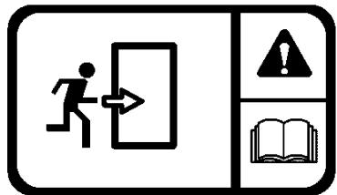

If exit from the cab side doors is blocked (following an accident or vehicle overturn) the alternative safety exits are indicated by decals.

The possible safety exits are:

• Rear window hatch (All tractors)

• Front window (for versions with openable front window).

## SAFETY PRECAUTIONS

## ▶ SAFETY PRECAUTIONS WHEN USING LOADER

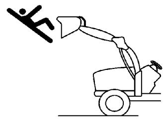

Never let anyone get in the loader and use the loader as a workbench. Otherwise, it may lead to a fatal injury or even death.

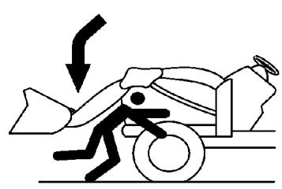

Do not stand under the lifted loader or get close to it.   
Also, lower the loader arm onto the ground before leaving the tractor.   
Otherwise, it may lead to a fatal injury or even death. When attaching or detaching the loader, fix all parts which are connected to the bucket and boom.   
The bucket or boom can be accidentally dropped down, leading to an injury or even death.

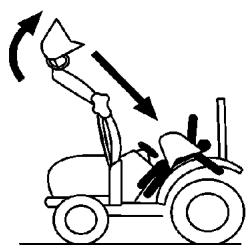

## Be careful of objects falling from loader.

## IMPORTANT

ROPS (Roll Over Protective Structure), sun canopy or cabin are not a FOPS (Falling Object Protective Structure). It never can protect the riders against falling objects.

Avoid driving the vehicle into a dangerous area such as falling rocks zone.

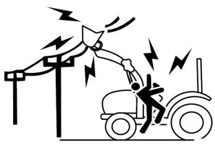

Do not allow loader arms or attachment to contact electrical power lines. Electrocution will cause serious injury or death.

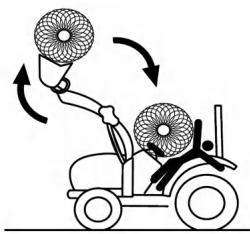

Never carry a big object with the loader unless a proper implement is attached.

Keep a carried object low during driving.

Otherwise, it may lead to an injury or even death.

## SAFETY PRECAUTIONS

## ▶ TOWING SAFELY

Maintain a suitable speed taking into account the weight of the trailed load and the gradient, remembering that braking distances will be greater than with just the tractor.

Trailed loads with or without brakes that are too heavy for the tractor or that towed at too high speed may cause the operator to loose of control of the tractor.

Always take into consideration the total weight of the implements and their loads.

## CAUTION

Before you leave the driving seat when a trailers is hitched to the tractor, remember to put all the controls in neutral, apply the parking brake, switch off the engine, engage first gear (if the tractor has a mechanical transmission) and remove the key from the starter switch.

If the tractor is not parked on level ground, always place chocks under the wheels of both the tractor and the trailer.

## ▶ TRANSPORT TRACTOR BY TRUCK

Always secure the tractor to the loader bed with chains.

Before transporting the tractor on a low loader or on a railway wagon, make sure that the engine hood, doors, openable roof (if present) and windows are all closed and securely fastened.

Never tow the tractor at speeds in excess of 10km/h.

An operator must stay in the operator position to steer and brake the tractor.

The term FOPS refers to structure installed on the tractor intended to reduce the risk to the operator of injury from falling objects during normal use of the vehicle.

## IMPORTANT

 This tractor is not equipped with a FOPS.

 The energy level of drop test is 1365J.

The term OPS refers to a protective structure installed on a tractor in order to minimize risk of operator injury caused by objects penetrating into the operator position area.

## DANGER

This tractor is not equipped with an OPS. If work must be performed in areas subject to the risk of the penetration of objects into the operator position, consult your dealer before starting work so that the tractor can be equipped with an appropriate protective structure.

European standard EN 15695-1 is applicable to the cabs of agricultural or forestry tractors and self-propelled sprayers.

The purpose of the standard is to limit the exposure of the operator (driver) to hazardous substances when applying plant protection products and liquid fertilizers.

In accordance with the stipulations of EN 15695-1 regarding cab classification, measurement of the internal positive pressure differential must be carried out in conformance with ISO 14269-5:

• The engine operating at nominal speed;

• The maximum quantity of air drawn from outside the cab (recirculation closed);

• Fan set to maximum speed.

The following terms and definitions are applied:

Hazardous substances:   
substances such as dust, vapours and aerosols, with the exception of fumigants which can be dispersed during the application of plant   
protection products and liquid   
fertilizers, which may have a harmful effect on the operator.

Dust general term identifying solid air-borne particles, finely divided and accumulated.

## • Aerosol:

suspension of solid, liquid or solid and liquid particulate in a gaseous medium with a negligible fall rate (generally less than 0.25 ms-1)

## • Vapour:

gaseous phase of a substance whose liquid or solid state is stable at 20℃ and 1 bar (absolute).

This cab, even when closed, does not protect against the inhalation of hazardous substances.

If the manufacturer's instructions for using these substances recommend personal protective equipment, wear the equipment even in the cab.

Cabs are classified as follows:

• Category 1: the cab does not provide protection against hazardous substances.

• Category 2: the cab provides protection exclusively from dust.

• Category 3: the cab provides protection from dust and aerosol.

• Category 4: the cab provides protection from dust, aerosol and chemical vapours.

The classification category, as stipulated by ISO 14269-5, of the cab installed on this range of tractors is given below:

• the engine operating at nominal speed.

• the maximum quantity of air drawn from outside the cab (recirculation closed) with fan at maximum speed.

Table 1 – Technical data
<table><tr><td>ROPS / CABIN</td><td>CATEGORY</td></tr><tr><td>Hazardous substances</td><td></td></tr><tr><td>protection category</td><td>1</td></tr></table>

## DANGER

Use all the personal protective equipment suitable for the tasks in hand and relative substances, in compliance with the requirements of statutory legislation in your country.

The manufacturer of your tractor has made every effort to make it as safe as is humanly possible.

Beyond this point it is the responsibility of the operator to avoid accidents and we ask that you read and implement our suggestions for your safety.

Ensure that only trained and competent operators use this tractor and ensure that they are fully conversant with the machine and aware of all its control and safety features.

Operators should not operate the tractor or associated machinery while tired or untrained.

To avoid accidents please ensure that the operator wears clothing which will not get entangled in the moving parts of the tractor or machine and protect him or her from the elements.

When spraying or using chemicals, please ensure that clothing and protective equipment is worn which prevents respiratory or skin problems.

For full details consult the manufacturer of the chemicals.

To avoid lengthy exposure to noise ensure that ear protection is worn.

If adjustment to the tractor or machinery need to be made ensure the tractor or machine are turned off beforehand.

Use of certified Roll Over Protection Structure (ROPS) is a must while operating a tractor.

Use of seat belt is a must while operating a tractor.

In summary, ensure at all times that the safety of the operator and any other worker is paramount.

Ensure no one is between the tractor and a towed vehicle (trailer or implement).

## SAFETY PRECAUTIONS

## ▶ SAFETY TIPS DURING MAINTENANCE

1. At least on a daily basis check all oil levels. Water level in the radiator and electrolyte level in the battery and perform services according to the service schedule.

2. Ensure tire pressure are even and the correct pressure for the job being done is maintained.

3. Check to ensure that the all controls and preventative mechanisms of the tractor and implement work correctly and effectively.

4. Ensure that an adequate set of the correct tools is available for maintenance and minor repairs.

5. Ensure that all service work and repairs are carried out on a flat area with a concrete or similar floor. Do not carry out service work on a tractor until it is switched off, and

the parking brake applied and   
wheels choked.   
Where a tractor is started in a   
confined area, ensure that the area is well ventilated as exhaust gases are very harmful, and can cause death.

6. Do not work under raised implements.

7. When changing wheels or tires ensure that a suitable wheel stand is placed under the axle prior to removing the wheel and the wheels are chocked.

8. Where guards or shields need to be removed to perform a service or repair, ensure that the guard or shield is correctly reinstalled before starting the tractor.

9. Never refuel near a naked flame or with an overheated engine.

Ensure to turn off the engine before refueling.

10. The cooling system operates under pressure, take care when removing the radiator cap on a hot engine to prevent being scalded by steam or hot water. Do not add water in the radiator when the engine is hot. Add water to the radiator only after the engine cools down completely.

11. To prevent fires keep the tractor including the engine clean and free from inflammable material and well away from fuels and other inflammable material.

1. Ensure that all mounting and removal of implements is done on safe flat ground. Ensure no one is between the tractor and implement and do not get under the implement to avoid accidental injuries.

2. After mounting the implement, ensure that all sway chains are correctly adjusted and, where PTO shafts are used that the shaft is fitted and secured correctly.

3. Where heavy implements are used, ensure that the combination is well balanced or use proper ballast to achieve balance.

4. Before leaving the tractor at any time, lower the implement, stop the PTO shaft where applicable, set the parking brake and switch off the engine.

5. While operating the implements with the PTO keep all bystanders away from any moving parts and do not attempt to make adjustments while the machine is running.

6. Only the driver should ride on the tractor with the ROPS frame fitted and with the seat belt properly fastened.

7. Where young children are present, particular care should be taken and the tractor should not be moved until the whereabouts of all children is known.

8. Only trained operators should operate the tractor and so taking care to ensure that other workers are not injured. In particular they should take care during dusty operations, which will reduce visibility substantially.

9. Never start the tractor unless the transmission is out of gear, the operator is in the seat and all round safety has been checked.

10. Only operate the tractor seated in the driver's seat and never turn or brake suddenly at high speed as this can cause a roll-over and serious injury or death.

11. When traveling on a public road ensure that the tractor and driver both meet all laws relating to safety and licensing. When traveling with wide implements use red flags on the extremities and observe all legal including escort requirements.

12. When operating under adverse conditions, hilly terrain or on bad ground adjust the speed of the tractor to suit the conditions, safety

## ▶ THE FOLLOWING PRECAUTIONS ARE SUGGESTED TO HELP PREVENT ACCIDENTS protection. protection

comes first.

Never drive down-hill at high speed or with the transmission in neutral. Use of the braking capacity of the engine as well as the service brakes. Do not try to change gear going up or down a steep slope, select the correct gear before starting.

13. Take care when traveling uphill with a heavy implement to ensure that it does not overbalance and tip up the front end.

14. Never remove or modify the seat belt.

15. Never remove, modify or repair the ROPS frame.

Please remember that a little bit of extra care can prevent serious injury or death and avoid damage to your tractor.

A careful operator is the best operator. Most accidents can be avoided by observing certain precautions. Read and take the following precautions before operating the tractor to prevent accidents. Tractor should be operated only by those who are responsible and properly trained to do so.

## <THE TRACTOR>

1. Read the operator’s manual carefully before using the tractor. Lack of operating knowledge can lead to accidents.

2. Use an approved rollover bar and seat belt for safe operation. Overturning of a tractor without a rollover bar can result in death or injury.

3. Do not remove ROPS (Roll Over Protective Structure). Always use the seat belt.

4. Fiberglass canopy does not give any

5. To prevent falls, keep steps and platform clear of mud and oil.

6. Do not permit anyone but the operator to ride on the tractor. There is no safety place for extra riders.

7. Replace all missing, illegible or damaged safety signs.

8. Keep safety signs clean of dirt and grease.

## <SERVICING THE TRACTOR>

1. keep the tractor in good operating condition for your safety. An improperly maintained tractor can be hazardous.

2. Stop the engine before performing any service on the tractor.

3. The cooling system operates under pressure, which is controlled by the radiator cap. It is dangerous to remove the cap while the system is hot.

4. Do not smoke while the refueling the tractor. Keep away any type of open flame.

5. The fuel in the injection system is under high pressure and can penetrate the skin. Unqualified persons should not remove or attempt to adjust a pump, injector, nozzle or any part of the fuel injection system. Failure to follow these instructions can result in serious injury.

6. Keep open flame away from battery or cold weather starting aids to prevent fire or explosions.

7. Do not modify or alter or permit anyone else to modify or alter this tractor or any of its components or any tractor functions.

1. Before starting the tractor apply the parking brake, place the PTO (Power Take Off) lever in the “OFF” position, the position control levers in the downward position, the hydraulic control levers in the neutral position(If fitted) and the transmission in neutral.

2. Do not start the engine or controls while standing beside the tractor. Always sit on the tractor seat when the engine or operating controls.

## 3. Safety start:

In order to prevent the accidental starting of the tractor, a safety switch has been provided. The starting system of the tractor is connected through this switch. On some models shuttle lever and PTO button should also be in neutral position for completing the starting circuit. Do not bypass the safety switch.

Consult your TYM tractor

4. Avoid accidental contact with the gear shifter lever while the engine is running. Unexpected tractor movement can result from such contact.

5. Do not get off or climb the tractor while it is in motion.

6. Shut off the engine, remove the key and apply the parking brake before getting off the tractor.

7. Do not operate the tractor in an enclosed building without adequate ventilation. Exhaust fumes can cause death.

8. Do not park the tractor on a steep slope.

9. If power steering or Engine seizes to operate, stop the tractor immediately.

10. Pull only from the swinging draw bar or the lower link drawbar in the down position. Use only a drawbar pin that locks in place.

Pulling from the tractor rear axle carriers or any point above the rear axle may cause the tractor’s front end to lift.

11. If the front end of the tractor tends to rise when heavy implements are attached to the three point linkage, install front end or front wheel weights.

Do not operate the tractor with a light front end.

12. Always use hydraulic position control lever when attaching equipment / implement and when transporting equipment. Be sure that the hydraulic couplers are properly mounted and will disconnect safely in case of accidental detachment of implement.

13. Do not leave equipment/implement in the raised position.

14. Use the flasher / turn signal lights and Slow Moving Vehicle (SMV) signs when driving on public roads during both day and night time, unless prohibited by law.

15. Dim tractor lights when meeting a vehicle at night. Be sure the lights are adjusted to prevent the blinding on the eyes of coming vehicle operator.

16. Emergency stopping instruction; If tractor fails to stop even after application of brakes. Pull the knob of fuel shut off control rod.

## <DRIVING THE TRACTOR>

1. Watch where you are going especially at row ends, on roads, around trees and low hanging obstacles.

2. To avoid upsets, drive the tractor with care and at speeds compatible with safety, especially when operating over rough ground, crossing ditches or slopes, and when turning at corners.

3. Lock the tractor brake pedals together when transporting on roads to provide proper wheel braking.

4. Keep the tractor in the same gear when going downhill as used when going uphill. Do not coast or free wheel down hills.

5. Any towed vehicle and/or trailer whose total weight exceeds that of the towing tractor, must be equipped with its own brakes for safe operation.

6. When the tractor is stuck or tires are frozen to the ground, back out to prevent upset.

7. Always check overhead clearance, especially when transporting the tractor.

1. When operating PTO driven equipment, shut off the engine and wait until the PTO stops before getting off the tractor and disconnecting the equipment.

2. Do not wear loose clothing when operating the power take-off or near rotating equipment.

3. When operating stationery PTO driven equipment, always apply the tractor parking brake and block the rear wheels from front and rear side.

4. To avoid injury, always move down flip part of PTO.

Do not clean, adjust or service PTO driven equipment when the tractor engine is running.

5. Make sure the PTO master shield is installed at all times and always replace the PTO shield cap when the PTO is not in use.

2. Under no circumstances should gasoline, alcohol or blended fuels be added to diesel fire or explosive hazard.

Such blends are more explosive than pure gasoline. In a closed container, such as a fuel tank. DO NOT USE THESE BLENDS.

3. Never remove the fuel cap or refuel the tractor with the engine running.

4. Do not smoke while refueling or when standing near fuel.

5. Maintain control of the fuel filler pipe when filling the tank.

6. Do not fill the fuel tank to capacity. Allow room for expansion.

7. Wipe up spilled fuel immediately.

8. Always tighten the fuel cap securely.

9. If the original fuel tank cap is lost, replace it with genuine cap. A none approved cap may not be safe.

12. Arrange fuel purchases so that winter grade fuel are not held over and used in the spring.

13. Use ultra-low sulfur fuel only.

## IMPORTANT

It is suggested that after repairs if any of the safety decals or signs are peeled or defaced, the same may be replaced immediately in interest of your safety.

## SAFETY PRECAUTIONS

## 3. DOs & DON’Ts

## ▶ DOs – FOR BETTER PERFORMANCE

DO - Ensure that safety shields are in place and in good condition.

DO - Read all operating instructions before commencing to operate tractor.

DO - Carry out all maintenance tasks without fail.

DO - Keep the air cleaner clean.

DO - Ensure that the correct grade of lubricating oils is used and that they are replenished and changed at the recommended intervals.

DO - Fit new sealing rings when the filter elements are changed.

DO - Watch the oil pressure gauge or warning light and investigate any abnormality immediately.

DO - Keep the radiator filled with clean water and in cold weather use antifreeze mixture. Drain the system only in an emergency and fill before starting the engine.

DO - Ensure that the transmission is in neutral before starting the engine.

DO - Keep all fuel in clean storage and use a filter when filling the tank.

DO - Attend to minor adjustments and repairs as soon as necessity is apparent.

DO - Allow the engine to cool before removing the radiator filler cap and adding water, remove the radiator cap slowly.

DO - Shift into low gear when driving down steeps hills.

DO - Latch the brake pedals together when driving on a highway.

DO - Keep draft control lever fully down when not in use.

DON’T - Start the tractor in an enclosed building unless the doors and windows are open for proper ventilation.

DON’T - Operate the tractor or engine while lubricating or cleaning.

DON’T - Allow the tractor to run out of diesel fuel otherwise it will be necessary to vent the system.

DON’T - Temper the fuel injection pump, If seal is broken the warranty becomes void.

DON’T - Allow the engine to run idle for a long period.

DON’T - Run the engine if it is not firing on all cylinders.

DON’T - Ride the brake. This will result in excessive wear of the brake lining.

DON’T - Use the independent brakes for making turns on the highway or at high speeds.

DON’T - Refuel the tractor with the engine running.

DON’T - Mount or dismount from the right side of the tractor.

DON’T - Temper the hydraulic control levers’ upper limit stops.

DON’T - Use draft control lever for lifting of implements.

DON’T - Start the engine with the PTO engaged.

DON’T - Use the throttle lever while driving on roads.

## SAFETY PRECAUTIONS

## 4. SAFETY DECALS

## ▶ GENERAL INFORMATION OF DECALS

▌ In order to work with the machine safely, safety decals should be placed on the machine.

▌ Make sure to read and follow the following directions.

## ▐ KEEP THE WARNING LABELS CLEAN AND NOT DAMAGED AT ALL TIMES.

If a decal on the machine is dirty, wash it with soapy water and wipe it off with a soft cloth.   
Never use solution such as thinner or acetone because these can erase characters or pictures.

## ▐ IF WASHED WITH HIGH PRESSURED WATER, A DECAL MAY BE PEELED OFF. Do not apply high pressured water directly onto decals.

## ▐ IF A SAFETY DECAL IS DAMAGED OR LOST, ORDER A NEW ONE IMMEDIATELY AND PLACE IT ON THE MACHINE.

When putting a new decal, wipe off the place to post the decal thoroughly and wait till it is dried.   
Then post the decal.

Each decal has a part number on the bottom.

## ▐ WHEN REPLACING A PART ATTACHED WITH A DECAL WITH A NEW PART, REPLACE THE DECAL AS WELL.

## ▶ DECALS ON CHASSIS

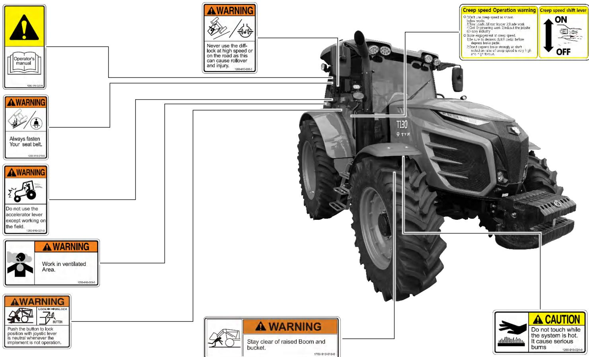

## Inner/Outer air Ventilation

● when louvers are opened cabin air will be recirculated

● For effective use, open the louvers when operating the heater or air conditioner and close the louvers when ventilating fresh air.1220-94-122-2

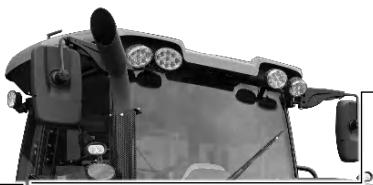

## Caution for operating turbocharged Engine

1. Do not increase engine RPM rapidly right after the ignition.

2. Do not turn off the engine when the engine is running on the high RPM, make sure the engine is idling for a sufficient time before turning off.

3. Idle the engine for 2\~3 minutes before running the tractor when the tractor has completely stopped or it hs engine oil or filter changed or it is in the freeze weather.

(Not following the instruction above, it may cause damage to the turbocharger.)

## Caution for operating DeSOx

1. When DeSOx lamp is on, DeSOx has to be done while the tractor is completely stopped(Natural Position)

2. Do not stop the engine while DesOx is in progress 3. Make sure enough idling time after the completion of DeSOx

4. Not following the instruction above, it may cause damage to the engine

(Please refer to the operator's manual for details)

## CAUTION

Always place the transmission in neutral and apph the parking brake while the tractor

is in standstill position.

Failure to do so can cause accidents and damages. 1871-910-031-0

## Caution for operating turbocharged Engine

1. Do not increase engine RPM rapidly right after the ignition.

2. Do not turn off the engine when the engine is running on the high RPM, make sure the engine is idling for a sufficient time before turning off.

3. Idle the engine for 2\~3 minutes before running the tractor when the tractor has completely stoppec or it hs engine oil or filter changed or it is in the freeze weather.

(Not following the instruction above, it may cause damage to the turbocharger.)

## Caution for operating DeSOx

1. When DeSOx lamp is on, DeSOx has to be done while the tractor is completely stopped(Natural Position)

2, Do not stop the engine while DeSOx is in progress 3. Make sure enough idling time after the completion of DeSOx.

4. Not following the instruction above, it may cause damage to the engine

(Please refer to the operator's manual for details)

## OPERATION

<table><tr><td></td><td>TO PROJECT YOUR ENGINE: 1. To activato the rogcncratior urctior manually (Ine eng ne has waining amd and regereralion amp is il uminaled. 2. For the egeneralion prccess. rofor to the Oporator s Manua.</td></tr><tr><td></td><td>1. Press this sw tch to stco auncrato rageneration onh 2. Do Not pross th&#x27;s switch frocuortly to provort from engine derate runring. For Turlher uelails. conault your Coerator s Marual or you local dealer.</td></tr></table>

## Adjust Shuttle Response with Black Rotary Knob

The middle knob position is recommended for most applications. To shuttle smoothly : Rotate the knob towards the tortoise To shuttle aggressively : Rotate the knob towards the hare. Repeat above until desired shuttle response is achieved

The three black buttons are for "dealer only" shuttle and inching pedal adjustment.

Contact vour dealer for additional adjustment

Do not remove radiator cap while engine is hot. Hot steam will injure you. 1200-010-015-0

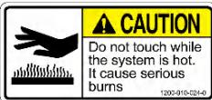

Always appiy the park brake when parking. Failure to do so can cause accidents and damages. 1200-010-002

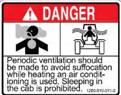

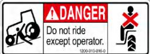

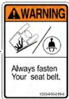

Do not refuel the tractor while smoking or near naked flame or sparks. always stop engine before refueling tractors. 12e1s0

## CAUTION

NO Diesel Only AdBlue

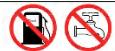

Do not fill any liquid olher than AdBlue(DEF). Filling of Diesel and othet materialslincluding water in exhaust system.

<table><tr><td rowspan=2 colspan=1></td><td rowspan=1 colspan=1>ADANGER</td></tr><tr><td rowspan=1 colspan=1>Getting caught in the PTO shaftmay lead to serious injury or death.1. Śtay away from the PTOshaft while it is rotating.2. Place a cap on the PTO whenit is not in use. Also, neverremove the PTO safety cover.1768-910-013-0</td></tr></table>

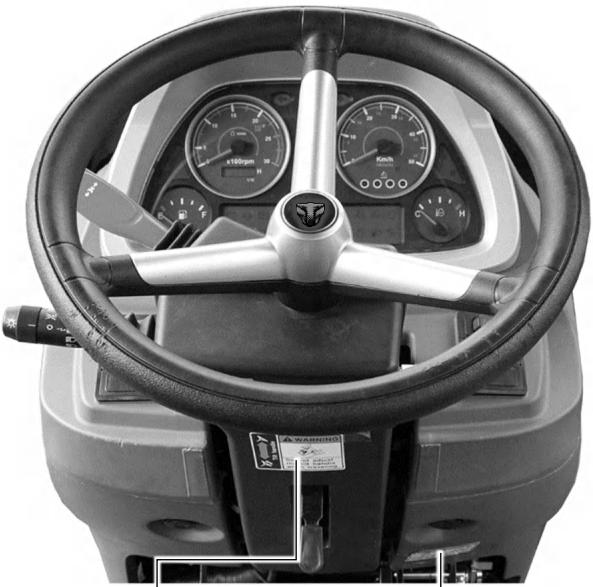

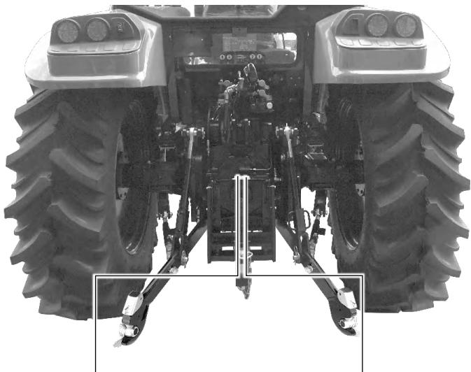

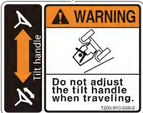

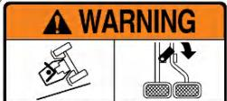

Brake pedals must always be locked'together when travelling on the highway. This will ensure uniform braking and provide maximum stopping ability sharp turns must only be made at slow speeds. 1200-910-007-0

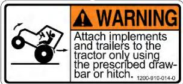

<table><tr><td rowspan=1 colspan=1>DESCRIPTION                     SYMBOL</td><td rowspan=1 colspan=1>DESCRIPTION                     SYMBOL</td><td rowspan=1 colspan=1>DESCRIPTION                     SYMBOL</td></tr><tr><td rowspan=1 colspan=1>ENGINE SPEED (REV/MIN X 100)         </td><td rowspan=1 colspan=1>PRESSURED, OPEN SLOWLY            </td><td rowspan=1 colspan=1>CORROSIVE SUBSTANCE                </td></tr><tr><td rowspan=1 colspan=1>HOURES, RECORED                      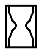</td><td rowspan=1 colspan=1>CONTINUOUSVARIABLE               </td><td rowspan=1 colspan=1>SLOW OR MINIMUM SETTING            </td></tr><tr><td rowspan=1 colspan=1>ENGINE COOLANT TEMPERATURE       </td><td rowspan=1 colspan=1>DANGER, WARNING, CAUTION          </td><td rowspan=1 colspan=1>FAST OR MAXIMUM SETTING            </td></tr><tr><td rowspan=1 colspan=1>FUEL LEVEL                              </td><td rowspan=1 colspan=1>HAZARD WARNING                      </td><td rowspan=1 colspan=1>TRANSMISSION OIL PRESSURE          </td></tr><tr><td rowspan=1 colspan=1>ENGINE STOP CONTROL                 </td><td rowspan=1 colspan=1>NEUTRAL                             N</td><td rowspan=1 colspan=1>TURN SIGNAL                        令</td></tr><tr><td rowspan=1 colspan=1>LIGHTS                                  </td><td rowspan=1 colspan=1>FAN                                    </td><td rowspan=1 colspan=1>TRANSMISSION OIL                   oTEMPERATURE</td></tr><tr><td rowspan=1 colspan=1>HORN                                   </td><td rowspan=1 colspan=1>POWER TAKE OFF ENGAGED            </td><td rowspan=1 colspan=1>PARKING BRAKE                      P)</td></tr><tr><td rowspan=1 colspan=1>ENGINE OIL PRESSURE                  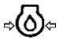</td><td rowspan=1 colspan=1>POWER TAKE OFF DISENGAGED         </td><td rowspan=1 colspan=1>WORKING LAMP                         </td></tr><tr><td rowspan=1 colspan=1>AIR FILTER CONTAMINATED             </td><td rowspan=1 colspan=1>RAISE LIFT ARM                         </td><td rowspan=1 colspan=1>DIFFERENTIAL LOCK                     </td></tr><tr><td rowspan=1 colspan=1>BATTERY CHARGE                       </td><td rowspan=1 colspan=1>LOWER LIFT ARM                       </td><td rowspan=1 colspan=1>REFER TO OPERATOR&#x27;S MANUAL         </td></tr></table>

MEMO   
…………………………………………………………………………………………………………   
……………………………………………………………………………………………………………   
……………………………………………………………………………………………………………   
……………………………………………………………………………………………………………   
……………………………………………………………………………………………………………   
……………………………………………………………………………………………………………   
……………………………………………………………………………………………………………   
……………………………………………………………………………………………………………   
……………………………………………………………………………………………………………

## C. TRACTOR INSTRUMENTS

1. SWITCHES · · · · · · · · · · · · · · · · · · · · · · · · · C – 2   
CLUSTER & GAUGES · · · · · · · · · · · · · · · · · · · · · · · C – 8   
3. CONTROL INSTRUMENTS · · · · · · · · · · · · · · · · · C – 19   
4. THREE POINT LINKAGE · · · · · · · · · · · · · · · · · · · C – 39   
5. CABIN · · · · · · · · · · · · · · · · · · · C – 44

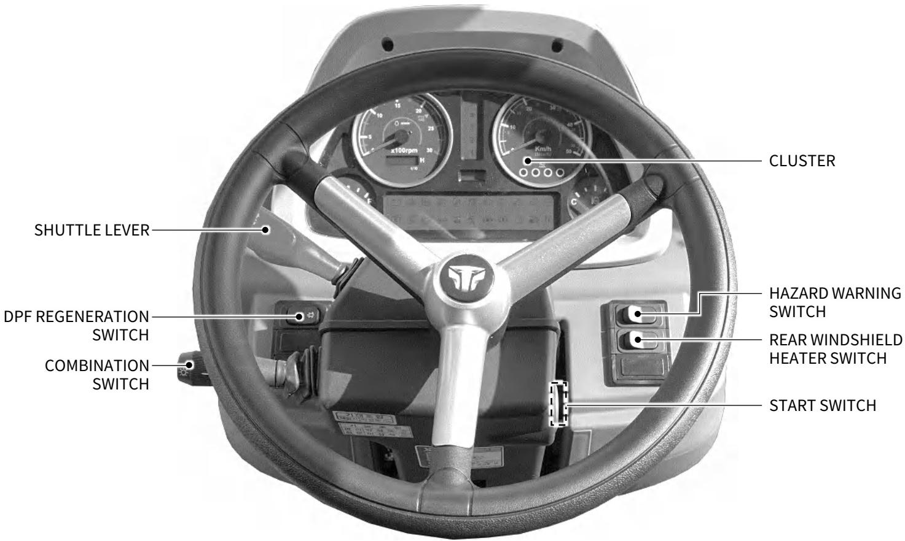

## ▶ START SWITCH

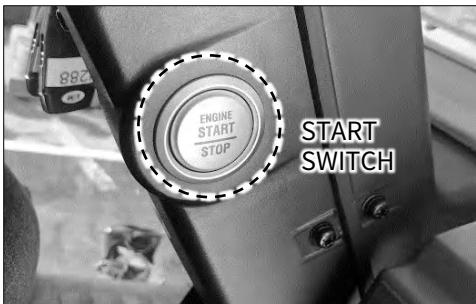

## • ON

Press the start switch once to turn the electric circuit on.

## • ENGINE START

Press the start switch once while the electric circuit is on.   
Following conditions should be set to start the engine.

1. PTO switch – OFF

2. Shuttle lever – Neutral

3. Clutch pedal – Depressed

## • ENGINE STOP

Press the start switch to shut the engine off while the engine is running.

## ▶ REMOTE KEY

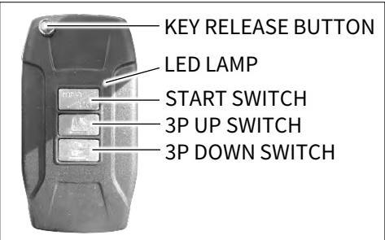

## • REMOTE ENGINE START

Press the start switch of the remote key more than 2 sec, then LED lamp blinks once and the engine will start

## • REMOTE ENGINE STOP

Press the start switch of the remote key more than 2 sec, then LED lamp blinks once and the engine will stop.

The parking brake should be applied to use remote engine stop function.

## IMPORTANT

The engine will stop when the start switch is pressed whether the remote key is near to the tractor or not.

 Maximum working distance of the remote key is around 32 \~ 65 feet. (10 \~ 20m)

 Press the button on top of the remote key to release the door key out.

The engine will stop if operator do not press the clutch pedal or change the shuttle lever with smart key within 10 minute right after the engine started with the remote key.

When the engine is not started with the cranking signals, release the clutch pedal once.

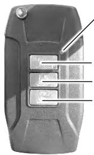  
LED LAMP  
START SWITCH 3P UP SWITCH 3P DOWN SWITCH

• REMOTE 3P UP / DOWN SWITCHES Three point linkage(3P) will be raised or lowered by pressing 3P UP / DOWN switches.

During the operation, LED lamp will glow.

Distance of raising or lowering 3P can be adjusted by the time of pressing the 3P UP / DOWN switches.

Be sure that the remote key should be close enough to the tractor within 32 \~ 65 feet.

Operation distance will vary depending on circumstance.

## ▶ DPF REGENERATION SWITCH

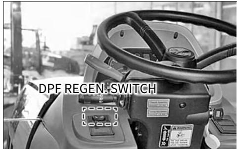

Perform following steps when DPF warning lamp is on.

1. Park the tractor on level surface with parking brake applied.

2. Idle the engine for 3 \~ 4 min.

3. Press DPF regeneration switch for 3 sec. to active DPF regeneration process.

DPF regeneration lamp will be on.

4. After the end of DPF regeneration process, DPF warning lamp goes off.

▶ HAZARD WARNING SWITCH  
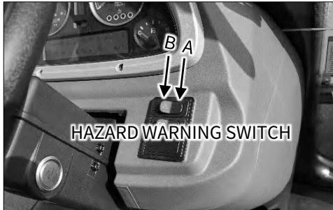

Press the hazard warning switch in emergency to warn other vehicles in order to prevent an accident. The hazard flasher is operated regardless of the position of the start switch.

Also, the turn signal lamp function is disabled while the hazard flasher is active.

• Position A: OFF

• Position B: The hazard flasher is activated and turn signal lamps on the cluster blink as well.

## IMPORTANT

 To prevent the battery running out, use it only when it is need.

## ▶ REAR WINDSHIELD HEATER SWITCH

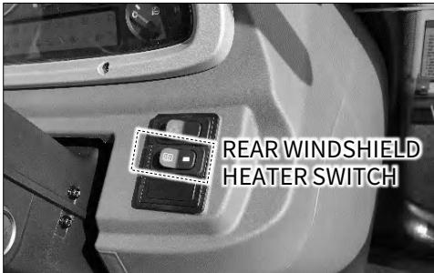

This switch is used to operate electric heating lines on rear windshield.

It will shut off automatically after 15 min.   
of working time.

Press the switch again to turn it off manually.

## ▶ SHUTTLE LEVER

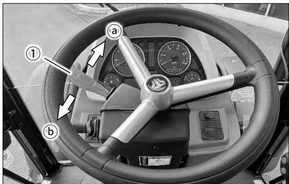

This lever is used to select the driving direction between forward and reverse directions.

• Set it in the neutral position unless driving.

With the lever pulled up slightly (Feeling is a slight spring tension), push it forward ⓐ to select forward driving, or pull it backward to ⓑ to select reverse driving.

## WARNING

Before starting the engine, set the shuttle lever in the neutral position and depress the clutch pedal fully to avoid an accident by abrupt starting off.

## IMPORTANT

 The shuttle lever consist of electric components, so forcible operation can damage the lever.

Follow the below to operate head lamp.

## ▶ COMBINATION SWITCH

This switch is to operate the head lamps, horn and turn signal lamps.

• Position lamp – Turn the dial ⓐ to the position ①.

• Horn –

Press the tip of the switch in the arrow direction.

• High beam –

Low beam –   
Pull the lever up with the high beam activated.

## WARNING

The high beam can obstruct the view of other drivers coming in the opposite direction on a road, leading to an unexpected accident.

Follow the below to operate turn signal lamp while the electric circuit is on.

• Right turn signal – Push the lever ① to the direction ⓐ.

• Left turn signal – Pull the lever ① in the direction ⓑ.

## CAUTION

This lever is not automatically returned to the neutral position.   
Therefore set it back to the neutral   
position after a turn.

## ▶ DPF REGENERATION PROCESS AND LAMPS

This lamp is on during DPF regeneration process.

## WARNING

Be careful with muffler and exhaust gas during DPF regeneration process since they are extremely hot.

## <1st stage DPF regeneration warning>

If particle material is accumulated on diesel particulate filter(DPF) at certain level, DPF regeneration warning lamp will be on.

DPF regeneration warning lamp will be off as soon as DPF regeneration process is done.

## <2nd stage DPF regeneration warning>

Operation of the tractor without DPF regeneration after the DPF regeneration lamp is on for a while, the engine torque will be reduced by 25%.

## WARNING

Perform DPF regeneration process when DPF warning lamp is on. The engine RPM may go down until DPF regeneration process is done.

## 2. CLUSTER & GAUGES

## ▶ FIGURE OF CLUSTER

  
(4) ENGINE WARNING LAMP (9) UREA LEVEL LAMPS (14) CHARGE WARNING LAMP (19) PRE-HEATING LAMP (24) DPF MALFUNCTION LAMP (29) 4WD LAMP PRESSURE WARNING LAMP LAMP

(1) TURN SIGNAL LAMPS   
(6) FUEL GAUGE   
(11) HOUR METER   
(16) PARKING BRAKE LAMP   
(21) DPF WARNING LAMP   
(26) ONE-SIDE BRAKE LAMP   
(31) ENGINE OIL PRESSRE WA

(2) MAIN SHIFT POSITION (7) SPEEDO METER (12) UREA WARNING LAMP (17) BACK-UP LAMP (22) DPF REGEN. LAMP (27) FUEL WARNING LAMP RNING LAMP TAMINATION WARNING LAMP

(5) ERROR DISPLAY  
(10) COOLANT TEMP. GAUGE  
(15) DIFFERENTIAL LOCK LAMP  
(20) HIGH-BEAM LAMP  
(25) APS LAMP  
(30) QUICK-TURN LAMP  
(35) PTO CRUISE LAMP

## ▶ TACHO METER

This indicates the engine RPM (Rotation Per Minute).

The green arrow indicates the engine speed at the standard 540 RPM speed of the PTO.

## IMPORTANT

 The engine can be damaged if increasing its speed too fast.

## ▶ HOUR METER

This indicates the total time of use.

• Black digits – Whole number for hours of use.

• Red digit – Decimal place for hours of use.

There are 6 digits for the hour meter.   
The last digit indicates one tenth hours.

ex.) The time of use illustrated above is 234 hours and 30 minutes.

## ▶ SPEEDO METER

  
This indicates the driving speed of the tractor.

## ▶ ERROR DISPLAY

  
This indicates malfunction of the tractor.

When an error code is shown on the display, stop driving and perform repair or service accordingly.

▶ FUEL GAUGE  

This indicates the amount of fuel while the electric circuit is on.

• F: Full

• E: Empty

## IMPORTANT

Poor fuel quality can damage the engine. Make sure to use only the specified genuine diesel fuel.

 Use fuel for winter season in winter to enhance engine starting performance.

## ▶ COOLANT TEMPERATURE GAUGE

  
This indicates the temperature of coolant while the start switch is in the "ON" position.

• C: Cold

• H: Hot

If the needle is in the red "H“ zone during driving, the coolant is overheated.

In this case, stop driving and take any necessary action according to the troubleshooting instructions.

## ▶ TURN SIGNAL LAMP

  
These indicate the turn signal lamps operation with the combination switch. These lamps blink along with left/right turn signal lamps.

## ▶ MAIN SHIFT POSITION NUMBER

  
This shows position of main shift from 1 to 6.

The color of main shift position number changes to blue(L), yellow(M), red(H) and green(N) according to sub shift positions. (positions of L, M, H and N).

## IMPORTANT

Main shift position will change the position that the operator sets when sub shift position changed.

Please refer to the ‘TOUCH MONITOR section for more detail.

## ▶ APS(Auto Power Shift) LAMP, PRE-HEAT LAMP

  
APS LAMP

PRE-HEAT LAMP

• APS(Auto Power Shift) LAMP It comes on when APS is activated.

• PRE-HEAT LMAP   
It comes on when preheating is on progress.

## ▶ HIGH-BEAM LAMP, FUEL WARNING LAMP

  
HIGH-BEAM LAMP

  
FUEL WARNING LAMP

## ▶ ENGINE WARNING LAMP, CHARGE WARNING LAMP

  
ENGINE WARNING LAMP

  
CHARGE WARNING LAMP

## ▶ PARKING BRAKE LAMP, ONE-SIDE BRAKE LAMP

PARKING BRAKE LAMP

ONE-SIDE BRAKE LAMP

## • HIGH-BEAM LAMP

This comes on with the high beam activated and goes off with the low beam activated.

## • FUEL WARNING LAMP

This comes on when the fuel amount in the fuel tank is not sufficient.

## • ENGINE WARNING LAMP

It comes on when the engine is malfunctioning.

## • CHARGE WARNING LAMP

This comes on when the start switch is turned to the "ON" position and goes off as soon as the engine is started.

## WARNING

If the charge warning lamp comes on while driving, the battery is not properly charged.

Therefore, turn off any unnecessary electrical devices and have your vehicle checked by your workshop immediately.

## • PARKING BRAKE LAMP

This comes on when the parking brake is applied.

## • ONE-SIDE BRAKE LAMP

This comes on when brake engaging hook is not engaged.

## ▶ 4WD LAMP, QUICK-TURN LAMP

  
4WD LAMP  
QUICK-TURN LAMP

## • 4WD LAMP

This comes on when the 4WD is activated.

## • QUICK-TURN LAMP

This comes on while the quick turn function is in use.

## ▶ DIFFERENTIAL LOCK LAMP

  
DIFFERENTIAL LOCK LAMP

This comes on when differential lock is engaged.

## ▶ BACK-UP LAMP, TURN-UP LAMP

  
BACK-UP LAMP

  
TURN-UP LAMP

## • BACK-UP LAMP

This comes on when the reverse drivinglifting function is selected with its switch.

## • TURN-UP LAMP

This comes on when the turning lifting function is selected with its switch.

  
PTO CRUISE LAMP

## ▶ PTO LAMP, PTO CRUISE LAMP

PTO LAMP

## • PTO LAMP

This indicates the operating condition of the PTO shaft.

• PTO CRUISE LAMP This comes on when PTO cruise is engaged.

## ▶ HYDRAULIC CLUTCH LOW PRESSURE WARNING LAMP

HYDRAULIC CLUTCH LOW PRESSURE WARNING LAMP

This comes on when the pressure of the hydraulic clutch is excessively low or the clutch oil level is low.

Also, it is illuminated when the strainer is clogged by foreign materials. If this comes on during driving, contact your dealer.

This lamp may come on for a while after the engine is started.   
If it keeps illuminated, contact your   
dealer.

## WARNING

When the oil pressure warning lamp comes on, this indicates malfunction of the hydraulic system.   
Check the oil immediately and have your vehicle serviced by your workshop as necessary.

If driving with the warning lamp illuminated, the transmission can be damaged.

## ▶ ENGINE OIL PRESSURE WARNING LAMP

ENGINE OIL PRESSURE WARNING LAMP

This is illuminated when the engine oil pressure or oil amount is insufficient during driving.

This may come on during the engine warming up.

## WARNING

When the oil pressure warning lamp comes on, this indicates malfunction of the lubrication system.   
Check the engine oil immediately and have your vehicle serviced by your   
workshop as necessary.

## ▶ AIR CLEANER WARNING LAMP

## AIR CLEANER WARNING LAMP

This comes on when the air cleaner is clogged by foreign materials.

When this comes on, open the cover and clean the inside of the cleaner. Also, blow air through the filter in the opposite direction of air flow to clean it or replace the filter with a new one.

## IMPORTANT

If keeping driving with this warning lamp illuminated, the engine power can be dropped.

## ▶ WATER IN FUEL WARNING LAMP

## WATER IN FUEL WARNING LAMP

When a certain amount of water is collected in the fuel filter, this lamp comes on.

In this case, stop the engine immediately and drain water from the fuel filter.

## WARNING

If the water-in-fuel warning lamp comes on, drain water from the fuel filter as soon as possible.

## ▶ NEUTRAL LAMP

  
This blinks when the shuttle lever is on neutral position.

## ▶ FORWARD LAMP, REVERSE LAMP

  
FORWARD LAMP  
REVERSE LAMP

## • FORWARD LAMP

This comes on when shuttle lever is on forward position.

## • REVERSE LAMP

This comes on when shuttle lever is on reverse position.

## ▶ UREA WARNING LAMP

This comes on when the urea level in the tank is below 25%.

## WARNING

The engine power decreases if urea is insufficient. Fill urea as soon as possible.

## ▶ UREA LEVEL LAMPS

This indicates the amount of urea while the start switch is in the "ON" position.

• 4 green lamps ON: 75% - 100% of urea in tank

• 3 green lamps ON: 50% - 75% of urea in tank

• 2 green lamps ON: 25% - 50% of urea in tank

• 1 green lamp ON: 25% of urea in tank

• Yellow lamp ON: 10% of urea in tank

• Red lamp ON: 5% of urea in tank

• Red lamp blinking: 2.5% of urea in tank

## ▶ DPF WARNING LAMP, DPF REGEN. LAMP

  
DPF WARNING LAMP

  
DPF REGEN. LAMP

## • DPF WARNING LAMP

It blinks when the DPF regeneration process is required.

## • DPF REGEN. LAMP

It comes on while DPF regeneration process is on progress.

## WARNING

 Muffler and exhaust gas are very hot while DPF regeneration process is on progress.

## ▶ SCR WARNING LAMP, DPF MALFUNCTIONING LAMP

  
SCR WARNING LAMP  
DPF MALFUNCTION LAMP

## • SCR WARNING LAMP

This comes on when SCR(Selective Catalytic Reduction) parts are malfunctioning.

Get service at workshop.

## • DPF MALFUNCTIONING LAMP • DPF MALFUNCTIONING LAMP

This comes on when DPF parts are malfunctioning.

Get service at workshop.

## ▶ PROBLEM RELATED TO UREA INJECTION SYSTEM AND OTHER SYSTEMS

  
<When a problem is initially occurred in the urea injection system>

  
<When time limit for defective urea injection system is exceeded>

  
<Any problem other than urea supply module's>

## WARNING

If the specified time limit is exceed after a problem is occurred, the engine power and speed may be limited. Contact your nearest dealer.

## 3. CONTROL INSTRUMENTS ▶ FIGURE OF CONTROLS

## ▶ CLUTCH PEDAL

  
Depressing the clutch pedal disengages the clutch.

With the clutch pedal depressed, move the main, range or shuttle lever into the desired position and release the pedal. Then, the clutch is engaged.

## ▶ BRAKE PEDALS

The brake is to stop the machine forcibly.

Unlike general automobiles, this tractor is equipped with left and right brake pedals.

Each brake pedal brakes only one rear wheel on the corresponding side.

## ▶ BRAKE INTERLOCK

There is an engaging hook for connecting the left and right brake pedals.

• Driving on road - Engage (Both brake pedals operated together)

• Working in field - Disengage (One side brake pedal operated)

## CAUTION

At a low speed, the rotating force of the axle acts greatly, so depressing the brake pedal strongly with the clutch pedal released cannot brake the vehicle. To stop the vehicle, disengage the clutch first and depress the brake pedals.

## WARNING

Connect the left and right brake pedals while driving on a road, loading / unloading the tractor or driving into/out of a field to avoid rollover and collision.

Inspect the brake pedals periodically so that they can be operated simultaneously without any problem.

## ▶ THROTTLE PEDAL

It has the same function to the throttle dial to control the engine speed.

• Depressing - The engine speed is increased.

• Releasing - The engine idles.

▶ PARKING BRAKE LEVER  

Pull the parking brake lever upward to apply the parking brake. To release the parking brake, press the button at the tip of the lever.

## CAUTION

## IMPORTANT

Make sure to park tractor, stop engine and apply parking brake. Also, chock wheels if parking on a steep slope.

## ▶ THROTTLE DIAL

Like the throttle pedal, it is used to control the engine speed. This lever is operated with a hand and can be used to fix the engine speed to a certain level.

Turn right : High speed

Turn left : Low speed

## WARNING

 Avoid using it on a road as it can cause an accident by high speed driving.

## ▶ MAIN SHIFT CONTROLLER

  
This lever steps main shift up or down without depressing the clutch pedal.

• To step up the main shift – Push forward (1→2→3→4→5→6)

• To step down the main shift – Pull backward (6→ 5→4→3→2→1)

▶ APS SWITCH  
  
This can turn on or off APS(Auto Power Shift) function.

• ON: Main shift can be changed automatically with the range set by operator.

• OFF: Operator controls main shift manually.

## IMPORTANT

 APS function only works when sub shift is in ‘H’ position.

 APS range can be set at APS setting menu using touch monitor.

## ▶ DRIVE MODE SET DIAL

Drive mode can be selected with this dial.

Turn clockwise: Power drive Main shift gear shifts at high engine RPM while APS is activated.

• Turn counter-clockwise: Eco drive Main shift gear shifts at low engine RPM while APS is activated.

## ▶ SUB SHIFT LEVER

Shifting operation can be performed in combination with the shuttle lever, main shift controller and sub shift lever.

Main shift automatically changes as operator sets when sub shift is changed.

Please refer to the ‘TOUCH MONITOR’ section for more detail.

## WARNING

Do not drive backward with the sub shift lever placed in the ‘H’ position as driving backward with fast speed can lead to a dangerous situation.

 Before changing the sub shift position, stop the tractor and press clutch pedal.

## ▶ CREEP SHIFT LEVER

Shift the creep shift lever at "OFF“ to high speeds and shift it "ON" to obtain low speeds.

1. The shifting requires clutch operation.

Creep speed (Attained by shifting the creep gear shift lever to ON) should be used only when doing one of the following jobs:

• Deep rotary-tilling and harrow

• Planting

• Turf application

2. Creep speed should not be used for any of the following:

• Pulling a trailer

• Front loader operation

• Front blade operation

• Earth-moving

• Entering and leaving a field

• Loading onto and unloading from a truck

3. To avoid personal injury:

When you leave the tractor, be sure to apply the parking brake and stop the engine

In applying the brakes: - The torque of wheel axle is extremely high while creep speed is being used.

Be sure to step down on the clutch pedal completely before applying the brakes, or they will not work.

\- When starting to operate the

tractor, be sure to release the parking brakes.

Misuse of the brakes may cause damage to the transmission and is therefore not acceptable to TYM for coverage under the warranty.

## ▶ JOYSTICK LEVER

This lever is used to control a loader.

## <Joystick lever operating direction>

ⓐ Bucket up

ⓑ Bucket down

ⓒ Boom up

ⓓ Boom down

ⓔ Floating

## IMPORTANT

Do not operate the boom cylinder and bucket cylinder simultaneously. Their simultaneous operation can lead to a lack of hydraulic oil, resulting in abnormal operation of the loader.

Some switches are installed on joystick lever as follow for convenience.

a. Horn switch

b. Main shift step up switch

c. Main shift step down switch

3rd function switches are installed for specific loaders.

Please refer to the operator manual of loaders.

There is a switch to lock the operation of the joystick lever.

Pushing it to the left locks the lever while pushing it to the right unlocks the lever.

## IMPORTANT

 A implement can be dropped suddenly by operating the joystick lever accidentally.

Therefore, lock it in position with its lock switch when it is not in use.

## ▶ FRONT LOADER VALVES

The loader valve is installed under the step on the right side and the joystick lever is installed on the right from the driver's seat in the cabin for easy installation and operation of a loader.

## WARNING

 Abnormal operation of a loader can lead to an accident.

Therefore, when connecting the hydraulic pipes, set the valve connection according to the operating directions specified on the label attached to the joystick lever.

▶ PTO SWITCH  

This switch is used to turn PTO shaft rotating on or off.

PTO activation –   
Turning it clockwise while switch is depressed.

• PTO deactivation – Pressing the switch to return it to original position.

▶ PTO LEVER  

This lever is used to select the PTO speed.

Stop PTO shaft rotating before PTO shift lever is changed.

<table><tr><td>PTO SPEED (RPM)</td></tr><tr><td>540</td></tr><tr><td>750</td></tr><tr><td>1,000</td></tr></table>

## ▶ PTO CRUISE SWITCH

## • RPM SET SWITCH

Press this switch to increase the speed to 2,200 RPM automatically to get 540 RPM of PTO.

Press this switch again or depress the brake pedal to lower the speed to the idle speed.

## • ⊕ SWITCH

increase the speed by 50 RPM each time.

## • ⊖ SWITCH

decrease the speed by 50 RPM each time.

▶ SHUTTLE RESPONSE SET DIAL  

This is used to control sensitivity of shuttle speed.

• To shuttle smoothly: Turn the dial counter-clockwise. (turtle position)

• To shuttle aggressively: Turn the dial clockwise. (rabbit position)

The middle position of the dial is recommended.

Repeat above until desired shuttle response is achieved.

## ▶ REMOTE CONTROL LEVERS

When using an attachment for an implement (rotavator, hydraulic plow, etc.), connect its hose to the proper port among the port 1, 2 and 3 according to its use.

Lever 1 operation → Hydraulic oil applied to valve port 1 (detent type)

• Lever 2 operation → Hydraulic oil applied to valve port 2 (auto kick out type)

• Lever 3 operation → Hydraulic oil applied to valve port 3 (automatic return type)

## <Detent type>

When pushing or pulling the 1st and 2nd hydraulic levers into the operating position, the levers remain in that position so there is no need to continue holding onto them, thereby making this type suitable for hydraulic motors etc. which require long operating time.

## <Automatic return type>

When the 3rd hydraulic lever is pushed or pulled into the operating position and then released again, it automatically returns to its original position and shuts off the hydraulic pressure.

## <Auto kick out function>

A function which performs an automatic return in the event that a problem occurs with the hydraulic pressure while the lever is in position.

## WARNING

When not using the hydraulic implement, be sure to keep the detent valve control lever in the central position. In the event that the detent valve is left in the operating position while the vehicle is not in use for an extended period of time, the relief valve remains open and various hydraulic components such as oil seals and Orings can be thermally damaged as the temperature of the hydraulic fluid rises.

An unnecessary load is placed on the engine when the detent valve is in an active state, thereby causing the engine's power to drop noticeably below the normal level as well as an increase in noise and vibrations due to the relief valve being open.

The starting performance of the engine also drops when the detent valve is in an active state. Particularly during winter, starting performance drops noticeably and exhaust fumes are heavy immediately after starting the engine.

## ▶ REMOTE CONTROL VALVES

• How to connect coupler

1. Clean the couplers on the tractor and implement thoroughly.

2. Remove the dust cover from the tractor side. Then, fit the male coupler on the implement side while moving its external ring backward slightly.

3. Pull the male coupler on the implement side backward slightly to check its firm engagement.

# ▶ ELECTRIC LIFT SYSTEM CONTROL PANEL

## • How to disconnect coupler

1. Lower the implement on the ground to release pressure in the hydraulic hose.

2. Stop the engine and operate the remote hydraulic lever for 2 to 3 times to remove any residual pressure in the hose.

3. Disconnect the male coupler on the implement side while pulling the external ring of the coupler on the tractor side backward slightly.

4. Wipe oil and dust from the coupler and plug the dust cover.

## WARNING

 To prevent a burn and skin damage, make sure to stop the engine before connecting or disconnecting the coupler.

Do not use your hands to check for oil leakage.

The electronically controlled lift system can provide various functions through simple switch operations, unlike the mechanical type, to enhance the driver's convenience and efficiency.

This system has the following three control modes and each mode can be selected and mixed with their corresponding control knobs for optimum working condition.

• Position control

• Draft control

• Floating function

## WARNING

Before operating the control unit, make sure that the knobs are adjusted to the desired positions.

Never stop and leave the tractor with an implement lifted.

The control unit is equipped with selfdiagnosis function which triggers the alarm for any found fault in the system.

## CAUTION

To prevent damage to electronic components, keep the following instructions when arc welding the tractor equipped with the electronic lift or an attached implement.

\- Separate an implement or part to be welded from the tractor if possible.

\- Disconnect the two battery cables.

\- Set the welding machine's ground clamp as close as possible to the point to be welded.

\- Remove the control unit first if the welding spot is within 1m from the unit.

\- Make sure that the cable is not close to or over any electric or electronic lead while welding.

## <ELECTRIC LIFT CONTROL PANEL>

1. LIFT ARM LOWER POSITION LIMIT CONTROL KNOB

2. POSITION LEVER

3. DRIVE MODE SET DIAL

4. LIFT ARM LOWERING SPEED CONTROL KNOB

5. FAULT INDICATOR

6. APS(Auto Power Shift) SWITCH

7. MAIN SHIFT CONTROLLER

8. LIFT ARM UPPER POSITION LIMIT CONTROL KNOB

9. POSITION/DRAFT SENSITIVITY CONTROL KNOB

10. LIFT ARM LIFTING INDICATOR

11. SWING DAMPING FUNCTION ON BUTTON

12. LIFT ARM LOWERING INDICATOR

13. LIFT ARM LIFTING BUTTON

14. LIFT ARM LOWERING BUTTON

a. POSITION LEVER FIXING GROOVE

1. LIFT ARM LOWER POSITION LIMIT CONTROL KNOB Set lift arm lower position limit by turning the knob clockwise to desire position.

2. POSITION LEVER Push forward to lowering lift arm. Pull backward to raising lift arm.

3. DRIVE MODE SET DIAL

• Clockwise: power drive

• Counter-clockwise: eco drive

4. LIFT ARM LOWERING SPEED CONTROL KNOB Control speed of lift arm lowering - Counter-clockwise : Slow - Clockwise : Fast - Turn counter-clockwise to end: Lock

5. FAULT INDICATOR Indicates malfunction of hydraulic system.

6. APS(Auto Power Shift) SWITCH Turn or off the APS function.

7. MAIN SHIFT CONTROLLER Push forward to increase a step of

main shift.

Pull backward to decrease a step of main shift.

8. LIFT ARM UPPER POSITION LIMIT CONTROL KNOB Counter-clockwise : Low Clockwise : High

9. POSITION/DRAFT SENSITIVITY CONTROL KNOB Counter-clockwise: draft control priority

• Clockwise: Position control priority

10. LIFT ARM LIFTING INDICATOR It glows when lift arm is lifting.

11. SWING DAMPING FUNCTION ON BUTTON Activate swing damping function.

12. LIFT ARM LOWERING INDICATOR It glows when lift arm is lowering.

13. LIFT ARM LIFTING BUTTON Lift 3P to highest position at once.

14. LIFT ARM LOWERING BUTTON Lift 3P to lowest position at once.

## <SWING DAMPING DEVICE>

This device is to protect the hydraulic system against impact from an implement when driving the tractor equipped with an implement. To activate this device, set the lever (2) to the lifting position (A) and press the switch (11).

## <OPERATION>

There are three control modes for an 3P implement:

\- Position control

\- Draft control

\- Floating mode

## • DRAFT CONTROL

1. Turning the position/draft sensitivity control knob counterclockwise increases the priority of the draft control.

Turning it counter-clockwise to its end activates only the draft control.

2. Place the lever (2) into the lowering position.

3. Turning it counterclockwise lowers an implement while turning it clockwise lifts an implement. To lift or lower an implement at once, use the lever (2). When the working depth in a field with an implement changes greatly, turn the position/draft sensitivity control knob (9) clockwise slowly to narrow the gap.

## • POSITION CONTROL

1. Turning the position/draft sensitivity control knob (5) clockwise increases the priority of the position control. Turning it clockwise to its end activates only the position control.

2. Lower the implement with the lever (2) and adjust the lowering speed with the knob (4). When lowering or lifting an implement, use the lever (2) only to keep the settings.

## • FLOATING MODE

Set the lever (2) between 0 \~ 1 and press lift arm lowering button (14). Floating mode will be activated.

## WARNING

When leaving from the tractor, lowering a implement and stop the engine to prevent from unexpected an accident.

## ▶ SWITCH PANEL

1. TOP LINK EXTRACTION SWITCH

2. TOP LINK RETRACTION SWITCH

3. 4WD AUTO SWITCH

4. 4WD SWITCH

5. BACK UP SWITCH

6. TURN UP SWITCH

7. PTO AUTO SWITCH

8. DIFF. LOCK SWITCH

9. PTO AUTO STOP HEIGHT SET SWITCH

10. MAIN SHIFT SHIFTING SENSITIVITY CONTROL SWITCH

## ▶ TOP LINK EXTRACTION SWITCH

  
TOP LINK EXTRACTION SWITCH

Top link cylinder extracts while the button is pressed.

## ▶ TOP LINK RETRACTION SWITCH

  
TOP LINK RETRACTION SWITCH  
Top link cylinder retracts while the button is pressed.

## ▶ 4WD AUTO SWITCH

  
4WD AUTO SWITCH

The 4WD function is automatically deactivated when the angle of one of the front wheels is over 20 degrees or the vehicle speed exceeds 15km/h.

Pressing the button once turns on the lamp and activates the automatic mode. Pressing it once again turns off the lamp and deactivates the automatic mode.

## ▶ 4WD SWITCH

  
4WD SWITCH

It is possible to control the 4WD function manually by a driver for easier operation.

Pressing the button once turns on the lamp and activates the manual mode.

Pressing it once again turns off the lamp and deactivates the manual mode.

## <Examples of useful conditions of 4WD>

The 4WD can be useful under the following conditions:

1. When cultivating in a field

2. When traction is required on a slope, in a wet field or for towing a trailer

3. When working in a wet or sandy field

4. When cultivating on firm soil with a rotavator to prevent the tractor from being pushed forward

5. When driving into/out of a field or going over a field bank

## IMPORTANT

 Avoid using the 4WD on a road or hard soil. The tires can be worn excessively.

If stopping the engine while the 4WD is engaged, starting the engine again automatically engages the 4WD.

## ▶ BACK UP SWITCH

  
BACK UP SWITCH

This function is to lift the implement automatically when the vehicle is driven backward.

Pressing the button once turns on the lamp and activates the reverse drivinglifting function.

Pressing it once again turns off the lamp and deactivates the function.

## ▶ TURN UP SWITCH

  
TURN UP SWITCH

This function is to lift the implement automatically when the vehicle is being turned.

Pressing the button once turns on the lamp and activates the turning- lifting function.

Pressing it once again turns off the lamp and deactivates the function.

## WARNING

Do not activate the reverse drivinglifting function or turning-lifting function while driving on a road.

## ▶ PTO AUTO SWITCH

  
PTO AUTO SWITCH

The PTO shaft is automatically stopped for safety when the implement is lifted to the preset height.

Also, the PTO shaft is automatically stopped when depressing the clutch pedal.

Pressing the button once turns on the lamp and activates the automatic PTO function.

Pressing it once again turns off the lamp and deactivates the function.

## WARNING

PTO shaft won’t stop by depressing clutch pedal when PTO auto switch is on “OFF” position.

## ▶ DIFF. LOCK SWITCH

  
DIFF. LOCK SWITCH

## <DIFFERENTIAL LOCK>

The differential lock is designed to lock the differential system in order to rotate the left and right wheels at the same speed.

Use this when the rear wheels slip or one wheel spins with no traction.

## • Manual mode

It is possible to control the differential manually by a driver for easier operation.

Pressing the button once turns on the lamp and activates the manual mode. Pressing it once again turns off the lamp and deactivates the manual mode.

## <Examples of useful conditions of differential lock>

1. One wheel slips or tractor cannot be driven forward when moving into/out of a field.

2. A wheel slips during work requiring traction, such as plowing.

3. One wheel is stuck into a soft field and can't escape.

## WARNING

Never use the differential lock when driving on a road. A collision or rollover can occur.

Make sure to deactivate the function before turning.   
Otherwise, it can lead to an injury or accident.

## IMPORTANT

 When using the differential lock, run the engine at a low speed.

 The differential lock is disengaged when depressing the brake pedal.

 The differential lock is disengaged when the vehicle speed exceeds 15km/h.

## ▶ PTO AUTO STOP HEIGHT SET SWITCH

## PTO AUTO STOP HEIGHT SET SWITCH

PTO rotation would stop when an implement is raised at certain height.

Height of PTO auto function can be set among low(L), middle(M) and high(H).

## ▶ MAIN SHIFT SHIFTING SENSITIVITY CONTROL SWITCH

## MAIN SHIFT SHIFTING SENSITIVITY CONTROL SWITCH

Main shift shifting sensitivity can be among light, middle and heavy.

## IMPORTANT

Operation may have a delay due to the difference between the electrical signal and the mechanical response time.

## ▶ EXTERNAL TOP LINK EXTRACT/RETRACT SWITCH

  
Use this switch to extract(down) or retract(up) a top link from outside of the cabin for convenience.

## ▶ EXTERNAL 3P UP/DOWN SWITCH

  
Use this switch to lift or lower an implement from the outside of the cabin for convenience.

## 4. THREE POINT LINKAGE ▶ FIGURE OF THREE POINT LINKAGE

## ▶ TOP LINK

  
Hydraulic top link is installed on the back side of the tractor.

Use the top link up / down switches on switch panel or external top link up / down switch installed on the back side of left fender to adjust the length of the top link cylinder.

## IMPORTANT

 When no implement is attached, engage the top link with the hook.

▶ LIFT ROD  
  
The level of an implement can be adjusted with the adjustment handle.

Slide the handle cover up to show the adjustment handle.

Adjust the length of lift rod accordingly.

## ▶ CHECK LINK

  
Check link is used to stabilize lower link.

## ▶ LOWER LINK

An implement can be attached to this.   
The installation type is category II.

(Implement mounting hole diameter: 1.13 inch)

## IMPORTANT

When no implement is attached, fix the lower links with the left and right check links so that they do not touch the rear wheels.

  
Confirm that the lock pin is installed after connecting to an implement.

## ▶ DRAW BAR

Install only an implement applicable to the tractor.

## WARNING

Make sure to use the towing hitch for towing to avoid rollover. Never tow anything by connecting a rope to the top link bracket, axle or safety frame.

When using a rotavator that draws power through the universal joint from the PTO shaft, remove the towing hitch from the tractor.

Otherwise, the universal joint hits and damages the towing hitch, leading to an accident.

## ▶ DRAW BAR ADJUSTMENT

## Adjust the drawbar as follows:

1. Use the adjusting pin ② to set sway range of the drawbar.

2. To adjust the distance between the PTO and drawbar, move the lock pin ① to another hole in the drawbar.

▶ PTO SHAFT CAP  
  
▶ 3P OIL FLOW CONTROL

When the PTO shaft is not in use, apply grease and place its cap to it.

## DANGER

 If caught by the PTO shaft, a severe injury or even death can occur.

Stay out of the PTO shaft while it is rotating.

When the PTO shaft is not in use, fit a cap to it.

 Also, never remove the PTO safety cover.

## CAUTION

It is dangerous to use an implement at a high speed if it is designed to be operated at a low speed.

 Before using an implement, make sure to read its owner's manual.

• Recommended 3P oil flow amount : more than 15 liter.

• 3P oil flow amount calculation: INPUT – IMPLEMENT

Base point is crossing dot between snap ring and 0 point line.

Control 3P oil flow by turning the knob by counter-clockwise.

<table><tr><td rowspan=1 colspan=1>RPM</td><td rowspan=1 colspan=1>OIL FLOW</td></tr><tr><td rowspan=1 colspan=1>835</td><td rowspan=1 colspan=1>17</td></tr><tr><td rowspan=1 colspan=1>900</td><td rowspan=1 colspan=1>18</td></tr><tr><td rowspan=1 colspan=1>1,000</td><td rowspan=1 colspan=1>20</td></tr><tr><td rowspan=1 colspan=1>1,100</td><td rowspan=1 colspan=1>22</td></tr><tr><td rowspan=1 colspan=1>1,200</td><td rowspan=1 colspan=1>24</td></tr><tr><td rowspan=1 colspan=1>1,300</td><td rowspan=1 colspan=1>26</td></tr><tr><td rowspan=1 colspan=1>1,400</td><td rowspan=1 colspan=1>28</td></tr><tr><td rowspan=1 colspan=1>1,500</td><td rowspan=1 colspan=1>30</td></tr><tr><td rowspan=1 colspan=1>1,600</td><td rowspan=1 colspan=1>32</td></tr><tr><td rowspan=1 colspan=1>1,700</td><td rowspan=1 colspan=1>34</td></tr><tr><td rowspan=1 colspan=1>1,800</td><td rowspan=1 colspan=1>36</td></tr><tr><td rowspan=1 colspan=1>1,900</td><td rowspan=1 colspan=1>38</td></tr><tr><td rowspan=1 colspan=1>2,000</td><td rowspan=1 colspan=1>40</td></tr><tr><td rowspan=1 colspan=1>2,100</td><td rowspan=1 colspan=1>42</td></tr><tr><td rowspan=1 colspan=1>2,200</td><td rowspan=1 colspan=1>44</td></tr><tr><td rowspan=1 colspan=1>2,300</td><td rowspan=1 colspan=1>46</td></tr><tr><td rowspan=1 colspan=1>2,310</td><td rowspan=1 colspan=1>46</td></tr></table>

<table><tr><td rowspan=1 colspan=1>KNOB MARK</td><td rowspan=1 colspan=1>Q (OIL FLOW)</td></tr><tr><td rowspan=1 colspan=1>0</td><td rowspan=1 colspan=1>1</td></tr><tr><td rowspan=1 colspan=1>1</td><td rowspan=1 colspan=1>3</td></tr><tr><td rowspan=1 colspan=1>2</td><td rowspan=1 colspan=1>7</td></tr><tr><td rowspan=1 colspan=1>3</td><td rowspan=1 colspan=1>11</td></tr><tr><td rowspan=1 colspan=1>4</td><td rowspan=1 colspan=1>16</td></tr><tr><td rowspan=1 colspan=1>5</td><td rowspan=1 colspan=1>21</td></tr><tr><td rowspan=1 colspan=1>6</td><td rowspan=1 colspan=1>29</td></tr><tr><td rowspan=1 colspan=1>7</td><td rowspan=1 colspan=1>37</td></tr><tr><td rowspan=1 colspan=1>8</td><td rowspan=1 colspan=1>46</td></tr><tr><td rowspan=1 colspan=1>9</td><td rowspan=1 colspan=1>52</td></tr></table>

 Input oil flow is zero load condition. If implement is attached, the value may vary on a implement.

## 5. CABIN

## ▶ INSIDE OF THE CABIN

## ▶ DOOR LEVER

Press the button on the lever to open the door from outside.

Push the lever down to open the door from inside.

## ▶ REAR WINDOW LEVER

To open the window, push the lever on the center of the rear window in the cabin gently.

To close the window, hold the lever and pull it gently.

## IMPORTANT

The rear window may not be able to be opened depending on the type of an attached implement. Make sure to check it in advance.

Avoid driving at a high speed or driving on a bumpy road with the window open. The window may be broken.

## ▶ SIDE WINDOW LEVER

Hold the handle and push it outward to open the window.

## CAUTION

When opening and closing the side window, be careful not to get caught by the handle edge or in the window.

## ▶ WORKING LAMP

There are 8 working lamps installed on the front and back of the cabin roof, 2 working lamps on top of turn signal lamps and 2 working lamps bottom of head light.

They can be operated by the buttons on the panel on the right side in the cabin.

## WARNING

Do not turn on the work lamps at nighttime while driving on a road. They can obstruct other drivers‘ view.

## ▶ REARVIEW MIRROR

  
To avoid a collision with an obstacle outside, adjust their positions to suit the driver.

## ▶ WIPER, WINDOW WASHER, WORKING LAMP SWITCHES

The switches for the windshield/rear wipers/washers and work lamps are located on the right side from the driver's seat.

## 1. Windshield wiper switch

Front Two-Stage Wiper   
Pushing the front wiper switch once illuminates one light and moves the wiper slowly; pushing the switch   
again illuminates two lights and   
moves the wiper quickly. Pushing the switch once more turns the wiper off.

## • Rear Wiper

Push the rear wiper switch once to activate the wiper; push it again to turn it off.

2. Windshield/Rear washer switches When pressing this switch, washer fluid is sprayed and the wiper is operated.

3. Front/Rear work lamp switch Pressing this switch turns on the LED and working lamps for work at nighttime.

Pressing it again turns off the work lamps.

## ▶ HANGER, USB CHARGER

## • Hanger

Clothes and small bag can be hung on it.

## • USB charger

USB charger is installed for convenience.

## WARNING

Never place any part of your body, such as your filter, or a conductive object into the power socket. You can get a shock or a fire can break out.

Use it only while the engine is running. After use, remove the plug from the socket. If using it with the engine stopped or plugging an electric device to it for an extended period of time, the battery can be discharged.

 Close its cover when it is not in use.

## ▶ SUN VISOR

  
Use this to protect the driver's view from sunlight.

Pull down the handle of the sun visor and release it at the desired position. Then, it is automatically fixed to that point.

To retract it, press the rewind button on the right top of it.

▶ ROOF SUN VISOR  
  
Pull the sun visor handle and fasten it to the ring.

In order to wind it up again, pull the handle back to its original position and it will wind itself automatically.

## ▶ A/C, HEATER CONTROL PANEL

## <how to use a heater>

1. To use the heater, turn the temperature control dial counterclockwise.

2. Operate the fan speed control dial (1st to 4th step).

3. Warm air can be provided when the engine coolant is sufficiently warm.

## <Cautions for using heater>

• Make sure to use antifreeze for the winter season in winter.

General engine antifreeze can freeze in winter.

• Check the heater hose before use.

FAN SPEED CONTROL DIAL  
COOLER  
  
POWER SWITCH  
DIAL

## <how to use the air conditioner>

1. To use the $\mathsf { A } / \mathsf { C } ,$ turn the temperature control dial counterclockwise.

2. Operate the fan speed control dial (1st to 4th step).

3. Turn the air conditioner dial to the "ON" position.

## EVAPORATOR UNIT

  
COMPRESSOR  
AIR INLET

## <Cautions for using the air conditioner>

1. This air conditioner uses new refrigerant, R134-a. Make sure to check the refrigerant type before adding it.

2. When adding refrigerant, add compressor oil as well.

3. When repair or adjustment is needed, contact your workshop.

4. Do not disconnect the A/C hose or pipe connection or apply excessive

5. force to it.

## WARNING

Ventilate the cabin periodically when working in the cabin with the A/C or heater ON for an extended period of time to avoid suffocation.

 Never sleep in the cabin.

If refrigerant gets on your skin, you can get burnt severely. Therefore, any system service should be performed by qualified technicians.

## IMPORTANT

 If operating the A/C without refrigerant, the compressor is not sufficiently lubricated, resulting in mechanical failure.

Make sure to check the refrigerant level frequently.

 Avoid using the A/C for an extended period of time with the tractor stopped. The compressor can be overloaded.

 If refrigerant gets on your skin, you can get burnt severely. Therefore, any system service should be performed by qualified technicians.

 For superior cooling performance, keep the engine speed over 1,000 RPM.

## ▶ FRESH AIR SUCTION FILTER

When using the A/C or heater in the fresh air mode, fresh air is drawn into the cabin through the filters installed on the left and right sides of the roof.

There are two circulation modes for the A/C and heater operation; fresh air mode and recirculation mode.

## <Fresh air/recirculation mode selection>

The fresh air mode or recirculation mode can be selected by opening or closing air inlet on the roof in the cabin.

• Open - Recirculation mode

• Closed - Fresh air mode

## WARNING

If the cabin needs to be ventilated, select the fresh air mode. Then, fresh air is drawn into the cabin from outside through the filter.

 The air suction filter can be clogged by dirt and foreign materials during work.

 Clean it periodically and replace it when necessary.

## IMPORTANT

 The fresh air suction filter can remove dust in air, but not chemicals in pesticides.

Misuse of such chemicals can harm driver and others' health.

Make sure to follow dust inhalation safety instruction, personal hygiene guidance and other precautions from the manufacturers of the tractor and chemicals.

## ▶ WIRELESS CHARGER, ELECTRIC THERMAL CUP HOLDER

## • Wireless charger

This is able to charger the mobile phone.

• Electric thermal cup holder The electric thermal cup holder keeps the cup bottle warm or cold.

## ▶ SEAT ADJUSTMENT

## • Seat sliding

The seat position can be slid forward or backward with the lever in front of it pushed to the left.

After adjustment, make sure that the seat is firmly secured.

## • Seatback reclining

The angle of the seatback can be adjusted by pulling up the angle control lever.

## • Headrest

The headrest position can be adjusted to fit to the driver.

Its height can be adjusted by pressing the lock on the seatback and headrest mounting section.

## • Seat belt

Before driving, adjust the length of the seat belt properly and fit its tongue into the receptacle until it clicks.

## WARNING

Make sure to fasten your seat belt to protect yourself in case of rollover or collision.

 Never adjust the seat during driving.

• Seat rotating adjustment Seat can be rotated up to 15 degree clockwise.

## • Seat height adjustment

Press seat height adjustment switches to adjust the seat height.

Suitability of each position is as follows:

## • Lifting seat

In the position (a) with the seat empty, press upper of the switch to set the seat into the position (b).

## • Lowering seat

In the position (b) with the seat empty, press bottom of the switch to set the seat into the position (a).

▶ TILT LEVER  

The angle of the steering wheel can be adjusted to suit the driver. The tilt lever is installed under the steering wheel.

Use this lever to adjust the position.   
To fix the position, push down the lever.

• Pushing down the lever fixes the steering wheel into the position.

• Pulling up the lever enables the steering wheel to be adjusted.

## WARNING

Adjust the position of the steering only when the tractor is stationary. Adjusting it during driving can cause an accident.

▶ PASSENGER SEAT  
  
The passenger seat is only for an instructor or inspector.

## DANGER

 No one, except the driver, should ride the tractor while moving or driving on a road.

When anyone, other than the driver, rides the tractor, he/she cannot be protected in the cabin in case of rollover, leading to a severe accident and injury.

## D. OPERATION

1. START & STOP OF ENGINE · · · · · · · · · · · · · · · · D – 2   
2. OPERATING TRACTOR · · · · · · · · · · · · · · · · · · · · D – 4   
3. OPERATION OF PTO · · · · · · · · · · · · · · · · · · · · D – 7   
4. OPERATION OF DPF · · · · · · · · · · · · · · · · · · · · · · D – 9   
5. IMPLEMENTS · · · · · · · · · · · · · · · · · · · · D – 11   
6. TOWING THE TRACTOR · · · · · · · · · · · · · · · · · · D – 12   
7. CHECKS DURING DRIVING · · · · · · · · · · · · · · · · · D – 14   
8. WORK PROCEDURES · · · · · · · · · · · · · · · · · · · · · D – 16   
9. OPERATION TIPS · · · · · · · · · D – 22

## 1. START & STOP OF ENGINE

## ▶ HOW TO START ENGINE

1. Make sure that there is no obstacle around the tractor.

2. Seat on driver’s seat and confirm that parking brake is applied.

3. Check that each shift lever and PTO switch are in the neutral position.

4. Push down clutch pedal to activate safety-starting switch.

5. Insert the key into key switch and turn it to「ON」position. Check that warning lights are working and come off.

6. Turn the key switch to the「START position.

When the engine is started, release the switch.

7. Ensure that all warning lamps go off.

## IMPORTANT

 Avoiding running the start motor over 10 second. It consumes lots of current.

If the engine cannot be started within 10 second, wait for 30 second and try it again.

Especially in cold weather, always allow the tractor to idle for a while to warm up and build up for a while to warm up and build up sufficient oil pressure to ensure normal operating temperature for longer engine life.

When the engine is not started with the cranking signals, release the clutch pedal once.

The engine will stop if operator do not press the clutch pedal or change the shuttle lever with smart key within 10 minute right after the engine started with the remote key.

## WARNING

 Never start the engine by connecting start motor terminal or safety switch directly.

The tractor may move suddenly and cause an accident.

## ▶ PRINCIPLE OF AUTO PREHEATING SYSTEM

  
PREHEAT LAMP

When the electric circuit is ON, the engine is automatically preheated as necessary.

Glow lamp is on as well.

As soon as preheating operation is completed, the lamp also goes off.

The engine can be started while the preheating operation is in progress.

## ▶ STOPPING ENGINE

1. Idle the engine before stopping it.

2. Press start switch to shut engine off.

3. Keep the remote key securely.

## IMPORTANT

 Do not stop the engine at a high speed.

If the engine has been running for an extended period of time, stop the engine only after idling it for 5 to 10 minutes.

## ▶ ENGINE IDLING

After starting the engine, idle the engine for 5 \~ 10 minute so that oil is delivered to each part of the engine.

## WARNING

Make sure to apply the parking brake while idling the engine.

Never idle the engine in a poorly ventilated area. It can cause carbon monoxide poisoning by emissions.

## IMPORTANT

If the engine is loaded right after it is started, it may cause engine stalling and failure.

Make sure to idle the engine first.

 If neglecting to idle the engine, it can cause:

\- Seizure of the hydraulic pump

\- Failure in the hydraulic system.

## ▶ IDLING IN COLD WEATHER

Hydraulic oil in this vehicle is also used as transmission fluid.

If the temperature drops in winter so oil gets cold, its viscosity rises and the hydraulic pump cannot suck oil in, causing malfunction.

Make sure to idle the engine in winter according to the following instructions.

<table><tr><td rowspan=1 colspan=1>TEMPERATURE</td><td rowspan=1 colspan=1>TIME</td></tr><tr><td rowspan=1 colspan=1>32℉ or higher(0°℃ or higher)</td><td rowspan=1 colspan=1>more than 10 min.</td></tr><tr><td rowspan=1 colspan=1>32℉~14℉(- 0℃ ~ - 10℃)</td><td rowspan=1 colspan=1>10 ~ 20 min.</td></tr><tr><td rowspan=1 colspan=1>14℉~-4℉(-10℃~-20℃)</td><td rowspan=1 colspan=1>20 ~ 30 min.</td></tr><tr><td rowspan=1 colspan=1>- 4℉ or less(- 20°℃ or less)</td><td rowspan=1 colspan=1>more than 30 min.</td></tr></table>

## WARNING

 Proper ventilation is needed when the engine idling is performed indoors.

## 2. OPERATING TRACTOR

## ▶ RUNNING-IN PERIOD

Make sure to keep the following instructions for the initial 50 hour use.

1. Avoid abrupt starting and abrupt stopping.

2. Do not use excessive speed or load.

3. Drive the tractor only when the engine is sufficiently warm.

4. Do not idle the engine at the maximum speed.

5. Check each part and change oil and fluid after 50-hour use.

6. Refer to the section Maintenance for adding and changing engine oil.

## ▶ SHIFTING AND DRIVING

To shift during driving, depress the brake pedal to stop the vehicle in advance.

## WARNING

The driving speed in the reverse direction is almost the same to the speed in the forward direction. Make sure to check the surroundings carefully when driving backward.

Especially, never drive backwards with the sub shift lever in the position high speed.

The driving speed becomes faster and it can cause an accident.

Connect the left and right brake pedals when it is about to drive when two brake pedals are installed.

## ▶ TURNING IN FIELD

When two brake pedals are installed.

1. To turn in a field, release hook for left and right brake pedals.

2. Turn steering wheel and depress brake pedal for desired direction.

3. While turning, keep engine speed low and turn slowly.

When single brake pedal is installed.   
Turn steering wheel to desired direction.

## WARNING

Avoid turning at a high speed. The tractor can fall on its side.

When the tractor is installed with an implement, its overall length becomes large. Be extra care with other people and objects around when turning.

## ▶ PARKING THE TRACTOR

1. Stop the tractor completely in level ground.

2. If an implement is attached to the vehicle, lower it.

3. Set the levers in neutral position.

4. Apply the parking brake.

5. Remove the key from the key switch.

## WARNING

 After parking, make sure to apply the parking brake.

Avoid parking on a slope if possible. If it is absolutely necessary to park on a slope, chock the rear wheels.

## ▶ START ON STEEP SLOPE

1. Depress the brake pedals.

2. Place sub shift lever in the low speed position.

3. Set engine at the mid speed with the throttle lever.

4. Depress the throttle pedal or use throttle lever to increase engine revolution.

5. Release the brake pedal at the same time.

## ▶ TIPS FOR DRIVING ON SLOPE

1. Set sub shift lever in low speed position on a slope to prevent engine from stopping.

2. Keep driving speed low on a downhill road.

3. Do not set sub shift lever in neutral position on a downhill road.

## IMPORTANT

When the needle on the coolant temperature gauge is pointing at「H or coolant lamp comes on, engine is overheated.

If running the engine under this condition continuously, the engine parts can be severely damaged. Make sure to take an appropriate action immediately.

## WARNING

On a downhill road, use the engine brake. Otherwise, it can cause an accident.

## ▶ CAUTIONS FOR DRIVING INTO OR OUT OF FIELD

1. Check that left and right brake pedals are connected.

2. It is dangerous to drive into/out of a field if the field is deep from its bank. Use ramps.

3. Move in the perpendicular direction to the bank.

4. When driving out of the field, lower the implement so that the front wheels cannot be lifted.

5. It is recommended to drive into a field backward to utilize full power.

## WARNING

Be careful to keep the tractor's balance when working on a slope. The tractor may become out of balance and roll over.

 It is very dangerous to ride a person as a front weight.

## ▶ LOADING TO OR UNLOADING FROM TRUCK

1. When loading the tractor onto a truck, drive backward.

2. Be extra careful when using ramps.

3. If the engine stops on ramps, depress the brake pedals immediately and release them slowly to move onto the ground. Then, start the engine again to climb the ramps again.

## ▶ CAUTIONS FOR DRIVING ON ROAD

1. When changing the direction on a road, use the turn signal lamp to inform other drivers.

2. Use the low beam when there is any vehicle coming on the other side at nighttime.

3. Check that the left and right brake pedals are connected.

4. Keep the work lamps off when driving at night.

5. Follow any applicable laws and keep safe driving.

6. Never let anyone ride the tractor, except yourself as a driver.

## WARNING

If driving on a road with an implement attached, the front side of the tractor tends to be lifted and vehicle may not be steered properly.

## 3. OPERATION OF PTO

Rear PTO is provided for variable utility. The engine will not start if PTO switch is ON position.

The engine will shut-off if the operator leaves the seat with parking brake released and PTO engaged.

<table><tr><td>PTO</td><td>PTO speed</td></tr><tr><td>REAR</td><td>540 / 750 / 1,000 RPM</td></tr></table>

## WARNING

To avoid damage of transmission and implement, do not engage PTO with the engine running at high speed.

Do not operate any implement at a high speed than is specified for it.

When making adjustments to the implement, stop the engine to avoid serious injury.

When leaving the tractor stop the engine and remove the key. Apply parking brake.

## ▶ OPERATING PTO

  
PTO SWITCH

## PTO AUTO SWITCH

Follow next steps to use PTO.

1. Decrease engine speed to near idle.

2. Change PTO auto switch and PTO shift lever to desired positions.

3. Turn on the PTO switch.

4. Increase engine speed to desired speed.

## ▶ PTO LAMP

  
PTO LAMP

## PTO monitor lamp indicates the state of the PTO shaft.

## If the monitor glows: The PTO is rotating.

• If the monitor is off: The PTO is off.

## • If the monitor blinks:

The PTO is presently stationary but will instantly start rotating of the implements lowered.

## ▶ PTO ROTATION TABLE

N/A : not applicable
<table><tr><td rowspan=1 colspan=1>PTOSWITCH</td><td rowspan=1 colspan=1>PTO AUTOSWITCH</td><td rowspan=1 colspan=1>PTOLEVER</td><td rowspan=1 colspan=1>POSITION OFIMPLEMENT</td><td rowspan=1 colspan=1>PTO LAMP</td><td rowspan=1 colspan=1>PTO SHAFTROTATING</td></tr><tr><td rowspan=1 colspan=1>OFF</td><td rowspan=1 colspan=3>N/A</td><td rowspan=1 colspan=1>OFF</td><td rowspan=1 colspan=1>OFF</td></tr><tr><td rowspan=1 colspan=1>N/A</td><td rowspan=1 colspan=1>OFF</td><td rowspan=1 colspan=2>N/A</td><td rowspan=1 colspan=1>OFF</td><td rowspan=1 colspan=1>OFF</td></tr><tr><td rowspan=1 colspan=2>N/A</td><td rowspan=1 colspan=1>OFF</td><td rowspan=1 colspan=1>N/A</td><td rowspan=1 colspan=1>OFF</td><td rowspan=1 colspan=1>OFF</td></tr><tr><td rowspan=1 colspan=1>ON</td><td rowspan=1 colspan=1>ON</td><td rowspan=1 colspan=1>ON</td><td rowspan=1 colspan=1>RAISED</td><td rowspan=1 colspan=1>BLINK</td><td rowspan=1 colspan=1>OFF</td></tr><tr><td rowspan=1 colspan=1>ON</td><td rowspan=1 colspan=1>ON</td><td rowspan=1 colspan=1>ON</td><td rowspan=1 colspan=1>LOWERED</td><td rowspan=1 colspan=1>ON</td><td rowspan=1 colspan=1>ON</td></tr><tr><td rowspan=1 colspan=1>ON</td><td rowspan=1 colspan=1>OFF</td><td rowspan=1 colspan=1>ON</td><td rowspan=1 colspan=1>N/A</td><td rowspan=1 colspan=1>ON</td><td rowspan=1 colspan=1>ON</td></tr></table>

From the table above we learn about the safety features of the PTO. When the monitor on the dash panel is blinking it indicates to the operator that the PTO is in the on position but temporarily not rotating because the implement is lifted off the ground or both. The PTO will start rotating instantaneously when the implement is lowered to the ground.

The operator must use this blinking signal to clear the area around the tractor off bystanders/onlookers as the rotating blades of certain implements can accidentally cause injuries to the persons standing near the tractor.

• The stopping of the PTO when the implement is lifted off the ground with the position control prevents the damage to the implement or the PTO shaft.

## WARNING

When the PTO auto switch is in manual position the PTO does not stop rotating. If working on hard soils, pavements with a rotary implement the PTO switch must be put to the OFF position to stop the PTO from rotating. If this is not done, the rotating blades of the implement will push on the hard ground below and in turn push the tractor toward causing accident which can lead to serious injuries or death.

Extra precaution must be taken to clear the area of bystanders/onlookers when using PTO driven implements. The rotating blades of the implements can cause serious injuries on contact. The warning that is indicated by the blinking PTO monitor is to make the operator aware that the PTO is in on position and will instantly start rotating if the implement is lowered or both.

In no case the specified rotating speeds indicated by the implement manufacturer be crossed as the same can lead to serious damage to the tractor/equipment and can lead to serious injuries to persons around.

<table><tr><td></td><td>PROCESS</td><td>LAMP STATUS</td><td>BUZZING STATUS</td></tr><tr><td></td><td>DPF REGENERATION PROCESS REQUIRED</td><td>ON</td><td>BUZZING 3 TIMES [1 sec. – 1 sec. – 1 sec] BUZZING AGAIN IN 1 MIN.</td></tr><tr><td></td><td>DPF REGENERATION</td><td></td><td>BUZZING 1 TIME</td></tr><tr><td></td><td>PROCESS START</td><td></td><td>[2 sec.]</td></tr><tr><td></td><td>DURING DPF REGENERATION PROCESS</td><td>ON ON</td><td></td></tr><tr><td></td><td>DPF REGENERATION COMPLETE</td><td>ALL LAMPS GO OFF</td><td>BUZZING 3 TIMES [1 sec. – 1 sec. – 1 sec]</td></tr></table>

## 4. OPERATION OF DPF▶ OPERATION SEQUENCE

## ▶ LAMPS RELATED TO DPF PROCESS BUZZING

1) Cleaning logic (30% valve operation) is performed at every key-on after electronic exhaust valve learning.

▶ ABNORMAL OPERATION DURING DPF REGENERATION PROCESS
<table><tr><td rowspan=1 colspan=2>ISSUE</td><td rowspan=1 colspan=1>LAMP</td><td rowspan=1 colspan=1>LAMP STATUS</td></tr><tr><td rowspan=1 colspan=2>COOLANT TEMPERATURE OVER 105CDURING DPF REGENERATION PROCESS</td><td rowspan=1 colspan=1></td><td rowspan=1 colspan=1>[ON] + [ON]</td></tr><tr><td rowspan=3 colspan=1>RELEASE MODE</td><td rowspan=1 colspan=1>REGENERATION FAILED</td><td rowspan=1 colspan=1>彭</td><td rowspan=1 colspan=1>[BLINK]</td></tr><tr><td rowspan=1 colspan=1>RELEASE MODE</td><td rowspan=1 colspan=1>彩島</td><td rowspan=1 colspan=1>[BLINK]</td></tr><tr><td rowspan=1 colspan=1>FORCE RELEASE</td><td rowspan=1 colspan=1> $\frac { - \sqrt { 3 } - 1 } { \sqrt { 3 } - 1 } = \frac { - 2 } { 2 }$      $\sum \limits _ { k = 3 } ^ { \epsilon }$ </td><td rowspan=1 colspan=1>[BLINK] + [BLINK]</td></tr></table>

## ▶ ENGINE AND DPF MALFUNCTION

<table><tr><td rowspan=1 colspan=2>ISSUE</td><td rowspan=1 colspan=1>LAMP</td><td rowspan=1 colspan=1>LAMP STATUS</td></tr><tr><td rowspan=2 colspan=1>ENGINESENSORFAULT</td><td rowspan=1 colspan=1>RPM</td><td rowspan=1 colspan=1>       $+ \mathsf { R P M O F F }$ </td><td rowspan=1 colspan=1>[ON]</td></tr><tr><td rowspan=1 colspan=1>COOLANT TEMPERATURE</td><td rowspan=1 colspan=1>       $+ \mathsf { C O O L A N T } \mathsf { T E M P O F F }$ </td><td rowspan=1 colspan=1>[ON]</td></tr><tr><td rowspan=1 colspan=2>ELECTRONIC EXHAUST VALVE FAULT</td><td rowspan=1 colspan=1></td><td rowspan=1 colspan=1>[BLINK] + [BLINK]</td></tr><tr><td rowspan=2 colspan=1>DPF FAIL</td><td rowspan=1 colspan=1>DPF DAMAGE</td><td rowspan=1 colspan=1> $\frac { x } { 1 } = 0$              $\frac { - \sqrt { 3 } - 1 } { \frac { 1 } { 2 } - 1 } = \frac { - 2 } { 2 }$ </td><td rowspan=1 colspan=1> $[ 0 \mathsf { N } ] + [ 0 \mathsf { N } ]$ </td></tr><tr><td rowspan=1 colspan=1>DPF REMOVAL</td><td rowspan=1 colspan=1> $\frac { x } { 1 2 }$              $\frac { - \sqrt { 3 } - 1 } { \sqrt { 3 } - 1 } = \frac { - 2 } { 2 }$ </td><td rowspan=1 colspan=1>[ON] + [ON]</td></tr></table>

## 5. IMPLEMENTS

## ▶ CONNECTION TO IMPLEMENTS

1. Make sure to stop the engine before connecting the implements.

2. Move the double acting valve lever forward and backward for 4 to 5 times to release pressure in the hydraulic line of tractor. Otherwise, it is hard to connect the couplers, and hydraulic fluid can be sprayed from the line and get in to your eyes while connecting them.

3. Remove any foreign material around male and female couplers. If foreign material enters the hydraulic components, it can lead to malfunction of the system.

4. Open dust-proof cover of female coupler of the tractor and insert the male coupler of the implement. A clicking sound is heard when the couplers are engaged.

5. Pull the hydraulic hose of the implement to check that the couplers are properly connected.

※ Hydraulic control valves may notexist depending on tractor model.

## ▶ DISCONNECTION FROM IMPLEMENTS

1. Make sure to stop the engine before disconnecting it.

2. Release any residual pressure in the hydraulic hoses of the implement and tractor by operating the double acting valve lever 4 to 5 times.

3. Remove any foreign material around the couplers.

4. Keep the implement balanced by removing any load applied (lowering it onto the ground, for example).

If disconnecting the hose while outer load is applied to the implement, it is hard to connect the implement in the future.

5. Remove the male coupler by pushing the female coupler boss of the tractor backward.

6. Close the dust-proof cover of the female coupler of the tractor. Wrap the male coupler of the implement with a plastic bag to prevent contamination.

## ▶ MOUNTING IMPLEMENTS

If the PTO is used, remove the safety   
cover off the PTO shaft.   
Adjust the yoke rod on the lower links to suit the implement in use.   
Attach the left lower link, then attach the right lower link using the adjusting handle on the leveling box if required. Attach the top link.   
Attach PTO shaft to the tractor if used, making sure that it is locked in place. Adjust the check chains to suit the   
implement and tighten the locknuts.

## WARNING

Never connect or disconnect the   
implement hydraulic hose while the pressure in it is not released or the   
engine is running.   
It’s hard to connect and disconnect the hose and hydraulic fluid can be sprayed from the hose, and get into your eyes or skin.

 Stop the engine and wear protective glasses and gloves before work.

## 6. TOWING THE TRACTOR

## ▶ TOWING THE TRACTOR

The tractor can be towed only for short distances, such as, for example, from inside to outside a building.

A broken down tractor should be towed for the minimum indispensable distance to remove it from potentially dangerous conditions.

Observe all legal provisions as envisaged in the highway code relative to national legislation regarding towing manoeuvres.

## DANGER

NEVER permit other persons to access the tractor operator position during towing.

## WARNING

We recommend transporting the tractor on a low loader in the case of longer transport distances.

Comply with the maximum width and height regulations for road transport. Check that the loader is suitable for the weight of the tractor to be transported.

## CAUTION

An operator must always be at the tractor's controls when the tractor is being towed.

## ▶ TOWING WITH ENGINE RUNNING

Towing with the engine running can be performed if forced gearbox lubrication is ensured:

• Engine speed between 1,200 \~ 1,300 rpm.

• Maximum towing speed 8km/h

• Maximum towing distance 1km For towing the tractor use only a standard bar applied to the front towing hitch approved by the manufacturer. Make sure to use the correct pin for the towing hitch and that it is secured with its locking pin.

Clean all lights required for road use, front and rear, and make sure they are in working order.

Before starting towing check the following conditions:

• Unhitch any implement from the tractor;

• Lock the two brake pedals together with the connecting latch;

• Disengage the power take-off and differential locks;

• Set the shuttle lever and gear lever to neutral;

• Move the sub shift lever to the high speed position;

• Move the creep lever to neutral;

• Display the SMV (Slow Moving Vehicle) sign and turn on the rotating beacon and hazard lights

## During road transfers observe the following instructions:

• Wait until traffic thins before joining the road.

Exert caution in the proximity of unregulated intersections.

Slow down until you have a clear view in both directions.

• Keep in your lane and drive as close as possible to the curb.

• If a tailback builds up behind you pull into a lay-by as soon as possible to allow the traffic to pass

## • When stopping the tractor (in any circumstances) apply the parking brake.

## Travel speed must always be such as to allow complete control and stability of the tractor in all conditions.

## DANGER

 Never attempt to tow the tractor with ropes (including steel ropes) because rope breakage can cause serious injury.

## WARNING

Switch on the hazard warning lights and revolving warning lights.

Affix suitable notices indicating that the tractor is being towed.

Observe and follow the relevant national regulations.

Observe local safety regulations.

## ▶ TOWING WITH ENGINE OFF

With engine stopped and with forced gearbox lubrication system inoperative the tractor should not be towed except when safety is at risk.

## IMPORTANT

With engine stopped and with forced gearbox lubrication system inoperative the tractor can be transferred to a service center only when loaded onto a transporter.

## 7. CHECKS DURING DRIVING

## ▶ CHECK DURING DRIVING

Constantly monitor the warning lamps on the cluster and if any comes on, stop the tractor to determine the cause.

## ▶ OIL PRESSURE CHECK

  
If the oil pressure lamp comes on check the oil level first of all. If the oil level is OK, ask a qualified dealer to check the reason for the lamp coming on.

  
If the alternator warning lamp comes on check all connections and ensure that the fan belt is not broken. If all connections and the fan belt are intact consult your dealer to determine the cause of the problem.

## ▶ FUEL LEVEL CHECK

To avoid excessive condensation in the fuel tank refill at the end of each day’s work and ensure during the day that it does not drop to a low level where the fuel system will require bleeding to expel air in the system after refilling the tank.

## ▶ COOLANT TEMPERATURE CHECK

If the coolant warning lamp comes on, the engine is over-heated.

Stop the tractor and check followings:

• Radiator coolant

• Radiator fin for clogging

• Fan belt for looseness If necessary, have your tractor checked by workshop.

## DANGER

Allow the engine to cool down before opening radiator cap as serious burns may result due to hot steam and boiling water.

## ▶ DPF WARNING CHECK

A DPF (Diesel Particulate Filter) is a filter fitted in the exhaust system of the tractor.

This filters particulate matter or soot from entering the atmosphere which causes health issues.

The DPF catches pollution created by the engine before it can enter the air.

When DPF lamp on cluster comes on, follow next steps.

1. Park the tractor and apply parking brake. Ensure that no flammable materials around the muffler.

2. Start regeneration process for 20 \~ 40min. Do not perform any other work during the process.

## 8. WORK PROCEDURES

## ▶ PRECAUTIONS FOR HANDLING IMPLEMENTS

1. When driving the tractor to attach or detach an implement, make sure that there is no one in between or around the tractor and implement.

2. Install and remove the implement only on safe and level ground.

3. When installing a heavy implement, install weight on the front to keep balance.

4. When adjusting an implement, apply the parking brake, stop the engine and set the PTO switch in the OFF position in advance.

5. To tow anything, use the towing hitch only.

6. When working with a front loader, install an implement to the back to keep balance (if necessary).

## WARNING

Read instructions on warning decals on each implement thoroughly before work.

To avoid an injury due to mishandling of an implement, read the user's manual of the implement thoroughly and work safely and precisely with caution.

Installation of an improper implement can lead to an injury. Install only implements specified by the manufacturer.

## ▶ GENERAL IMPLEMENT

<Safety precautions for rotavator> Never remove the safety cover of the rotavator.

Do not remove the PTO shaft cover and safety cover on the universal joint. When adjusting each part, disengage the PTO and stop the engine in advance. When driving on a road, keep the PTO disengaged.

Also, keep the rotavator lowered on a road as long as it does not hit the ground.

For the universal joint, its inner shaft and outer shaft should be overlapped at least 15cm.

Check that the universal joint is firmly fixed to the tractor and rotavator shaft.

Moving direction

Backword

## 1. Sequential returning plowing pattern

• This pattern can be useful in a wellplanned field in a good condition.

• The border shown in the figure is the effective plowing width of the rotavator and should be set a little narrower than three times of one plowing width.

• The starting point is the ending point.

• Plow in a sequential pattern from (1) to (6) and in a circular pattern from (7) to (18).

• When driving forward to plow, have the bank on the right side.

• Be careful not to press already plowed soil with the wheels.

## 2. Alternating returning plowing pattern

• This pattern is useful for narrow or short fields or poorly planned fields in which are not easy to turn.

• In the figure, the plowing width for (1), (2), (3) and (4) should be overlapped with the one for (5), (6) and (7) for approx. 10 cm.

• For the sections (1) to (7), perform plowing in an alternating pattern. For the sections (8) to (19), plow in a circular pattern.

• Refer to the sequential returning pattern for other details.

Moving direction

Backward

Turning:  

## 3. Land leveling pattern

• The land leveling work may be performed after crushing soil or not.

• The vehicle speed can be set faster when performing the land leveling work with soil crushed already.

• When working in a wet field, fill the field with a sufficient amount of water so that the trace of plowing cannot be seen.

The border shown in the figure should be set a little narrower than two times of one plowing width.

• Refer to the alternating returning pattern for other details.

## ▶ FRONT LOADER VALVE

When installing for loader, the loader should be facing up, but a loader the left when not installed.

## WARNING

When connecting the hydraulic pipes, set them according to the operating directions specified on the label attached to the side of the joystick lever.

 Abnormal operation of a loader can lead to an accident.

## IMPORTANT

If it is hard to steer the tractor for plowing as the front wheels are lifted, install additional weight to the front. (if no loader is installed.)

  
Keep the balance between the front and rear by installing a weight to the back of the tractor or attaching a weight or implement using the 3-point link.

When transporting things with a loader, lower the loader and keep the driving speed slow.

Keep the loader 11.8 \~ 19.7 in. (30 \~ 50 ㎝) off the ground and the driving speed below 3.1 mph. (5 km/h)

When going onto a slope or unpaved area, lower the speed and drive with care.

Do not lift anything only with one side of the tractor. If so, the tractor may fall on its side.

Make sure to distribute the load evenly.

Keep the clearance between the rear wheels as large as possible for safety of the tractor.

## WARNING

Do not let anyone ride a loader for work, such as spreading fertilizer. He/she may fall off the loader, leading to an injury or even death.

 Always lower the loader to the ground before leaving the tractor.

## IMPORTANT

This chapter only provides brief   
descriptions and instructions for a rotavator and loader.   
Therefore, for detailed operational instructions and other descriptions, refer to the user's manual of each implement.

## 9. OPERATION TIPS

To save fuel & oil in your tractor, following things should always be kept in mind.

## ▶ AIR CLEANING SYSTEM TIP

1. Clean the air cleaner regularly so that dust does not settle down.

2. For every 50 hours & every day in sandy/dusty conditions.

• Clean the air cleaner filter element with compressed air.

If the rubber ring is cut or expanded then change it with an appropriate one.

Fix the rubber at the proper location & check for leakages if any.

If air is leaking through the hose connection, check & rectify other leakages, too.

## IMPORTANT

If air cleaning system is not properly maintained, it will lead to early wear of piston rings & sleeves. This will lead to problems like loss of engine power, excessive oil consumption fuel consumption.

## ▶ ENGINE TIP

1. Put the engine oil on load after the engine is heated & the water temperature gauge indicates the needle to be in the green zone.

2. If excessive black smoke is visible, then the paper element of air cleaner, fuel injection pump or nozzles should be checked.

3. Do not run the engine without load for more than 2 minutes. It is better to stop the engine rather than run it idle. This will help in saving of fuel.

## ▶ BRAKE TIP

1. If the tractor has to be stopped for a long period, it is advisable to bring the transmission in neutral position.

2. Do not override the brake pedals.

3. While coming down from a slope, reduce the engine throttle & use low gear. Do not depend only on the brakes for stoppage.

## ▶ OIL SYSTEM TIP

1. Always use recommended grade of oil.

2. Every day before starting the engine, check the oil level with a dipstick & refill between the minimum & maximum level.

3. Charge the engine oil. Replace filter & O-ring, as & when required.

## ▶ LUBRICATING OIL TIP

## • GENERAL

Modern diesel engines place very high demands on the lubricating oil to be used. The specific engine performances which have increased constantly over the last few years lead to an increased thermal load on the lubricating oil. The lubricating oil is also more exposed to contamination due to reduced oil consumption and longer oil change intervals. For this reason it is necessary to observe requirements and recommendations described in this operating manual in order not to shorten the life of the engine. Lubricating oils always consist of a base oil and an additive package. The most important tasks of a lubricating oil (e.g. wear protection, corrosion protection, neutralization of acids from combustion products, prevention of coke and soot deposits on the engine parts) are assumed by the additives. The properties of the base oil are also decisive for the quality of the

product, e.g. with regard to thermal load capacity. In principle, all engine oils of the same specification can be mixed. However, mixing of engine oils should be avoided because the worst properties of the mixture are always dominant.

## • VISCOSITY

The ambient temperature at the installation site or in the application area of the engine is decisive for choosing the right viscosity class. Too high a viscosity can lead to starting difficulties, too low a viscosity can endanger the lubrication effect and cause high lubricating oil consumption. The viscosity is classified according to SAE. Multipurpose lubricating oils should be used basically.

## IMPORTANT

The prescribed lubricating oil quality must be observed when selecting the viscosity class.

1. Always use filtered diesel for the fuel system.

2. At the end of the day’s working, it is preferable to fill the diesel tank so that it may prevent condensation.

3. Change the filter, if the system gets choked. Do not change both the filters at the same time. If the above directives are not adhered to, the fuel injection pump & injection nozzle will lose its life early. Also, it will lead to excessive black smoke & excessive diesel consumption.

※ Please refer to「APPENDIX chapter for more details of diesel fuel.

## ▶ WINTER OPERATION TIP WITH DIESEL FUEL

Special demands are placed on the cold behavior (temperature limit value of the filterability) for winter operation. Suitable fuels are available at filling stations in winter.

At low ambient temperatures paraffin discharges can lead to blockages in the fuel system and cause operating faults.

## IMPORTANT

For engines with common rail injection, the mixing of petroleum and adding of extra low additives is not permissible.

## ▶ COOLING SYSTEM TIP

1. Check the fan belt tension regularly. Adjust, If required.

2. Check the coolant level in the radiator fins always clean.

3. Replace the radiator cap with a genuine cap only, if required.

4. Do not remove the thermostat but replace with a new one, if required.

5. Do not change the radiator water often.

※ Please refer to「APPENDIX chapter for more details of coolant.

## ▶ OTHER TIPS

In liquid-cooled engines, the coolant must be conditioned and monitored, otherwise the engine could be damaged by:

• Corrosion

• Cavitation

• Freezing

• Overheating

MEMO   
…………………………………………………………………………………………………………   
……………………………………………………………………………………………………………   
……………………………………………………………………………………………………………   
……………………………………………………………………………………………………………   
……………………………………………………………………………………………………………   
……………………………………………………………………………………………………………   
……………………………………………………………………………………………………………   
……………………………………………………………………………………………………………   
……………………………………………………………………………………………………………

## E. MAINTENANCE

##

1. MAINTENANCE SCHEDULE · · · · · · · · · · · · · · · · E – 2   
2. OPENING COVERS · · · · · · · · · E – 4   
3. CHECK & SERVICING FOR EACH PART · · · · · · E – 5   
4. GREASING EACH PART · · · · · · · · · E – 25   
5. INSPECTING ELECTRO HYDRAULIC   
SYSTEM · · · · · · · · · E – 26   
6. STORING THE TRACTOR · · · · · · · · · · · · · · · · · · E – 31

## 1. MAINTENANCE SCHEDULE

## ▶ PERIODICAL CHECK AND SERVICE SCHEDULE TABLE

▌ Check or adjust each part only when the engine is stopped.

▌ When any hot part should be serviced, wait until it is cooled down.

▌ Prioritize the interval of hour or year whichever it comes first.

○ : Adjust · Check △ : Clean

● : Replace

★ : First time only

(Replace/Clean/Check)

<table><tr><td rowspan=2 colspan=1>PART</td><td rowspan=2 colspan=1>ITEM</td><td rowspan=1 colspan=11>INTERVAL – HOUR</td><td rowspan=1 colspan=2>YEAR</td><td rowspan=2 colspan=1>REMARK</td></tr><tr><td rowspan=1 colspan=1>EVERY50</td><td rowspan=1 colspan=1>EVERY100</td><td rowspan=1 colspan=1>EVERY150</td><td rowspan=1 colspan=1>EVERY200</td><td rowspan=1 colspan=1>EVERY250</td><td rowspan=1 colspan=1>EVERY300</td><td rowspan=1 colspan=1>EVERY350</td><td rowspan=1 colspan=1>EVERY400</td><td rowspan=1 colspan=1>EVERY450</td><td rowspan=1 colspan=1>EVERY500</td><td rowspan=1 colspan=1>EVERY2000</td><td rowspan=1 colspan=1>EVERY1</td><td rowspan=1 colspan=1>EVERY2</td></tr><tr><td rowspan=10 colspan=1>ENGINE</td><td rowspan=1 colspan=1>COOLANT LEVEL</td><td rowspan=1 colspan=13>CHECK BEFORE EVERY WORK</td><td rowspan=1 colspan=1></td></tr><tr><td rowspan=1 colspan=1>COOLANT</td><td rowspan=1 colspan=1></td><td rowspan=1 colspan=1></td><td rowspan=1 colspan=1></td><td rowspan=1 colspan=1></td><td rowspan=1 colspan=1></td><td rowspan=1 colspan=1></td><td rowspan=1 colspan=1></td><td rowspan=1 colspan=1></td><td rowspan=1 colspan=1></td><td rowspan=1 colspan=1></td><td rowspan=1 colspan=1></td><td rowspan=1 colspan=1></td><td rowspan=1 colspan=1>●</td><td rowspan=1 colspan=1></td></tr><tr><td rowspan=1 colspan=1>ENGINE OIL LEVEL</td><td rowspan=1 colspan=13>CHECK BEFORE EVERY WORK</td><td rowspan=1 colspan=1></td></tr><tr><td rowspan=1 colspan=1>ENGINE OIL &amp; FILTER</td><td rowspan=1 colspan=1>★</td><td rowspan=1 colspan=1></td><td rowspan=1 colspan=1></td><td rowspan=1 colspan=1></td><td rowspan=1 colspan=1></td><td rowspan=1 colspan=1></td><td rowspan=1 colspan=1></td><td rowspan=1 colspan=1></td><td rowspan=1 colspan=1></td><td rowspan=1 colspan=1>●</td><td rowspan=1 colspan=1></td><td rowspan=1 colspan=1>●</td><td rowspan=1 colspan=1></td><td rowspan=1 colspan=1>FIRST 50HR REPLACE</td></tr><tr><td rowspan=1 colspan=1>FUEL FILTER</td><td rowspan=1 colspan=1></td><td rowspan=1 colspan=1></td><td rowspan=1 colspan=1></td><td rowspan=1 colspan=1></td><td rowspan=1 colspan=1></td><td rowspan=1 colspan=1></td><td rowspan=1 colspan=1></td><td rowspan=1 colspan=1></td><td rowspan=1 colspan=1></td><td rowspan=1 colspan=1>●</td><td rowspan=1 colspan=1></td><td rowspan=1 colspan=1></td><td rowspan=1 colspan=1></td><td rowspan=1 colspan=1></td></tr><tr><td rowspan=1 colspan=1>AIR CLEANER ELEMENT</td><td rowspan=1 colspan=1></td><td rowspan=1 colspan=1>△</td><td rowspan=1 colspan=1></td><td rowspan=1 colspan=1></td><td rowspan=1 colspan=1></td><td rowspan=1 colspan=1></td><td rowspan=1 colspan=1></td><td rowspan=1 colspan=1></td><td rowspan=1 colspan=1></td><td rowspan=1 colspan=1>●</td><td rowspan=1 colspan=1></td><td rowspan=1 colspan=1></td><td rowspan=1 colspan=1></td><td rowspan=1 colspan=1>REPLACEWHEN IT IS DAMAGED</td></tr><tr><td rowspan=1 colspan=1>RADIATOR &amp; NET</td><td rowspan=1 colspan=13>CLEAN BEFORE EVERY WORK</td><td rowspan=1 colspan=1></td></tr><tr><td rowspan=1 colspan=1>FAN BELT &amp; AIR CONDITIONER BELT</td><td rowspan=1 colspan=1></td><td rowspan=1 colspan=1></td><td rowspan=1 colspan=1></td><td rowspan=1 colspan=1></td><td rowspan=1 colspan=1>O</td><td rowspan=1 colspan=1></td><td rowspan=1 colspan=1></td><td rowspan=1 colspan=1></td><td rowspan=1 colspan=1></td><td rowspan=1 colspan=1></td><td rowspan=1 colspan=1></td><td rowspan=1 colspan=1></td><td rowspan=1 colspan=1></td><td rowspan=1 colspan=1>REPLACEWHEN IT IS NEEDED</td></tr><tr><td rowspan=1 colspan=1>BATTERY</td><td rowspan=1 colspan=1></td><td rowspan=1 colspan=1>O</td><td rowspan=1 colspan=1></td><td rowspan=1 colspan=1></td><td rowspan=1 colspan=1></td><td rowspan=1 colspan=1></td><td rowspan=1 colspan=1></td><td rowspan=1 colspan=1></td><td rowspan=1 colspan=1></td><td rowspan=1 colspan=1></td><td rowspan=1 colspan=1></td><td rowspan=1 colspan=1></td><td rowspan=1 colspan=1></td><td rowspan=1 colspan=1>REPLACE/CHARGEWHEN IT IS NEEDED</td></tr><tr><td rowspan=1 colspan=1>UREA PUMP ELEMENT &amp; FILTER</td><td rowspan=1 colspan=1></td><td rowspan=1 colspan=1></td><td rowspan=1 colspan=1></td><td rowspan=1 colspan=1></td><td rowspan=1 colspan=1></td><td rowspan=1 colspan=1></td><td rowspan=1 colspan=1></td><td rowspan=1 colspan=1></td><td rowspan=1 colspan=1></td><td rowspan=1 colspan=1></td><td rowspan=1 colspan=1>●</td><td rowspan=1 colspan=1></td><td rowspan=1 colspan=1>●</td><td rowspan=1 colspan=1></td></tr><tr><td rowspan=5 colspan=1>HOSES &amp; BANDS</td><td rowspan=1 colspan=1>FUEL HOSE &amp; BAND</td><td rowspan=1 colspan=1></td><td rowspan=1 colspan=1></td><td rowspan=1 colspan=1></td><td rowspan=1 colspan=1></td><td rowspan=1 colspan=1></td><td rowspan=1 colspan=1></td><td rowspan=1 colspan=1></td><td rowspan=1 colspan=1></td><td rowspan=1 colspan=1></td><td rowspan=1 colspan=1>O</td><td rowspan=1 colspan=1></td><td rowspan=1 colspan=1></td><td rowspan=1 colspan=1>●</td><td rowspan=5 colspan=1>REPLACEWHEN IT IS DAMAGED</td></tr><tr><td rowspan=1 colspan=1>AIR CLEANER HOSE &amp; BAND</td><td rowspan=1 colspan=1></td><td rowspan=1 colspan=1></td><td rowspan=1 colspan=1></td><td rowspan=1 colspan=1></td><td rowspan=1 colspan=1></td><td rowspan=1 colspan=1></td><td rowspan=1 colspan=1></td><td rowspan=1 colspan=1></td><td rowspan=1 colspan=1></td><td rowspan=1 colspan=1>O</td><td rowspan=1 colspan=1></td><td rowspan=1 colspan=1></td><td rowspan=1 colspan=1>●</td></tr><tr><td rowspan=1 colspan=1>INLET HOSE &amp; BAND</td><td rowspan=1 colspan=1></td><td rowspan=1 colspan=1></td><td rowspan=1 colspan=1></td><td rowspan=1 colspan=1></td><td rowspan=1 colspan=1></td><td rowspan=1 colspan=1></td><td rowspan=1 colspan=1></td><td rowspan=1 colspan=1></td><td rowspan=1 colspan=1></td><td rowspan=1 colspan=1>O</td><td rowspan=1 colspan=1></td><td rowspan=1 colspan=1></td><td rowspan=1 colspan=1>●</td></tr><tr><td rowspan=1 colspan=1>RADIATOR HOSE &amp; BAND</td><td rowspan=1 colspan=1></td><td rowspan=1 colspan=1></td><td rowspan=1 colspan=1></td><td rowspan=1 colspan=1></td><td rowspan=1 colspan=1></td><td rowspan=1 colspan=1></td><td rowspan=1 colspan=1></td><td rowspan=1 colspan=1></td><td rowspan=1 colspan=1></td><td rowspan=1 colspan=1>O</td><td rowspan=1 colspan=1></td><td rowspan=1 colspan=1></td><td rowspan=1 colspan=1>●</td></tr><tr><td rowspan=1 colspan=1>UREA PART HOSE &amp; BAND</td><td rowspan=1 colspan=1></td><td rowspan=1 colspan=1></td><td rowspan=1 colspan=1></td><td rowspan=1 colspan=1></td><td rowspan=1 colspan=1></td><td rowspan=1 colspan=1></td><td rowspan=1 colspan=1></td><td rowspan=1 colspan=1></td><td rowspan=1 colspan=1></td><td rowspan=1 colspan=1>O</td><td rowspan=1 colspan=1></td><td rowspan=1 colspan=1></td><td rowspan=1 colspan=1>●</td></tr></table>

▌ Check or adjust each part only when the engine is stopped.

▌ When any hot part should be serviced, wait until it is cooled down.

▌ Prioritize the interval of hour or year whichever it comes first.

○ : Adjust · Check △ : Clean

● : Replace

★ : First time only (Replace/Clean/Check)

<table><tr><td rowspan=2 colspan=1>PART</td><td rowspan=2 colspan=1>ITEM</td><td rowspan=1 colspan=11>INTERVAL – HOUR</td><td rowspan=1 colspan=2>YEAR</td><td rowspan=2 colspan=1>REMARK</td></tr><tr><td rowspan=1 colspan=1>EVERY50</td><td rowspan=1 colspan=1>EVERY100</td><td rowspan=1 colspan=1>EVERY150</td><td rowspan=1 colspan=1>EVERY200</td><td rowspan=1 colspan=1>EVERY250</td><td rowspan=1 colspan=1>EVERY300</td><td rowspan=1 colspan=1>EVERY350</td><td rowspan=1 colspan=1>EVERY400</td><td rowspan=1 colspan=1>EVERY450</td><td rowspan=1 colspan=1>EVERY500</td><td rowspan=1 colspan=1>EVERY2000</td><td rowspan=1 colspan=1>EVERY1</td><td rowspan=1 colspan=1>EVERY2</td></tr><tr><td rowspan=4 colspan=1>TRANSMISSION</td><td rowspan=1 colspan=1>TRANSMISSION OIL</td><td rowspan=1 colspan=1>★</td><td rowspan=1 colspan=1></td><td rowspan=1 colspan=1></td><td rowspan=1 colspan=1></td><td rowspan=1 colspan=1></td><td rowspan=1 colspan=1></td><td rowspan=1 colspan=1></td><td rowspan=1 colspan=1></td><td rowspan=1 colspan=1></td><td rowspan=1 colspan=1>●</td><td rowspan=1 colspan=1></td><td rowspan=1 colspan=1></td><td rowspan=1 colspan=1></td><td rowspan=5 colspan=1>FIRST 50HR REPLACE</td></tr><tr><td rowspan=1 colspan=1>SUCTION FILTER</td><td rowspan=1 colspan=1>★</td><td rowspan=1 colspan=1></td><td rowspan=1 colspan=1></td><td rowspan=1 colspan=1></td><td rowspan=1 colspan=1></td><td rowspan=1 colspan=1></td><td rowspan=1 colspan=1></td><td rowspan=1 colspan=1></td><td rowspan=1 colspan=1></td><td rowspan=1 colspan=1>●</td><td rowspan=1 colspan=1></td><td rowspan=1 colspan=1></td><td rowspan=1 colspan=1></td></tr><tr><td rowspan=1 colspan=1>LINE FILTER</td><td rowspan=1 colspan=1>★</td><td rowspan=1 colspan=1></td><td rowspan=1 colspan=1></td><td rowspan=1 colspan=1></td><td rowspan=1 colspan=1>●</td><td rowspan=1 colspan=1></td><td rowspan=1 colspan=1></td><td rowspan=1 colspan=1></td><td rowspan=1 colspan=1></td><td rowspan=1 colspan=1></td><td rowspan=1 colspan=1></td><td rowspan=1 colspan=1></td><td rowspan=1 colspan=1></td></tr><tr><td rowspan=1 colspan=1>HIGH PRESSURE FILTER</td><td rowspan=1 colspan=1>★</td><td rowspan=1 colspan=1></td><td rowspan=1 colspan=1></td><td rowspan=1 colspan=1></td><td rowspan=1 colspan=1>●</td><td rowspan=1 colspan=1></td><td rowspan=1 colspan=1></td><td rowspan=1 colspan=1></td><td rowspan=1 colspan=1></td><td rowspan=1 colspan=1></td><td rowspan=1 colspan=1></td><td rowspan=1 colspan=1></td><td rowspan=1 colspan=1></td></tr><tr><td rowspan=9 colspan=1>OTHERS</td><td rowspan=1 colspan=1>FRONT AXLE OIL</td><td rowspan=1 colspan=1>★</td><td rowspan=1 colspan=1></td><td rowspan=1 colspan=1></td><td rowspan=1 colspan=1></td><td rowspan=1 colspan=1></td><td rowspan=1 colspan=1></td><td rowspan=1 colspan=1></td><td rowspan=1 colspan=1></td><td rowspan=1 colspan=1></td><td rowspan=1 colspan=1>●</td><td rowspan=1 colspan=1></td><td rowspan=1 colspan=1></td><td rowspan=1 colspan=1></td></tr><tr><td rowspan=1 colspan=1>BOLTS &amp; NUTS</td><td rowspan=1 colspan=13>CHECK BEFORE EVERY WORK</td><td rowspan=1 colspan=1></td></tr><tr><td rowspan=1 colspan=1>CLUTCH PEDAL FREE PLAY</td><td rowspan=1 colspan=13>CHECK BEFORE EVERY WORK</td><td rowspan=1 colspan=1>20 ~ 30mm (0.78 ~ 1.18in.)</td></tr><tr><td rowspan=1 colspan=1>BRAKE PEDAL FREE PLAY</td><td rowspan=1 colspan=13>CHECK BEFORE EVERY WORK</td><td rowspan=1 colspan=1>30 ~ 40mm (1.18 ~ 1.57in.)</td></tr><tr><td rowspan=1 colspan=1>FRONT REAR WHEEL</td><td rowspan=1 colspan=13>CHECK BEFORE EVERY WORK</td><td rowspan=1 colspan=1></td></tr><tr><td rowspan=1 colspan=1>GREASING EACH PART</td><td rowspan=1 colspan=1>O</td><td rowspan=1 colspan=1></td><td rowspan=1 colspan=1></td><td rowspan=1 colspan=1></td><td rowspan=1 colspan=1></td><td rowspan=1 colspan=1></td><td rowspan=1 colspan=1></td><td rowspan=1 colspan=1></td><td rowspan=1 colspan=1></td><td rowspan=1 colspan=1></td><td rowspan=1 colspan=1></td><td rowspan=1 colspan=1></td><td rowspan=1 colspan=1></td><td rowspan=1 colspan=1>GREASING WHENEVERY WATERY WORK</td></tr><tr><td rowspan=1 colspan=1>THROTTLE SYSTEM</td><td rowspan=1 colspan=1></td><td rowspan=1 colspan=1></td><td rowspan=1 colspan=1></td><td rowspan=1 colspan=1></td><td rowspan=1 colspan=1></td><td rowspan=1 colspan=1>O</td><td rowspan=1 colspan=1></td><td rowspan=1 colspan=1></td><td rowspan=1 colspan=1></td><td rowspan=1 colspan=1></td><td rowspan=1 colspan=1></td><td rowspan=1 colspan=1></td><td rowspan=1 colspan=1></td><td rowspan=1 colspan=1></td></tr><tr><td rowspan=1 colspan=1>ELECTRIC WIRING</td><td rowspan=1 colspan=1>O</td><td rowspan=1 colspan=1></td><td rowspan=1 colspan=1></td><td rowspan=1 colspan=1></td><td rowspan=1 colspan=1></td><td rowspan=1 colspan=1></td><td rowspan=1 colspan=1></td><td rowspan=1 colspan=1></td><td rowspan=1 colspan=1></td><td rowspan=1 colspan=1></td><td rowspan=1 colspan=1></td><td rowspan=1 colspan=1></td><td rowspan=1 colspan=1></td><td rowspan=1 colspan=1>REPLACEWHEN IT IS DAMAGED</td></tr><tr><td rowspan=1 colspan=1>TOE-IN</td><td rowspan=1 colspan=1></td><td rowspan=1 colspan=1></td><td rowspan=1 colspan=1></td><td rowspan=1 colspan=1></td><td rowspan=1 colspan=1></td><td rowspan=1 colspan=1>O</td><td rowspan=1 colspan=1></td><td rowspan=1 colspan=1></td><td rowspan=1 colspan=1></td><td rowspan=1 colspan=1></td><td rowspan=1 colspan=1></td><td rowspan=1 colspan=1></td><td rowspan=1 colspan=1></td><td rowspan=1 colspan=1>GET SERVICEDAT WORKSHOP</td></tr></table>

## 2. OPENING COVERS

## ▶ OPENING HOOD

  
Insert the key to switch and turn it to counter-clockwise to unlock.

  
Lift the hood with hands slightly.  
Press the switch then hood hook will be released.  
Then, the hood is automatically opened by its damper.

## 3. CHECK & SERVICING FOR EACH PART

To prevent any possible failure, some items should be checked daily. Make sure to perform inspection before driving.

## ▶ INSPECTING ITEMS

Inspect each part in the following order:

1. Check the items that were faulty yesterday

2. Go around the tractor and check: - Lamps for proper illumination and damage

\- Tires for inflation pressure, crack, damage and wear

\- Rotating parts, including tires, for loose bolts and nuts

\- Transmission fluid level

\- Implement attachment status

\- Pre-cleaner for cleanness

3. Open the hood and check: - Engine oil level - Coolant level - Fan belt for looseness and damage - A/C belt for looseness and damage

4. Sit on the driver's seat, turn the start switch to the "ON“ position and check:

\- Fuel gauge for proper operation - Fuel level

\- UREA Level gauge

\- Engine oil and charge warning lamps for blinking operation

\- Turn signal lamp

\- Horn operation

\- Brake pedal free play

\- Clutch pedal play

5. Start the engine, drive the tractor slowly and check:

\- Emission color

\- Brake pedal operation

\- One brake pedal operation

\- Heaviness and vibration of steering wheel

\- Coolant gauge operation - Hydraulic operation of 3-point link

## ▶ CHECKING AND CHANGE COOLANT

  
<Inspection>  
Open the coolant cap and check if coolant is filled up to the filler neck. If not, add more coolant to the radiator.

## <Changing>

1. To drain coolant rapidly, open the drain cock and remove the radiator cap simultaneously.

At this time, set the heater cock to the open position to drain coolant.

2. Flush the inside of the radiator with clean water thoroughly.

3. Fit the drain cock and add coolant.

4. Start and idle the engine for approx. 5 minutes and check the coolant level in the reservoir tank. Add more coolant as necessary.

## <Anti-freeze>

If coolant freezes, the engine can be damaged.

Clean the radiator thoroughly before adding antifreeze.

The mixture ratio of antifreeze is different by manufacturers and temperature. Refer to the manufacturer's manual. Mix antifreeze with water sufficiently before adding it.

## Adding antifreeze

• If evaporated: Add water for the reduced amount.

• If leaked: Add mixture of antifreeze and water with the same mixture ratio.

## CAUTION

If engine coolant gets on your skin, it can irritate the skin and cause a skin condition.

Make sure to clean your skin with soap and water or hand cleaner thoroughly.

▶ CLEANING RADIATOR GRILLE  
  
Working at night, the radiator or condenser grille may be clogged by grass, straws or bugs, reducing cooling performance.

Clean the grille in this case. If dust is stuck between the fin and tube, flush the area with clean water.

## IMPORTANT

 Do not clean the radiator fin with water jet.

It can deform the fin.

## ▶ CLEANING CONDENSER AND OIL COOLER GRILLE

  
Lift the opening levers on both side to access to the condenser and oil cooler. Clean them with clean water.

## ▶ CHECKING AND CHANGING ENGINE OIL

## <Inspection>

1. Remove dipstick gauge provided on the right hand side of the crankcase.

2. Oil level should be between the two marks provided on the dipstick.

## <Changing>

1. Ensure that the engine is stopped before changing oil.

2. Remove the drain 2 drain plugs provided at bottom of oil sump.

3. Allow the oil to drain at least for five minutes. All the oil can be drained out when engine is still warm.

4. Now reinstall the 2 drain plugs. Service the oil filter as explained below.

5. Remove the oil filler cap in the front cover to expose the oil filler neck.

6. Refill the oil sump slowly by recommended grade of oil.

7. Clean and place the oil filler cap again.

## CAUTION

If engine oil gets on your skin, it can irritate the skin and cause a skin condition. Make sure to clean your skin with soap and water or hand cleaner thoroughly.

## IMPORTANT

 Do not add engine oil over the upper limit level.

Check the engine oil before starting the engine or at least in 5 minutes after the engine is stopped.

When trying to use new oil from a different manufacturer or oil with different viscosity, drain used oil completely before adding new oil.

## ▶ CHECKING AND CHANGING TRANSMISSION OIL

## <Inspection>

Perform inspection while the engine is stopped.

1. level gauge is installed on back side of the tractor.

2. Check oil level between upper limit and lower limit.

3. Add more oil if it is not sufficient.

## <Changing>

1. Unscrew the drain plug on the lower section of the transmission to drain contaminated transmission fluid.

Since hot fluid flows out of the engine first, be careful not to get burnt.

2. After draining fluid, tighten the transmission fluid drain plug.

3. Add the specified amount of the specified transmission fluid through the filler hole.

## CAUTION

If transmission fluid gets on your skin, it can irritate the skin and cause a skin condition. Make sure to clean your skin with soap and water or hand cleaner thoroughly.

## IMPORTANT

 Do not add fluid over the upper limit level.

Check the fluid before starting the engine or at least in 5 minutes after the engine is stopped.

When trying to use new fluid from a different manufacturer or fluid with different viscosity, drain used fluid completely before adding new fluid.

## ▶ CHECKING AND CHANGING FRONT AXLE OIL

## <Inspection>

1. Unscrew the drain plug on bottom of the front axle and each side of wheels.

2. Check front axle oil is filled up to the oil level.

3. If insufficient, add more oil.

## <Changing>

1. Unscrew the drain plugs on the bottom of the front axle and each side of wheels.

Ensure that drain plugs of each side of the wheel faces downward to drain front axle oil.

Since hot fluid flows out of the engine first, be careful not to get burnt.

2. After draining oil, tighten the oil drain plug.

3. Add the specified amount of the specified oil through the fill plugs.

## CAUTION

If oil gets on your skin, it can irritate the skin and cause a skin condition. Make sure to clean your skin with soap and water or hand cleaner thoroughly.

Make sure to cool down the engine sufficiently before draining oil. Oil is very hot and can cause a burn if changing oil right after the engine is stopped.

## IMPORTANT

 Do not add front axle oil over the upper limit level.

Check the front axle oil before starting the engine or at least in 5 minutes after the engine is stopped.

When trying to use new oil from a different manufacturer or oil with different viscosity, drain used oil completely before adding new oil.

## ▶ REPLACING ENGINE OIL FILTER

1. Remove the engine oil filter cartridge by turning it counterclockwise with a wrench.

2. Apply a thin film of oil to the O-ring of a new cartridge and install the new cartridge by tightening it with a hand. When its packing touches the sealing surface, turn it approx. 2/3 turns further with a wrench.

3. Add the specified amount of engine oil.

4. After engine running for 30 \~ 45min, ensure that engine oil warning lamp is turned off.

5. Check the oil level with the dipstick again. If still insufficient, add more.

## ▶ REPLACING TRANSMISSION OIL (SUCTION) FILTER

1. Remove the hydraulic oil filter element by turning it counterclockwise with a wrench.

2. Apply a thin film of oil to the O-ring of a new cartridge and install the new cartridge by tightening it with a hand.

When its packing touches the sealing surface, turn it approx. 2/3 turns further with a wrench.

3. Add the specified amount of hydraulic oil.

4. Check the oil level with the dipstick again. If still insufficient, add more.

## ▶ REPLACING HIGH-PRESSURE FILTER

1. When the indicator is turned on after the engine is started, the element needs to be replaced.

2. Stop the engine and turn the cover counter-clockwise with a spanner to remove it.

3. Pull down the cartridge to remove it.

4. Replace the element.

5. Apply a thin film of oil to the O-ring and push it up to fit it.

6. Wash the removed cover with hydraulic oil and install it with a spanner.

7. Start the engine and confirm that the indicator is turned off.

## ▶ FUEL TANK

  
Use clean diesel only.

## DANGER

When checking the fuel system or fueling, keep flammable items, such as a lit cigarette, away from the tractor. The tractor may catch fire.

## ▶ CLEANING WATER SEPARATOR OF PRE-FUEL FILTER

  
Pre-fuel filter is installed next to the front loader valves.

1. Fuel supply flow to the pump

2. Venting screw

3. Electrical connection for water level sensor

4. Drain plug

5. Filter insert

6. Fuel inlet from the fuel tank

## ▶ EMPTY WATER TANK

1. Switch off the engine.

2. Place suitable collecting containers underneath.

3. Electrical connection - Disconnect cable connections.

4. Loosen drain plug.

5. Drain fluid until pure diesel fuel runs out.

6. Mount drain plug. - Tightening torque 1.6 ± 0.3Nm

## 7. Electrical connection - Connect cable connections

## ▶ CHANGE FUEL PRE-FILTER INSERT

1. Switch off the engine.

2. Shut off the fuel supply to the engine (with high level tank).

3. Place suitable collecting containers underneath.

4. Electrical connection - Disconnect cable connections.

5. Loosen drain plug and drain liquid.

6. Disassemble filter insert.

7. Clean any dirt off the sealing surfaces of the new filter cartridge and opposite side of filter head.

8. Wet the sealing surfaces of the filter cartridge slightly with fuel and screw back on to the filter head, clockwise (17-18Nm).

9. Mount drain plug. Tightening torque 1.6±0.3Nm

10. Electrical connection - Connect cable connections.

11. Open the fuel shutoff tap and vent the system, see venting the fuel system

## ▶ VENT THE FUEL SYSTEM

The fuel system is vented via the electric fuel supply pump.

In order to ensure that no error messages are generated, no attempt should be made to start the system up whilst venting.

This process is carried out as follows:

• Ignition "ON“

The electronic fuel supply pump switches on for 20 seconds in order to vent the fuel system and build up the required fuel pressure. Wait until the electric fuel supply pump is disconnected from the control unit.

Ignition "OFF“ Repeat the process at least 2 times until the fuel system is vented.

## ▶ REPLACING FUEL FILTER

1. Remove clamps when twist protection mounted (optional).

2. Loosen and unscrew filter with tool (order no.: 0189 9142)

3. Catch any escaping fuel.

4. Clean the sealing surface of the filter support with a lint-free, clean cloth.

5. Oil the gasket of the new DEUTZ original filter cartridge lightly.

6. Screw on new filter by hand until the gasket is touching and tighten with a torque of: 10-12Nm

7. Fasten clamps of the twist protection (optional).

8. Vent the fuel system

## CAUTION

The filter cartridge should never be prefilled. There is a danger of dirt contamination!

## ▶ UREA TANK

When the urea amount in the tank is below 25%, the urea level warning lamp comes on. In this case, add more urea into the tank.

1. Stop the engine and remove the urea filler cap.

2. Pour urea through the filler port until the urea level reaches the mark on the gauge which is located on the right side of the cap.

3. Turn the filler cap clockwise completely.

 The urea level gauge is located on the cluster

## CAUTION

The engine power is limited when driving only with 10% of the full urea capacity.

Never add any fluid, such as diesel fuel, gasoline and alcohol, into the urea tank other than the recommended urea (complying with ISO22241 or DIN70070).

Do not add urea over the middle mark in the tank gauge.   
The tank may overflow.   
Also, the tank can be frozen and broken in winter.

 The urea tank gauge is designed to prevent overflow of the tank. It is not designed to be used as a level gauge.

 The urea level in the tank can be checked on the cluster.

If using poor-quality urea or fluid other than the recommended, it can damage the after-treatment system and other parts in the vehicle.

If using poor-quality fuel, foreign materials are collected in the SCR catalyst, leading to piling up and breaking of the catalyst.

<table><tr><td rowspan=2 colspan=1>INGREDIENT</td><td rowspan=2 colspan=1>UNIT</td><td rowspan=1 colspan=2>ITEM</td><td rowspan=2 colspan=1>TEST METHOD</td></tr><tr><td rowspan=1 colspan=1>MIN.</td><td rowspan=1 colspan=1>MAX.</td></tr><tr><td rowspan=1 colspan=1>Urea concentrationª</td><td rowspan=1 colspan=1>%(m/m)b</td><td rowspan=1 colspan=1>31.8</td><td rowspan=1 colspan=1>33.2</td><td rowspan=1 colspan=1>ISO 22241-2 Annex BcISO 22241-2 Annex Cc</td></tr><tr><td rowspan=1 colspan=1>Density (at 20°Cd)</td><td rowspan=1 colspan=1>kg/m3</td><td rowspan=1 colspan=1>1,087</td><td rowspan=1 colspan=1>1,093</td><td rowspan=1 colspan=1>ISO 3675 or ISO 12185</td></tr><tr><td rowspan=1 colspan=1>Refractive index (at 20°Ce)</td><td rowspan=1 colspan=1>1</td><td rowspan=1 colspan=1>1.3814</td><td rowspan=1 colspan=1>1.3843</td><td rowspan=1 colspan=1>ISO 22241 2 Annex C</td></tr><tr><td rowspan=1 colspan=1>Ammonia alkalinity</td><td rowspan=1 colspan=1>%(m/m)b</td><td rowspan=1 colspan=1>-</td><td rowspan=1 colspan=1>0.2</td><td rowspan=1 colspan=1>ISO 22241 2 Annex D</td></tr><tr><td rowspan=1 colspan=1>Biuret</td><td rowspan=1 colspan=1>%(m/m)b</td><td rowspan=1 colspan=1>-</td><td rowspan=1 colspan=1>0.3</td><td rowspan=1 colspan=1>ISO 22241 2 Annex E</td></tr><tr><td rowspan=1 colspan=1>Aldehyde</td><td rowspan=1 colspan=1>mg/kg</td><td rowspan=1 colspan=1>-</td><td rowspan=1 colspan=1>5</td><td rowspan=1 colspan=1>ISO 22241 2 Annex F</td></tr><tr><td rowspan=1 colspan=1>Insoluble matter</td><td rowspan=1 colspan=1>mg/kg</td><td rowspan=1 colspan=1>-</td><td rowspan=1 colspan=1>20</td><td rowspan=1 colspan=1>ISO 22241 2 Annex G</td></tr><tr><td rowspan=1 colspan=1>Phosphate (PO4)</td><td rowspan=1 colspan=1>mg/kg</td><td rowspan=1 colspan=1>-</td><td rowspan=1 colspan=1>0.5</td><td rowspan=1 colspan=1>ISO 22241 2 Annex H</td></tr><tr><td rowspan=1 colspan=1>Calcium</td><td rowspan=1 colspan=1>mg/kg</td><td rowspan=1 colspan=1>-</td><td rowspan=1 colspan=1>0.5</td><td rowspan=1 colspan=1></td></tr><tr><td rowspan=1 colspan=1>Iron</td><td rowspan=1 colspan=1>mg/kg</td><td rowspan=1 colspan=1>-</td><td rowspan=1 colspan=1>0.5</td><td rowspan=1 colspan=1></td></tr><tr><td rowspan=1 colspan=1>Copper</td><td rowspan=1 colspan=1>mg/kg</td><td rowspan=1 colspan=1>-</td><td rowspan=1 colspan=1>0.2</td><td rowspan=8 colspan=1>ISO 22241 2 Annex I</td></tr><tr><td rowspan=1 colspan=1>Zinc</td><td rowspan=1 colspan=1>mg/kg</td><td rowspan=1 colspan=1>-</td><td rowspan=1 colspan=1>0.2</td></tr><tr><td rowspan=1 colspan=1>Chromium</td><td rowspan=1 colspan=1>mg/kg</td><td rowspan=1 colspan=1>-</td><td rowspan=1 colspan=1>0.2</td></tr><tr><td rowspan=1 colspan=1>Nickel</td><td rowspan=1 colspan=1>mg/kg</td><td rowspan=1 colspan=1>-</td><td rowspan=1 colspan=1>0.2</td></tr><tr><td rowspan=1 colspan=1>Aluminum</td><td rowspan=1 colspan=1>mg/kg</td><td rowspan=1 colspan=1>-</td><td rowspan=1 colspan=1>0.5</td><td rowspan=1 colspan=1></td></tr><tr><td rowspan=1 colspan=1>Magnesium</td><td rowspan=1 colspan=1>mg/kg</td><td rowspan=1 colspan=1>-</td><td rowspan=1 colspan=1>0.5</td></tr><tr><td rowspan=1 colspan=1>Sodium</td><td rowspan=1 colspan=1>mg/kg</td><td rowspan=1 colspan=1>-</td><td rowspan=1 colspan=1>0.5</td></tr><tr><td rowspan=1 colspan=1>Potassium</td><td rowspan=1 colspan=1>mg/kg</td><td rowspan=1 colspan=1>=</td><td rowspan=1 colspan=1>0.5</td></tr><tr><td rowspan=1 colspan=1>Identical equation</td><td rowspan=1 colspan=1></td><td rowspan=1 colspan=2>Identical</td><td rowspan=1 colspan=1>ISO 22241 2 Annex J</td></tr></table>

a. Standard: 32.5%(m/m). b. The unit "%(m/m)" is used to indicate mass fraction of matter according to the international standard. c. Calculated without excluding ammonia nitrogen e. Standard: 1.3829 d. Standard: 1,090 kg/m3

## <Urea Crystallization issue during long storage>

Following recommissioning procedure is to part of operator manual/storage instructions.

• The urea tank must be filled to maximum level before storage of vehicle

After the idle period and during restart of the tractor, stored Adblue® to be drained & the urea tank should be re-filled to maximum level and then the tractor should be started.

## CAUTION

Important information before storing and restart after storing.

\- Concentration of DEF must be more than 32.5% As per regulation AUS 32 ISO 22241.

\- Must make sure the battery is on for more than 2 minutes until automatic DEF withdrawal process is completed. - DEF storing guidance is 2 months under -40℃\~40℃ (-40F\~104F)and 4 months under -40℃\~25℃(-40F\~77F).

## ▶ AIR CLEANER SERVICING

Check and clean the air cleaner periodically as follows:

## <Cleaning vacuum valve>

Pull out the valve with a hand and remove dust from its inside. If it is dirty or watery, wipe it with a dry rag thoroughly before fitting it again. < Precautions for inspection and service of air cleaner>

1. Use only standard elements and do not apply oil on it.

2. Foreign materials in the cover should be removed thoroughly as well.

3. Make sure to install it securely so that foreign materials do not enter the cover.

4. Never drive the vehicle with the element removed.

## <Cleaning element>

Blow compressed air from the inside toward the outside of the element. Keep proper distance between the air nozzle and element.

## <Replacing element>

After cleaning the element 5 times or if it is damaged, replace it with a new one.

## <Cleaning cover>

Undo the clip and remove the cover to wash it thoroughly with water.

## Unit: mm

  
※ The value marked with is the tread value at factory.

The tread can be adjusted by switching the rims and discs on the left and right sides.

## WARNING

 For safety, have tread adjustment performed by your dealer or workshop.

Never remove tires if there is no safe supporting device. The tractor can roll over.

## ▶ CHECKING HOSES

Rubber parts, such as the fuel hose and radiator hose, are aged by time even when the tractor is not in use.

Therefore, such parts should be replaced with their tightening bands every 2 years or when they are damaged.

## ▶ CHECKING AND CHARGING BATTERY

## DANGER

When charging the battery after removing it from the tractor, it produces hydrogen gas, presenting a fire risk. Charge the battery only in a wellventilated area.

The battery produces highly flammable hydrogen gas which can explode. Keep flammable items and spark away from the battery.

The battery electrolyte is sulfuric acid so can burn your skin and eyes. Be careful not to spill any.

If the battery electrolyte gets on your eyes, skin, clothes or object, rinse it with water thoroughly. If you swallowed it, drink a lot of water. Also, get medical attention immediately if acid contacts your eye or is swallowed.

If keeping using or charging the battery with its electrolyte level below the “LOWER LEVEL” mark, it can lead to battery damage or even explosion.

## <Checking>

1. Checking battery charging level

• If the battery is not used for over two weeks, it may become hard to start the engine. Charge the battery in this case.

• The exact charging level can be measured with a hydrometer or through a certain test.

2. Check that the electrolyte level is between the upper and lower limits. If insufficient, add battery acid to the upper level.

3. If the battery terminal is corroded, it cannot deliver current. If it is corroded or contaminated, wipe it with sandpaper or a brush.

and positive battery terminals correctly. When using a charger, its charging current should be below 10 A.

## <Charging>

1. Turn the ignition switch to the "OFF" position and remove the battery from the tractor.

2. Charge the battery in a wellventilated area.

3. Charge the battery with the normal procedures and avoid quick charging.

4. Open the electrolyte filler hole of the battery.

5. Turn the battery switch OFF and connect the cables to the negative

## ▶ JUMP START

1. Turn off all electric devices.

2. Connect the positive terminal of the normal battery to the positive terminal of the discharged battery with the jump cable.

3. Connect the negative terminal of the normal battery to the engine body of the tractor for the discharged battery with the jump cable.

4. Firstly, start the engine of the vehicle with the normal battery. Then, start the engine of the tractor with the discharged battery.

5. After the engine is started, disconnect the negative cable first. Then, disconnect the positive cable.

6. Charge the discharged battery for approx. 30 minutes after the engine is started.

## WARNING

Make sure to connect the positive terminal first and connect the negative terminal to the engine body of the tractor with the discharged battery.

## ▶ CHECKING ELECTRIC WIRING

1. Loose wiring terminals can cause contact failure and damaged wirings can lead to performance deterioration of electric devices, short circuit and fire. Replace or repair aged and damaged wirings.

2. If wiring sheath is peeled off, wrap wiring with insulating plastic tape.

3. If fasteners or bands to fix wirings are damaged, fix wirings with clamps.

4. Have wirings checked by your workshop once a year regularly to avoid fire.

## ▶ DISCONNECTING BATTERY

The function of the battery disconnect switch is to disconnect the power supply to the electrical system by interrupting the connection to the battery.

This has benefits for tractor safety and operation, in particular:

1. Protects the electrical system against short circuit;

2. Reduces battery self-discharge when the tractor is left idling for prolonged periods;

3. Allows maintenance and repairs to be carried out in conditions of safety.

Turn the knob to “OFF” to disconnect the battery and back to “ON” to resume normal operation.

The battery disconnect knob (1) is located on the bracket to the right of the battery.

The battery disconnect knob may be removed for safety purposes in the manner described below.

## <Removal of the knob>

1. Press the knob in and continue to turn it counter-clockwise as far as it will go.

## <Refitting the knob>

1. Press and turn the knob clockwise, positioning it at "ON".

## CAUTION

When the ignition switch is turned to the OFF position, urea is returned to the tank automatically.

However, this may take up to 2 minutes do not disconnect battery within less than 2 minutes from engine shut down.

## ▶ CHECKING AND REPLACING FUSE

## (1) Body fuse box

Fuses are installed in this tractor to prevent any possible accident in case of wiring circuit malfunction.

If the electric system is malfunctioning during driving, check for any blown fuse.

1. Remove the cover of the fuse box.

2. Remove the blown fuse.

3. Fit a new fuse with the same capacity.

4. The function and capacity of each fuse are indicated on the cover of the fuse box.

## WARNING

 If using fuses other than the specified, wirings can be overheated, leading to a fire.

Never use a fuse with different capacity. Also, never use a steel wire or foil instead of a fuse.

## (2) Slow-blow fuse

This tractor has 1 slow-blow fuse installed to its wirings (1 for battery positive terminal).

These fuses are blown to cut current to the electric circuit in order to protect wirings.

Find the cause for blown fuses and replace them with the specified genuine parts.

## ▶ ENGINE FUSE BOX

  
Engine fuse box supplies power to ECU and engine sensor and protects them.

If any issues with start motor or engine parts, check the engine fuse box.

## ▶ TWIN RELAY, FUSE BOX

Engine fuse box supplies power to SCR parts, fuel pump parts and cabin electric parts and protects them.

If any issues with starting the engine, SCR and fuel pump parts, check the engine fuse box.

## ▶ CABIN RELAY BOX

This supplies power to the cabin control panel and cabin electric devices. If any cabin electric device is not operating properly, check this part.

If defect is found, replace it with a new one. (The cabin relay box is installed in the roof.)

## ▶ CHECKING BELT DRIVE

1. Visually check the overall condition of the belt drive section for any damage.

2. Any damaged part should be replaced with a new one.

3. Attach protective devices as necessary.

4. Confirm with care that the replaced belt is properly fit.

5. Check the belt tension after operating the engine for approx. 15 minutes.

## CAUTION

Only carry out work on the belt drive with the engine at a standstill!

After repair work: Check that all guards have been replaced and that all tools have been removed from the engine.

▶ REPLACING FAN BELT  

1. Press tensioning roller with socket wrench in the direction of the arrow until a retaining pin can be fixed in the assembly bore.

The V-ribbed belt is now tension free.

2. First pull the V-ribbed belt off the smallest roller or off the tensioning roller.

3. Mount new V-ribbed belt.

4. Retain tensioning pulley using the pin wrench and remove the holding pin.

5. Tension V-ribbed belt using the tensioning roller and socket wrench. Check whether the V-ribbed belt is correctly in its guide.

▶ CHECKING A/C BELT  

Check and adjust the tension of the A/C compressor belt regularly.

1. Unscrew the tension adjusting bolt of the compressor belt.

2. Pull the bolt to adjust the tension. Then, tighten the bolt.

3. Press the center of the belt with a filter.

If it is deflected for 7 \~ 9mm, the tension is proper.

▶ TIRE PRESSURE  

Check if the inflation pressure of the front and rear tires is correct.

If not, adjust it to the specification.

<table><tr><td rowspan=1 colspan=1></td><td rowspan=1 colspan=1>SPEC.</td><td rowspan=1 colspan=1>AIR PRESSURE(kg/cm²)</td></tr><tr><td rowspan=1 colspan=1>FRONT</td><td rowspan=1 colspan=1>380 83R24</td><td rowspan=1 colspan=1>1.6</td></tr><tr><td rowspan=1 colspan=1>REAR</td><td rowspan=1 colspan=1>460 85R38</td><td rowspan=1 colspan=1>1.6</td></tr></table>

## 3. GREASING EACH PART

## ▶ GREASING AND DRAIN POINTS

For general greasing points, refer to the fuel, oil and fluid specification chart.   
However, add grease before work if the tractor is to be used in a wet field.

## ▶ GREASING BRAKE ARM

Remove the rubber caps on the floor and dash panel to access to the grease nipple.

Add grease with a grease gun.

## 4. INSPECTING ELECTRO HYDRAULIC SYSTEM

STATUS LED

When calibration fails, or re-enter to calibration mode;

1. Disconnecting sensor connector while start switch is on position.

2. Confirm error code 22.

3. Turn start switch to OFF position. Re-assembly sensor module.

4. Start the engine.

5. Confirm 44 of status led(calibration mode) is on, then try again from 1st step.

## ▶ CALIBRATION FOR REPLACEMENT OF SENSOR ATTACHED LIFT ARM OR ELECTRIC LIFT CONTROLLER

1. Start the engine, confirm that 44 of status led(calibration mode) is on.

2. Lift 3 point linkage up by pressing external 3P lifting switch.

3. Keep pressing 3P lifting switch even 3 point linkage is top position until status led stops blinking.

4. Once status led stops blinking, pressing 3P lowering switch to lower 3 point linkage.

5. Keep pressing 3P lowering switch even 3 point linkage is bottom position until status led stops blinking.

6. Once status led stops blinks, wait for the status turning on.

7. Once status led is turned on, stop the engine for 5 sec, and start switch to on position for 5 sec.

## ▶ ERROR CODE DISPLAY FOR HYDRAULIC SYSTEM

If an error is occurred in the hydraulic lifting/lowering system:

1. The type of the error is displayed by blinking of the status led on the control panel.

2. The error code is displayed through the indicator on the meter panel simultaneously.

When there is an electric or electronic fault, the indicator blinks according to the setting in the system to inform the type of the fault.

To read the error code properly, observe the number and sequence of blinking of the indicator carefully.

Read an error code according to the following steps:

1. The LED on the control panel stops for approx. 2 seconds before indicating a code.

2. After a brief stop, it blinks for the number of the first digit of the error code at a short interval.

3. After delivering the first digit, it stops blinking for approx. 1 second.

4. After a brief stop, it blinks for the number of the second digit of the error code at a short interval.

The control panel LED displays one error code with the highest priority (severe fault) at one time.

To check for any other error codes, this code with the highest priority should be cleared.

Then, the control panel LED displays another error code if there is any.

## ▶ LED BLINKING BY ERROR CODE

If there is an error in the system, the status LED indicates this error by blinking in the specified setting.

● : ON ○ : OFF

<table><tr><td rowspan=2 colspan=1>FAULTSCODE</td><td rowspan=1 colspan=1>1 PHASE</td><td rowspan=1 colspan=1>2 PHASE</td><td rowspan=1 colspan=1>3 PHASE</td><td rowspan=1 colspan=1>4 PHASE</td><td rowspan=2 colspan=1>DESCRIPTION</td></tr><tr><td rowspan=1 colspan=1>2 SEC.</td><td rowspan=1 colspan=1>1st DIGIT</td><td rowspan=1 colspan=1>1 SEC.</td><td rowspan=1 colspan=1>2nd DIGIT</td></tr><tr><td rowspan=1 colspan=1>11</td><td rowspan=1 colspan=1>O</td><td rowspan=1 colspan=1>●</td><td rowspan=1 colspan=1>O</td><td rowspan=1 colspan=1>●</td><td rowspan=1 colspan=1>Indicates Circuit Fault of the Lift Arm solenoid for Raising</td></tr><tr><td rowspan=1 colspan=1>12</td><td rowspan=1 colspan=1>O</td><td rowspan=1 colspan=1>●</td><td rowspan=1 colspan=1>O</td><td rowspan=1 colspan=1></td><td rowspan=1 colspan=1>Indicates Circuit Fault of the Lift Arm solenoid for Lowering</td></tr><tr><td rowspan=1 colspan=1>13</td><td rowspan=1 colspan=1>O</td><td rowspan=1 colspan=1>●</td><td rowspan=1 colspan=1>O</td><td rowspan=1 colspan=1></td><td rowspan=1 colspan=1>Indicates Short Fault of the Lift Solenoid for Raising/Lowering</td></tr><tr><td rowspan=1 colspan=1>14</td><td rowspan=1 colspan=1>O</td><td rowspan=1 colspan=1>●</td><td rowspan=1 colspan=1>O</td><td rowspan=1 colspan=1></td><td rowspan=1 colspan=1>Indicates Connecting Fault of Exterior (Raise and Lower) control button for Raising</td></tr><tr><td rowspan=1 colspan=1>15</td><td rowspan=1 colspan=1>O</td><td rowspan=1 colspan=1>●</td><td rowspan=1 colspan=1>O</td><td rowspan=1 colspan=1></td><td rowspan=1 colspan=1>Indicates Connecting Fault of Exterior (Raise and Lower) control button for Lowering</td></tr><tr><td rowspan=1 colspan=1>16</td><td rowspan=1 colspan=1>O</td><td rowspan=1 colspan=1>●</td><td rowspan=1 colspan=1>O</td><td rowspan=1 colspan=1></td><td rowspan=1 colspan=1>Indicates power Supply Fault of the Lift Arm controller (In short Circuit to +10V)</td></tr><tr><td rowspan=1 colspan=1>17</td><td rowspan=1 colspan=1>O</td><td rowspan=1 colspan=1>●</td><td rowspan=1 colspan=1>O</td><td rowspan=1 colspan=1></td><td rowspan=1 colspan=1>Indicates power Supply Fault of the Lift Arm controller (In short Circuit to +10V)</td></tr><tr><td rowspan=1 colspan=1>22</td><td rowspan=1 colspan=1>O</td><td rowspan=1 colspan=1></td><td rowspan=1 colspan=1>O</td><td rowspan=1 colspan=1></td><td rowspan=1 colspan=1>Indicates Position Sensor Fault</td></tr><tr><td rowspan=1 colspan=1>23</td><td rowspan=1 colspan=1>O</td><td rowspan=1 colspan=1>●</td><td rowspan=1 colspan=1>O</td><td rowspan=1 colspan=1></td><td rowspan=1 colspan=1>Indicates Set point knob fault</td></tr><tr><td rowspan=1 colspan=1>24</td><td rowspan=1 colspan=1>O</td><td rowspan=1 colspan=1>●</td><td rowspan=1 colspan=1>O</td><td rowspan=1 colspan=1></td><td rowspan=1 colspan=1>Indicates Upper limit knob fault</td></tr><tr><td rowspan=1 colspan=1>28</td><td rowspan=1 colspan=1>O</td><td rowspan=1 colspan=1>●</td><td rowspan=1 colspan=1>O</td><td rowspan=1 colspan=1></td><td rowspan=1 colspan=1>Indicates Control Lever(Lift/ stop / lowering) Switch fault</td></tr><tr><td rowspan=1 colspan=1>31</td><td rowspan=1 colspan=1>O</td><td rowspan=1 colspan=1></td><td rowspan=1 colspan=1>O</td><td rowspan=1 colspan=1></td><td rowspan=1 colspan=1>Indicates Left Draft Sensor Fault</td></tr><tr><td rowspan=1 colspan=1>32</td><td rowspan=1 colspan=1>O</td><td rowspan=1 colspan=1></td><td rowspan=1 colspan=1>O</td><td rowspan=1 colspan=1></td><td rowspan=1 colspan=1>Indicates Left Draft Sensor Fault</td></tr><tr><td rowspan=1 colspan=1>33</td><td rowspan=1 colspan=1>O</td><td rowspan=1 colspan=1>●●●</td><td rowspan=1 colspan=1>O</td><td rowspan=1 colspan=1></td><td rowspan=1 colspan=1>Indicates Low battery voltage fault (below+8v)</td></tr><tr><td rowspan=1 colspan=1>34</td><td rowspan=1 colspan=1>O</td><td rowspan=1 colspan=1></td><td rowspan=1 colspan=1>O</td><td rowspan=1 colspan=1></td><td rowspan=1 colspan=1>Indicates Lowering speed control knob fault</td></tr><tr><td rowspan=1 colspan=1>36</td><td rowspan=1 colspan=1>O</td><td rowspan=1 colspan=1></td><td rowspan=1 colspan=1>O</td><td rowspan=1 colspan=1></td><td rowspan=1 colspan=1>Indicates Position / Draft sensitivity control knob fault</td></tr><tr><td rowspan=1 colspan=1>44</td><td rowspan=1 colspan=1>O</td><td rowspan=1 colspan=1>●</td><td rowspan=1 colspan=1>O</td><td rowspan=1 colspan=1></td><td rowspan=1 colspan=1>Indicates Position Sensor needs calibration</td></tr></table>

## ▶ ERROR CODE IS DISPLAYED THROUGH THE INDICATOR ON METER PANEL SIMULTANEOUSLY

Error codes are displayed for 3P device and other devices' failure. Find the cause and take any necessary action.

11 : Circuit Fault of the Lift Arm solenoid for Raising

12 : Circuit Fault of the Lift Arm solenoid for Lowering

13 : Short Fault of the Lift Solenoid for Raising/Lowering

14 : Connecting Fault of the Exterior (raise and Lower) control button for Raising

15 : Connecting Fault of the Exterior (raise and Lower) Control Button for Lowering

16 : Power Supply Fault of the Lift Arm Controller (In short Circuit under 5V)

17 : Power Supply Fault of the Lift Arm Controller (In short Circuit over 19V)

22 : Position Sensor Fault

31 : Right Daft Sensor Fault

32 : Left Daft Sensor Fault

1301 : Pressure too low at hydraulic clutch

1302 : Short or Connecting fault at driving speed sensor

1303 : Short or Connecting fault at transmission oil temperature sensor

1401 : Shor or Connecting fault at Quick turn Solenoid

1402 : Short or Connecting fault at 4WD drive Solenoid

1403 : Short or Connecting fault at Power shift (High/Low speed) Solenoid

1404 : Short or Connecting fault at main shift high solenoid

1405 : Short or Connecting fault at Forward Drive Terminal Solenoid

1406 : Short or Connecting fault at Reverse Drive Terminal Solenoid

1407 : Short or Connecting fault at main shift gear 1 solenoid

1408 : Short or Connecting fault at main

shift gear 2 solenoid

1409 : Short or Connecting fault at main shift gear 3 solenoid

1410 : Short or Connecting fault at PTO Solenoid

1411 : Short or Connecting fault at rear differential lock solenoid

1412 : Short or Connecting fault at Transmission Shifter Temperature Compensation

2301 : Short or Connecting fault at Shuttle Switch

2302 : Abnormality of Oil Pressure at Main Shift Supplying

2303 : Shuttle Lever Working Warning with Parking brake applied.

2304 : Short or Connecting at Clutch Pedal Sensor

4501 : Abnormal Signal of Engine RPM from Transmission Control Unit (CAN)

4502 : Abnormal Signal of Electric Lift Arm Position Sensor from Transmission Control Unit (CAN)

## 5. STORING THE TRACTOR

## ▶ DAILY STORAGE

1. Store the tractor after cleaning it. Especially, clean it thoroughly after harrowing or working in a wet field.

2. Make sure to lower an implement.

3. Store the tractor indoors if possible.

4. If storing the tractor outside, cover it.

5. For better start-ability, it is recommended to remove the battery from the tractor and keep it indoors in winter.

6. If the outside temperature is below 0℃, add antifreeze or drain coolant completely to prevent the engine from freezing and bursting.

7. Remove the key and store it separately.

## ▶ LONG-TERM STORAGE

Clean the tractor thoroughly and store it as follows:

1. Change engine oil with new oil and run the engine for 5 minutes to distribute oil to each part evenly.

2. Drain coolant from the radiator. Then, make a label indicating "No Coolant" and fix it onto the steering wheel. If antifreeze is already added, it is not necessary to drain coolant.

3. Add oil, fluid and fuel to each part according to the maintenance chart.

4. Apply a thin film of grease of oil to body parts that are apt to rust.

5. Check each bolt and nut for looseness and tighten any loose bolt and nut.

6. Set the tire inflation pressure a little higher than the specification.

7. Remove a weight. Detach or lower an implement.

8. Chock the rear wheels.

9. Remove the battery from the tractor or turn off its switch to cut power connection.

10. Use the clutch cut-off arm to disengage the clutch. If storing the tractor with the clutch engaged for an extended period of time, the clutch disc is oxidized, resulting in its seizure.

11. Place wood blocks under the tires to protect them.

12. Charge the battery every 2 months during long-term storage.

13. Store it in a dry place to avoid rain or snow and cover the body.

## ▶ USE AFTER LONG-TERM STORAGE

Keep the following instructions when using the tractor after its long-term storage.

1. Inspect the tractor thoroughly before driving it.

2. To keep performance and life of the engine, idle the engine for approx. 30 minutes after starting it.

## CAUTION

If leaving the battery connected to the tractor, turn off its switch to cut electric power.

 If wiring is damaged by rodents, its short circuit can start a fire.

## IMPORTANT

For engine lubrication, run the engine at 1,500 \~ 2,000 RPM for 5 to 10 minutes once a month.

 Remove the key from the tractor and store it separately.

## ▶ USAGE AND DISPOSAL

It is recommended to keep the followings to protect the environment:

1. Avoid overloading work as it can lead to incomplete combustion and emissions that can pollute the air.

2. When changing oil, including engine oil, transmission fluid, hydraulic oil and coolant, be careful not to spill it and discard used oil according to the applicable law. Used oil should be treated with care and discarded properly as it can contaminate soil and water.

3. When this or other machine's life is expired, do not neglect or discard it on your own, but contact your dealer so that the approved service provider can discard the machine according to the laws.

## F. TOUCH MONITOR

1. BEFORE USING THE PRODUCT · · · · · · · · · · · · · F – 2   
2. UTILIZATION OF APPLICATION · · · · · · · · · · · · F – 5   
3. FUNCTIONS FOR PHONE CALLS · · · · · · · · · · · · F – 9   
4. STATUS OF THE TRACTOR · · · · · · · · · · · · · · · F – 13   
5. SYSTEM SETTING · · · · · · · · · · · · F – 18

## 1. BEFORE USING THE PRODUCT

## ▶ BEFORE USING THE PRODUCT

• Please read the manual carefully before using the product.

• Specification of the product may change without any notification for improvement.

• Installation of unauthorized software may cause serious malfunction of the product.

TYM has no responsibilities for any troubles such as a loss of data or disclosing a personal information due to unauthorized software or usage.

• Functions which use CPU or RAM highly affect overall performance of the product.

• Services or functions of the product may be closed or changed without a notification due to service provider’s situation.

• Images or icons used in this manual may differ from an actual screen due to software or firmware update.

• Contents of this manual may change without a notification for a product improvement.

• Images used in this manual may differ from the actual product.

## ▶ PRECAUTIONS FOR SAFETY

## ⊗ WARNING – KEEP THE INSTRUCTION TO PREVENT SERIOUS ACCIDENTS

<table><tr><td rowspan=1 colspan=1>INSTRUCTION</td><td rowspan=1 colspan=1>RESULT OR MANNER OF USE</td></tr><tr><td rowspan=1 colspan=1>DO NOT MANUPULATE THE TOUCH SCREENDURING OPERATION.</td><td rowspan=1 colspan=1>IT MAY LEAD TO ACCIDENTS. PARK THE TRACTOR BEFORE OPERATING THETOUCH SCREEN.</td></tr><tr><td rowspan=1 colspan=1>DO NOT KEEP STARING THE SCREEN DURINGOPERATION.</td><td rowspan=1 colspan=1>IT MAY LEAD TO ACCIDENTS.</td></tr><tr><td rowspan=1 colspan=1>DO NOT WATCH VIDEO FILES DURINGOPERATION.</td><td rowspan=1 colspan=1>IT MAY LEAD TO ACCIDENTS.</td></tr></table>

⚠ CAUTION – KEEP THE INSTRUCTION TO PREVENT DANGER OR MALFUNCTIONING

<table><tr><td rowspan=1 colspan=1>INSTRUCTION</td><td rowspan=1 colspan=1>RESULT OR MANNER OF USE</td></tr><tr><td rowspan=1 colspan=1>SET THE PROPER VOLUME OF THE SPEAKER.</td><td rowspan=1 colspan=1>LARGER VOLUME CAN DISTURB THE OPERATION.</td></tr><tr><td rowspan=1 colspan=1>SET THE PROPER BIGHTNESS OF THE SCREEN.</td><td rowspan=1 colspan=1>A BRIGHT SCREEN CAN TIRE THE OPERATOR OR DISTURB THE OPERATION.</td></tr><tr><td rowspan=1 colspan=1>DO NOT ASSEMBLE OR MODIFY THE PRODUCTMANUALLY.</td><td rowspan=1 colspan=1>BE CAERFUL THAT ASSEMBLING OR MODIFYING THE PRODUCT VOIDS THEWARRANTY.CONTACT AUTHROIZED TYM DEALER TO INSTALL OR REPAIR THE PRODUCT.TYM HAS NO RESPOSIBILITY OF THE ACCIDENT OR MALFUNCTION OF THEPRODUCT DUE TO MANUAL MODIFICATION OR ASSEMBLY OF THE PRODUCT.</td></tr><tr><td rowspan=1 colspan=1>KEEP THE PROPER WORKING TEMPERATURE.</td><td rowspan=1 colspan=1>THE PRODUCT MAY NOT WORK PROPERLY UNDER NON-PROPER WORKINGTEMPERATURE.</td></tr></table>

## ⚠ CAUTION - KEEP THE INSTRUCTION TO PREVENT DANGER OR MALFUNCTION

<table><tr><td rowspan=1 colspan=1>INSTRUCTION</td><td rowspan=1 colspan=1>RESULT OR MANNER OF USE</td></tr><tr><td rowspan=1 colspan=1>DO NOT PRESS THE LCD SCREEN STRONGLY</td><td rowspan=1 colspan=1>IT MAY LEAD TO DAMAGE THE SCREEN OF THE PRODUCT.</td></tr><tr><td rowspan=1 colspan=1>DO NOT IMPACT THE SCREEN</td><td rowspan=1 colspan=1>IT MAY LEAD TO MALFUNCTION OF THE PRODUCT.</td></tr><tr><td rowspan=1 colspan=1>DO NOT WASH THE SCRREN WITH CHEMICALFLUID.</td><td rowspan=1 colspan=1>USE SOFT FABRIC TO CLEAN THE PRODUCT.</td></tr></table>

⊘ PROHIBITION – IT MAY LEAD TO MALFUNCTION OF THE PRODUCT
<table><tr><td rowspan=1 colspan=1>INSTRUCTION</td><td rowspan=1 colspan=1>RESULT OR MANNER OF USE</td></tr><tr><td rowspan=1 colspan=1>BE CAREFUL NOT TO LET FOREIGN MATERIALINTO THE PRODUCT.</td><td rowspan=1 colspan=1>IT MAY LEAD TO MALFUNCTION OF THE PRODUCT.</td></tr><tr><td rowspan=1 colspan=1>STOP USING THE PRODUCT WHEN IT WORKSIMPROPERLY.</td><td rowspan=1 colspan=1>STOP OPERATING THE PRODUCT IMMEDIATELY, CONTACT CUSTOMERSERVICE.</td></tr></table>

## 2. UTILIZATION OF APP

## MAIN MENU

Main menu is composed of items below.

① Move to home menu. (Swipe left to move to home menu.)

② Indicate status of notification, Bluetooth connection, USB connection and sound volume.

③ Information of sound media with control buttons. (USB/Bluetooth/Radio)

④ Adjust Sound volume down / mute / up.

⑤ Current date and time. (AM/PM)

⑥ Current travelling speed of the tractor.

⑦ Current engine RPM.

⑧ Current level of fuel.

⑨ Current temperature of transmission oil.

## HOME MENU

Home menu is composed of the items below.

① Move to previous screen(main menu). (Swipe right to move to main screen)

② Current time with AM/PM.

③ Turn on the radio and listen to latest radio station.

④ Move to phone function screen.

⑤ Play music or video files.

⑥ Show the screen(s) from the camera(s) (front camera is optional)

⑦ Show various information of the tractor.

⑧ Move to system setting to manage Bluetooth devices, adjust sound volume and screen brightness.

## ▶ TOP MENU

Top menu will appear when you swipe down the screen from top.

① Turn the screen off or reboot the touch monitor.

(When the screen is off, touch the any part of the screen to turn on.)

② Move to file manager. (Only available on the tractor with autonomous driving.)

③ Move to brightness setting.

④ Move to volume setting.

⑤ Move to system setting (main menu).

⑥ Move to help screen.

## ▶ RADIO

  
Tap radio menu to listen to FM radio.

① Move to previous menu (Radio keeps playing)

② Move to home menu (Radio keeps playing)

③ Show selected radio frequency.

④ Auto tune-in function.

⑤ A list of searched radio stations.

⑥ Tap a star mark to add/remove a station to a favorite list.

⑦ Items of favorite list are shown on bottom of the screen. Swipe left or right to find the station.

⑧ Tap ‘<’ or ‘>’ to switch a radio station.

⑨ Increase/Decrease radio frequency slightly.

⑩ Stop / Play listening to radio.

⑪ Sound volume down / mute / up.

▶ PLAY MUSIC (USB DRIVE)  

You can play music files on USB drive. (Supported file format : MP3, AAC, OGG, FLAC)

① Move to previous menu. (Music keeps playing.)

② Move to home menu. (Music keeps playing.)

③ A list of music files on USB drive is displayed. Touch the file name to play.

④ An album cover image of current music file is displayed.

⑤ Repeat current music file or whole files of playlist.

⑥ Shuffle the playlist.

⑦ Play previous / stop, resume / next.

⑧ Information of current music file.

⑨ Sound volume down / mute / up.

⑩ Time of music played and total time of a music.

## ▶ PLAY MUSIC (BLUETOOTH)

You can play sounds via connected Bluetooth device.

① Move to previous menu (Music keeps playing)

② Move to home menu (Music keeps playing)

③ An album cover image of current music is displayed.

④ Play previous / stop, resume / next.

⑤ Information of current music.

⑥ Sound volume down / mute / up.

⑦ Time of music played and total time of a music.

## ▶ PLAY VIDEO (USB DRIVE)

  
You can watch the video files on USB drive. (Supported file format : AVI, MP4, MPG, MKV, FLV)

① Move to previous menu (Sound keeps playing)

② Move to home menu (Sound keeps playing)

③ A list of video files on USB drive is displayed. Touch the file name to play.

④ A file name of video currently playing.

⑤ Repeat a one or whole video files.

⑥ Play previous / stop, resume / next.

⑦ Sound volume down / mute / up.

⑧ Time of video file played and total time of a video file.

## CAMERA SCREEN

① Watch the screen with rear camera.

② Watch the screen with front camera.

(Only available when front camera is installed. It needs to activate front camera on setting menu before use.)

③ Watch the duel screens with rear and front camera. (Only available when front camera is installed. It needs to activate front camera on setting menu before use.)

⚠ Distance between the tractor and objects in the screen(s) may differ from actual distance.

⚠ Touch the screen to hide buttons.

## 3. PHONE CALL FUNCTIONS

## ▶ CONNECTING TO DEVICE VIA BLUETOOTH

To use phone calls, Bluetooth connection is required in system setting.

Bluetooth connection menu is composed of the items below.

① Tap ‘Add New’ to connect new device.

② Tap ‘Delete Devices’ to remove a selected connection from the list.

③ You can switch connection by tapping other device.

## ▶ BLUETOOTH PAIRING MODE

  
When you tap the ‘Add New’ button, touch monitor enters pairing mode.

The serial number of the tractor will appear on your Bluetooth device’s screen.

Please wait until the connection is completed.

▶ RECENT CALLS  

Recent calls will appear when you select phone call function on home menu.

The items on the list are sorted by recent time order.

① Move to recent calls.

② A list of recent calls.

③ You can filter the list by all / outgoing / incoming / missed calls.

▶ CONTACT LIST  
  
Tap contact list menu to display a contact list. Swipe down / up to see all items on the list.

① Tap to show a contact list.

② Type a name or number to find contacts.

③ Favorite contact list.

④ Tap ‘Edit List’ to add a number into a favorite contact list.

⑤ All items of contact list. Scroll up / down to see more items.

## ▶ FAVORITE CONTACT LIST

  
Pop-up window appears when you tap the ‘Edit List’ button.

① All items of contact list are shown on middle of the screen with star mark.

② Toggle star mark to add / remove the item into / from favorite contact list.

DIAL KEYPAD  
  
Tap ‘dial keypad’ to show dial keypad on right side of the screen. You can type the number directly and make a call.

① Tap to switch into the dial keypad screen.

② Items related with typed number will appear on the list. Tap an item to make a call.

③ You can type the number directly with dial keypad.

④ Erase a number you typed.

⑤ Move to Bluetooth connection setting.

⑥ Make a call with the number you typed.

## ▶ ACCEPT / REJECT A CALL

  
The pop-up window appears when a call incomes.

▶ ACCEPTING A CALL  
  
When you accept a call, the pop-up window changes as above.

① State of an incoming call.

② Press to accept a call.

③ Press to reject a call.

① Time of a call passed.

④ End a call.

② Increase/Decrease a sound volume of a phone call.

③ A call switches to Bluetooth device.

## 4. STATUS OF THE TRACTOR

## TRACTOR INFO SCREEN

Various information of the tractor is displayed at a glance.

① Current menu is located on top.

Swipe left or right to move to other menus.

② Current shift position of main and sub shift lever.

③ Status of 4WD, PTO, one side brake and creep shift lever.

④ Current travelling speed.

⑤ Current position of three point linkage.

⑥ Current engine RPM.

⑬ Current load of transmission in 3 levels of low, mid and high.

⑫ Current temperature of transmission oil.

⑦ Current engine load.

⑪ Current temperature of coolant.

⑩ Current battery voltage.

⑧ Current level of fuel.

⑨ Current level of urea.

## ▶ ENGINE

  
Information related to the engine is displayed.

① The engine RPM.

② The engine load.

③ A coolant temperature.

④ Ambient temperature. (some errors included.)

⑤ Exhaust gas temperature.

⑥ Engine oil pressure.

⑦ Urea temperature.

⑧ Level of urea.

⑨ Urea consumption.

⑩ Fuel consumption.

⑪ Level of fuel.

⑫ Battery voltage.

## ▶ TRANSMISSION

Information related to transmission is displayed.

① Current shift of main and sub shift lever.

② Current states of 4WD, differential lock, PTO rotating, one side brake, reverse drive shift and creep shift.

③ Current temperature or transmission oil.

④ State of AUTO PTO.

⑤ Current load of transmission in 3 levels of low, mid and high.

## ▶ APS(AUTO POWER SHIFT) SETTING

Auto Power Shift(APS) function automatically changes main shift gear according to travelling speed.

You can turn on / off or set the range of auto shift of APS function.   
With shuttle response set dial, you can adjust start / shift speed.

① APS is deactivated. (manual mode)

② APS is activated. (auto mode)

③ Working condition of APS can be set by the engine load.

⚠ Manual and auto buttons on drive mode link with APS switch installed on electric lift control panel.

⚠ APS is deactivated temporary if the current engine load reaches the setting value.

## ▶ APS SHIFT RANGE AND INITIAL MAIN SHIFT POSITION

Set the shift range of APS with start and max values.

① In L / M / H, start button changes the initial shift position of main shift according to sub shift change. In H, it also set the minimum value of APS shift range.

② Set the maximum value of APS shift range.

⚠ APS is activated only while sub shift is on H position.

⚠ APS will be deactivated and drive mode changes to manual mode when main shift is changed manually by the operator.

## ▶ SENSITIVITY OF SHUTTLE RESPONSE SETTING

  
Speed of start or shift can be adjusted.

Set the values of start and shift sensitivity, adjust shuttle response set dial to use.

① Adjust the speed when starts.

② Adjust the speed when travel gear shifts.

⚠ Values of L, M, H is related to shuttle response set dial.

⚠ Higher value means faster speed.

• L – Start/Shift sensitivity value when shuttle response set dial points at L position. (Turn the dial counter-clockwise to end. Minimum value of start/shift sensitivity.)

• M – Start/Shift sensitivity value when shuttle response set dial points at M position. (Turn the dial at middle of L and H.)

H – Start/Shift sensitivity value when shuttle response set dial points at H position. (Turn the dial clockwise to end. Maximum value of start/shift sensitivity.)

⚠ You can adjust the sensitivity according to the dial position in detail.

▶ THREE POINT LINKAGE  
  
Information related to three point linkage is displayed.

① Current working depth level.

② Maximum lift height of position lever.

③ Ratio of position/draft sensitivity.

④ Lowering speed of position lever/switch.

⑤ Current position of three point linkage.

▶ ERROR CODE DISPLAY  

A list of error codes is displayed in real time.

① Current error codes are displayed. You can see more codes by scrolling the list up or down if there are more than 6 error codes. (Error codes above are examples.)

## 5. SYSTEM SETTING

## ▶ SYSTEM SETTING MENU

System setting menu is composed of items below.

① Adjust display language / speaker volume / screen brightness.

② Manage Bluetooth connections. Refer the section ‘Phone call functions’ for more detail.

③ Update the system of the touch monitor.

④ Activate/Deactivate a front camera.

## ▶ DISPLAY LANGUAGE

  
Select the preferred language for system between Korean and English.

## ▶ SPEAKER VOLUME ADJUSTMENT

Turn on/off internal speaker, or adjust the sound volume.

① Activate/Deactivate internal speakers.

② Decrease a step of sound volume.

③ Current level of sound volume.

④ Increase a step of sound volume.

⑤ Decrease a step of phone call volume.

⑥ Current level of phone call volume.

⑦ Increase a step of phone call volume.

## ▶ SCREEN BRIGHTNESS ADJUSTMENT

  
Adjust the screen brightness.

① Switch to auto brightness mode.

② Switch to manual brightness mode.

③ Decrease a step of brightness.

④ Current level of brightness.

⑤ Increase a step of brightness.

## ▶ UI THEME SETTING

  
Change UI theme of the touch monitor.

① In bright theme, background color becomes white, text color becomes black.

② In dark theme, background color becomes black, text color becomes white.

③ In auto theme, UI theme changes automatically depending on ambient brightness.

## ▶ TIME SETTING

  
Set time of the touch monitor.

① Automatically set time with GPS.

② Set time manually.

▶ SOFTWARE UPDATE  

Update the touch monitor to improve the stability and functionality of the touch monitor.

① Current software version of the touch monitor.

⚠ Update button is shown when newer version of software is available.

## ▶ CAMERA SETTING

  
Activate the front camera or flip the screen of the camera screen.

① Activate the front camera.

② Flip the rear camera horizontally.

③ Flip the rear camera vertically.

④ Flip the front camera horizontally.

⑤ Flip the front camera vertically.

▶ SYSTEM GENERAL
<table><tr><td rowspan=1 colspan=3>&lt; “”                 03:06 PM                       名中明System</td></tr><tr><td rowspan=1 colspan=1>System Info      &gt;</td><td rowspan=2 colspan=1>Hardware Version Info.BaseSMTS-221012-0002</td><td rowspan=2 colspan=1>Software Version Info.FirmwareFW.V.1.0.3</td></tr><tr><td rowspan=4 colspan=1>System Reset    &gt;</td></tr><tr><td rowspan=1 colspan=1>CPGP101-2305-0001-0001</td><td rowspan=1 colspan=1>CPGCPG2.V.1.0.3</td></tr><tr><td rowspan=1 colspan=1>MoAM101-2237-0002-0002</td><td rowspan=2 colspan=1></td></tr><tr><td rowspan=1 colspan=1></td></tr></table>

You can reset the touch monitor or check the hardware and software version of touch monitor.

① Show the hardware and software version of touch monitor.

② Factory reset the touch monitor.

## POWER SWITCH

  
Power switch is used to turn the screen on/off or reboot the system.

• Switch the screen on/off: Press the switch shortly.

• Reboot the system: Press the switch for 3 sec.

## G. TELEMETICS

1. INTRODUCTION · · · · · · · · · · · · G – 2   
2. SIGN UP & LOGIN · · · · · · · · · · · · · · · · · · · · · · · · · G – 3   
3. HOME MENU · · · · · · · · · · · · · · · · · · · · · · · · · · · · · G – 10   
4. STATUS OF MACHINE · · · · · · · · · · · · · · · · · · · · G – 18   
5. MACHINE MANAGEMENT · · · · · · · · · · · · · · · · · G – 22   
6. WORK SHEET· · · · · · · · · · · · G – 25   
7. MENU (MORE) · · · · · · · · · · · · · · · · G – 29

## 1. INTRODUCTION

## ▶ HOW TO IDENTIFY SPECIFIC MACHINE MODEL

Follow the below to identify your specific machine model name.

Specific machine model name is carved on the product nameplate.

## 2. SIGN UP & LOGIN

## ▶ THE APP INSTALLATION

  
Use the keyword of ‘MYTYM’ to search the app ‘MYTYM’ on Google Play or App Store.

## ▶ LAUNCH THE APP

  
After installation, launch the app by tapping ‘MYTYM’ icon on the home screen or app drawer.

  
To use various features of the app, permission for accessing the device’s location is required.

## ▶ While using the app

Allow device location access while using the app. After initial setting, permission pop-up message won’t show again.

## ▶ Only this time

Allow device location access only this time.

A pop-up message will appear again on next app launch.

## ▶ Don’t allow

Deny permission of access to the device’s location. The application will shut down immediately.

## ▶ SET LOCATION PERMISSION

  
You can change the policy for allowance to access to the device’s location by tapping the ‘setting’ ① icon.

  
Tap the ‘Permissions’① to change the permission policy to access to device’s location.

  
To use the app, ‘Sign up’ is required. Click on the ‘Sign up’ ① to proceed to registration.

  
Read and agree to the Terms and Conditions. Check the agreement box① to proceed.

## ▶ ID

At least 5 characters with a combination of upper, lower case or numbers only.

## ▶ Password

It must be created with a combination of 8 or more letters (upper and lowercase letters), numbers, and special characters.

⚠ A password must include three types of uppercase, lowercase, and special characters.

## ▶ Required field

## • Name

Fill with an alphabet.

## • Mobile

Choose country code and fill with your current mobile number.

• Address Fill with your resident address.

## ▶ Optional field

## • E-mail

Fill with your current E-mail address.

## ▶ LOGIN

  
Log in with your ID and password.

⚠ For security purpose, please enable ‘Auto Login’① only on your mobile.

## ▶ REGISTER YOUR MACHINE

  
To use app, you should register your machine through an authorized dealer.

⚠ When the “Registration of your machine is required” message is shown, contact your dealer to register your machine.

## ▶ SET PIN CODE

  
After registration, you can set PIN code for quick login.

  
Input 6 digits of a PIN code twice.  
⚠ You should login with ID and password first. After setting PIN, you can log in with PIN code.

  
After setting PIN, you can log in with it.

## ▶ FIND ID

  
Input name and mobile correctly to find your ID.

## ▶ RESET PASSWORD

  
Input ID, name and mobile correctly to reset your password.

  
Input new password, confirmation and ‘Verification code’ ① sent to your mobile.

⚠ If you modify your mobile number, you can change it on the profile menu.

⚠ If you forgot your mobile number, please contact dealer to deal with.

## 3. HOME MENU

## HOME SCREEN

## ▶ Description

① Machine name

② Use other machine

③ Notification

④ Machine appearance

⑤ Connection status

⑥ Engine status

⑦ Machine monitor setting

⑧ Machine monitor

⑩ Main menu

⑨ Machine location

  
You can select machine for mobile connection among registered machines.

  
Tap the ‘more’① icon to change the machine name.

  
Notifications are categorized by emergency, general, error, consumables replacement and notice.

## ▶ Emergency notification

• Rollover

• Geofence

## ▶ General notification

• Battery low voltage : 11.5 V or below

• Telematics communication disconnection – 120 hours after engine off or battery below 11.0 V. (Telematics communication will be continued automatically after KEY-ON state.)

• Battery disconnection - battery cable disconnected or battery disconnection switch off.

⚠ While telematics communication or battery is disconnected, several functions such as remote start/stop and geofence won’t work. Please connect the communication by manual KEY ON.

⚠ Standard values of low battery and telematics disconnection can be changed without notice for improvement.

⚠ In push message setting, you can turn on/off push message notification.

## ▶ NOTIFICATION (DETAIL)

  
You can receive push message notification by turning on/off categories. You can receive push messages even if the app is closed.

  
Connected machine’s appearance will be shown in home menu.

  
You can check machine connection status through ‘connection status’ icon ①.

## • Connected

When the machine is connected to the mobile, red-colored ‘Connected’ icon will be displayed.

## • Disconnected

When the machine is not connected to the mobile, gray-colored ‘Disconnected’ icon will be displayed.

• Before using the app, please confirm the red-colored ‘Connected’ icon.

  
While the engine is off, ‘Engine Button’① is displayed in black with the text ‘ENGINE START’. Remote engine start can be executed with PIN code.

  
While the engine is on, ‘Engine Button’① is displayed in red with the text ‘ENGINE STOP’.

## ▶ MACHINE MONITOR

  
Machine status icons displayed up to 3 items. Tap ‘setting’① icon to choose which items to display.

## ▶ MACHINE MONITOR (SETTING)

  
Select up to 3 items to display on the home screen.

## ▶ MACHINE MONITOR (MORE)

  
Tap ‘More’① icon to view all of machine status.  
⚠ Displayed machine status items may vary depending on machine model.

  
Check the ‘Status of machine’ chapter for more details.

  
Machine’s current location shows up on the map.

  
Tap ‘Route’① icon to find a route from your position to the machine.  
⚠ In case that Google Maps is not installed on your mobile, the app will open Google Play or App Store to download Google Maps application.

## 4. STATUS OF MACHINE

## MACHINE STATUS

  
⚠ Displayed machine status items may vary depending on machine model.

Following machine status items are displayed.

① Battery voltage   
② Fuel level   
③ Coolant temperature   
④ Parking brake   
⑤ Shuttle direction   
⑥ PTO   
⑦ Air cleaner   
⑧ Transmission oil temperature   
⑨ Urea level   
⑩ Engine hours

⚠ Items updated real-time: Parking brake, shuttle direction, PTO, air cleaner

⚠ Items updated every 1 minute: Battery, fuel level, coolant temperature, transmission oil temperature, urea level

⚠ Items updated every 1 hour: Engine hours

## ▶ BATTERY

Battery icon shows the current voltage of the battery

• Red: 11.5V or less

When battery icon becomes red, charge the battery.

## ▶ FUEL LEVEL

Fuel level icon shows the current fuel level.

• Red icon: 15% or less

When fuel level icon becomes red, fill the fuel tank.

Coolant temperature icon shows the current temperature of coolant. When the engine is off, OFF is shown instead of numbers.

• Red icon: Coolant is overheated.

When coolant temperature icon becomes red, It means the coolant is overheated. Check followings.

① Coolant level insufficient

② Radiator fin clogged

③ Fan belt tension

  
Parking brake icon shows the current status of the parking brake.

PTO icon shows the current status of the PTO shaft.

Air cleaner icon shows the current air cleaner condition.

• Red icon: Air cleaner is clogged.

When air cleaner icon becomes red, clean the air cleaner.

Transmission oil temperature icon shows the current temperature of the transmission oil. When the engine is off, OFF is shown instead of numbers.

## • Red icon: 32℉ or less

⚠ In cold weather, engine pre-heating (idling) is required.

Urea level icon shows the current urea level.

• Red icon: 25% or less

When urea level icon becomes red, fill the urea quickly.

⚠ Engine power will be reduced when urea level is under 10%.

  
Engine hours icon shows the total time of usage.

## 5. MACHINE MANAGEMENT

## MANAGEMENT

## ▶ Emergency notification

## • Rollover

When the machine rolls over, a notification will be delivered.

## • Geofence

When the machine leaves geofence, A notification will be delivered.

## ▶ Error

## • Error

When error occurs, a notification will be delivered.

## ▶ Maintenance

• Consumable lifespans are sorted into 3 levels : Change / Check / Good.

  
You can see a history of emergency events such as rollover and geofence.

⚠ When emergency events occurs, push message will be delivered.

## ▶ ERROR

  
You can see a list of occurred errors and the progress of troubleshooting in Error details.

## ▶ Error-handling procedure

① Occurred

② Accepted

③ Repairing

④ Resolved

## ▶ CONSUMABLES

  
Lifespans of consumables are indicated in 3 levels : Change, Check and Good.

⚠ When consumables need replacement, push message will be delivered.

  
Tap ‘History’① icon on the maintenance menu to show the replacement history of consumables.

## 6. WORK SHEET

## WORK SHEET

  
Workdays (PTO/Tow) are displayed in red text as ‘Work’, while non-workdays are displayed in gray text as ‘Drive’.

Tap a day to show the drive and work path of the machine on the map.

• Black dot: Drive path

• Red dot: Work path

## ▶ Time

Total usage time of the machine on selected day.

## ▶ Fuel per hour

Fuel mileage on selected day.

## ▶ Fuel usage

Total fuel usage on selected day.

## ▶ Time worked

Total working time on selected day. (PTO + Tow)

## ▶ Speed worked

Average working speed on selected day.

## ▶ Area worked

Total movement × Implement width on selected day.

⚠ Work data is calculated only in certain conditions. (ex. Engine load, PTO)

⚠ When the implement width is unset or zero, area worked won’t be calculated.

⚠ Drive and work path are displayed as dots every 1 minute, not a linear form.

⚠ Data may not be accurate depending on the GPS conditions.

## ▶ STATISTICAL CHART OF USAGE

Tap ‘Statistics’① icon on the work sheet menu to view a statistical chart of usage sorted by this year, last month, this month, or today.

  
① Time of usage ② Average fuel mileage

  
③ Fuel consumption ④ Working hour

  
⑤ Average working speed ⑥ Working area

## ▶ MONTHLY STATISTICS

Tap ‘Details’① icon on a statistics menu to view a monthly statistical chart of usage.

  
① Time of usage (monthly) ② Average fuel mileage (monthly)

  
③ Fuel consumption (monthly) ④ Working hour (monthly)  
⑤ Average working speed (monthly) ⑥ Working area (monthly)

## 7. MENU (MORE)

## MENU (MORE)

Menu (more) contains following items.

① User profile

② Login setting

③ Notice

④ Implement setting

⑤ Geofence

⑥ Emergency contact

⑦ Automatic engine off

⑧ Customer service

⑨ Application information

⑩ System setting

⑪ Logout

## ▶ USER PROFILE

In Profile menu, you can see profile, machine and service information. Also, you can edit personal information such as mobile number, E-mail and address.

Telematics service is provided free of charge for 5 years from machine purchases. To continue using the service, a telematics service renewal is required with a monthly subscription fee.

⚠ Current machine location, route to machine, work sheet and other services can be provided only upon agreement of Terms of Use and Location services.

⚠ If you disagree to device’s location service, the application will automatically shut down.

## ▶ DELETE ACCOUNT

  
Tap ‘Delete’① to remove all user information from the telematics service.

⚠ Once the account is deleted, all user information cannot be recovered.

⚠ Deleted ID cannot be reused or created.

## ▶ Change Password

You can change the current password.

## ▶ Reset PIN

You can reset the PIN code. The identification process is required.

## ▶ Change PIN

You can change the current PIN code.

## ▶ Auto Login

The login process will be skipped when Auto Login is activated.

## ▶ NOTICE

  
You can check the notices from dealer or customer service in Notice menu.

  
Tap an item of the notice list to see more details.

  
You can register, edit and delete implement details such as name and width.

⚠ The numeric value of the implement width will affect the accuracy of the work sheet.

⚠ When the implement width is 0 or not set, working area will not be calculated.

  
You can set geofence to get notification in case the machine leaves a specific area. Tap Deactivate① icon to disable notification.

  
Set a radius of geofence from the current position.

⚠ You can set several geofences, but only one geofence can be activated.

⚠ Do not set geofence too narrow. Notifications can be delivered excessively.

⚠ Geofence notification will not be delivered unless geofence is registered or activated.

During emergency events(rollover, geofence), emergency messages will be sent to registered contacts, dealer and customer service. ⚠ You can register up to 3 emergency contacts for each model.

  
Select an item from the geofence list to view details and location on the map.

  
Tap ‘Register’① icon to register emergency contact on each machine.

## ▶ AUTOMATIC ENGINE OFF

  
If the machine is not in operation mode within the specified duration, remote engine start will automatically shut down for safety purpose.

(This function will be applied to next remote engine start.)

⚠ Check the remote engine start page for operation mode details.

## ▶ CUSTOMER SERVICE

  
Tap a customer service icon to make a call to your dealer or service shop.

## ▶ APPLICATION INFORMATION

  
You can check detailed app information and open-source licenses in App Information menu.

## ▶ How to update the app

① When application update is available, notification will be delivered.

⚠ For improved stability and access to new features, please use the latest version of the app.

## ▶ How to update TBOX

When TBOX boots up, it automatically checks and updates to the latest version.

⚠ Application UI (User Interface) can be changed by application updates.

  
Select between SI and US Unit to change default unit of the app. You can select displayed temperature unit regardless of unit setting.

## ▶ Items affected by unit change:

• STATUS(Coolant Temp., T/M Oil Temp.)

• Work Sheet(Fuel per Hour, Fuel Usage, Speed Worked, Area Worked)

• Implement Width

• Geofence Radius

  
Automatic Setting uses the time zone provided by network.

  
You can directly set the specific time zone by your preference.

▶ Items updated according to time zone change:

• Notification Time

• Work Sheet Data & Statistics

  
Tap OK button to log out and move to the login screen.

## H. TROUBLESHOOTING

## +

1. ENGINE TROUBLESHOOTING · · · · · · · · · · · · · H – 2   
2. BRAKE TROUBLESHOOTING · · · · · · · · · · · · · · · H – 5   
3. CLUTCH TROUBLESHOOTING · · · · · · · · · · · · · · H – 5   
4. STEERING WHEEL TROUBLESHOOTING· · · · H – 6   
5. HYDRAULIC SYSTEM TROUBLESHOOTING · H – 6   
6. ELECTRIC INSTRUMENTS   
TROUBLESHOOTING· · · · H – 7   
7. AIR CONDITIONER TROUBLESHOOTING· · · · H – 8

## 1. ENGINE TROUBLESHOOTING

<table><tr><td colspan="1" rowspan="1"></td><td colspan="1" rowspan="1">ISSUE</td><td colspan="1" rowspan="1">CAUSE</td><td colspan="1" rowspan="1">ACTION</td></tr><tr><td colspan="1" rowspan="5">ENGINE</td><td colspan="1" rowspan="1">The start motor does not rotate whenthe key switch is turned</td><td colspan="1" rowspan="1">Clutch is not pushed inPTO switch is on「ON」positionDefective safety switchBattery dischargedLoose terminalFaulty key switchDefective start motor</td><td colspan="1" rowspan="1">Push the clutch inSet PTO switch into「OFF」positionHave it repaired or replaced by workshopCharge batteryCheck for looseness and corrosionClean, tighten and apply greaseHave it repaired or replaced by workshopHave it repaired or replaced by workshop</td></tr><tr><td colspan="1" rowspan="1">The start motor runs, but its speedcannot be increased</td><td colspan="1" rowspan="1">Weak batteryPoor groundIncorrect viscosity of engine oil</td><td colspan="1" rowspan="1">Charge battery.Clean contact and connect ground firmlyChange engine oil with proper viscosity</td></tr><tr><td colspan="1" rowspan="1">The start motor runs, but engine cannotbe started</td><td colspan="1" rowspan="1">Air in fuel systemClogged fuel filterNo fuel supplyDefective engineDefective key stop unit</td><td colspan="1" rowspan="1">Bleed the systemClean or replace the filterOpen the cock and add fuelHave it repaired or replaced by workshopHave it repaired or replaced by workshop</td></tr><tr><td colspan="1" rowspan="1">Engine runs irregularly</td><td colspan="1" rowspan="1">Air in fuel systemClogged fuel filterClogged injection nozzleFuel leak from pipePoor fuel injection</td><td colspan="1" rowspan="1">Bleed the systemClean or replace the filterHave it repaired or replaced by workshopTighten clamp, replace pipe or machinesurface of copper washer before installationHave it repaired or replaced by workshop</td></tr><tr><td colspan="1" rowspan="1">Engine stops at low speed</td><td colspan="1" rowspan="1">Defective injection pumpIncorrect engine valve clearanceLow idle speedFaulty nozzle</td><td colspan="1" rowspan="1">Have it repaired or replaced by workshopHave it repaired or replaced by workshopAdjust speed to the rated speedHave it repaired or replaced by workshop</td></tr><tr><td colspan="1" rowspan="4">E NG1NE</td><td colspan="1" rowspan="1">The engine overruns</td><td colspan="1" rowspan="1">Clogged governor by foreign material ordustOil increased</td><td colspan="1" rowspan="1">Have it repaired or replaced by workshopHave it repaired or replaced by workshop</td></tr><tr><td colspan="1" rowspan="1">The engine stalls suddenly</td><td colspan="1" rowspan="1">Insufficient fuelFaulty nozzleEngine seizure by insufficient oil or poorlubrication</td><td colspan="1" rowspan="1">Add more fuel and bleed the systemHave it repaired or replaced by workshopHave it repaired or replaced by workshopPull the fan belt.If crank pulley is moved, it may indicateinsufficient fuel and faulty nozzle</td></tr><tr><td colspan="1" rowspan="1">The engine is overheated</td><td colspan="1" rowspan="1">Insufficient coolant amountLoose or damaged fan beltClogged radiatorInsufficient engine oil</td><td colspan="1" rowspan="1">Add coolantAdjust fan belt tension or replace itClean radiatorInspect and replenish</td></tr><tr><td colspan="1" rowspan="1">The engine produces white or blacksmoke</td><td colspan="1" rowspan="1">White smokeClogged air cleanerExcessive engine oil amountInsufficient fuel delivery amountBlack smokeLow quality fuelExcessive fuel amount deliveryInsufficient nozzle pressure</td><td colspan="1" rowspan="1">White smokeClean air cleaner elementCheck and set the proper amountHave it repaired or replaced by workshopBlack smokeAdd specified fuelHave it repaired or replaced by workshopHave it repaired or replaced by workshop</td></tr><tr><td></td><td>The engine power is insufficient</td><td>Clogged or carbon on nozzle tip Insufficient compression or gas leak from valve seat Incorrectly adjusted valve clearance Incorrect injection timing Insufficient fuel Clogged air cleaner Urea supply shortage</td><td>Have it repaired or replaced by workshop Have it repaired or replaced by workshop Have it repaired or replaced by workshop Have it repaired or replaced by workshop Add more fuel Clean the air cleaner element Add more urea</td></tr><tr><td>ENGI driving NE</td><td>The oil warning lamp comes on during</td><td>Low engine oil level Low viscosity of engine oil Faulty pressure switch Defective oil pump Oil filter element clogged</td><td>Add engine oil to specified level Change oil with proper viscosity Replace the switch Have it repaired by workshop Replace the element</td></tr><tr><td rowspan="2">during driving</td><td rowspan="2">The charge warning lamp comes on</td><td>Defective wiring Defective alternator</td><td>Check for loose or missing terminal, short circuit and poor ground and repair as</td></tr><tr><td>Defective battery or insufficient distilled water Loose or damaged fan belt</td><td>necessary Have it repaired by workshop Replace the battery or add distilled water Adjust the tension or replace the belt</td></tr></table>

## 2. BRAKE TROUBLESHOOTING

<table><tr><td rowspan=1 colspan=1></td><td rowspan=1 colspan=1>ISSUE</td><td rowspan=1 colspan=1>CAUSE</td><td rowspan=1 colspan=1>ACTION</td></tr><tr><td rowspan=1 colspan=1>ＢＲＡKＥ</td><td rowspan=1 colspan=1>Brake does not operate or brake on oneside operates only</td><td rowspan=1 colspan=1>Excessive brake pedal free playWorn or seized linerDifferent play of left and right pedals</td><td rowspan=1 colspan=1>Adjust the free playHave it repaired by workshopSet the left and right free play to the same</td></tr><tr><td rowspan=1 colspan=1></td><td rowspan=1 colspan=1>The brake pedal does not return to isoriginal position properly</td><td rowspan=1 colspan=1>Damaged brake return springNo grease on sliding part</td><td rowspan=1 colspan=1>Replace the springRemove rust and apply grease</td></tr></table>

## 3. CLUTCH TROUBLESHOOTING

<table><tr><td rowspan=1 colspan=1></td><td rowspan=1 colspan=1>ISSUE</td><td rowspan=1 colspan=1>CAUSE</td><td rowspan=1 colspan=1>ACTION</td></tr><tr><td rowspan=2 colspan=1>CLUTCH</td><td rowspan=1 colspan=1>The clutch slips</td><td rowspan=1 colspan=1>Poorly adjusted pedalWorn or seized clutch lining</td><td rowspan=1 colspan=1>• Adjust the pedal free playHave it repaired or replaced by workshop</td></tr><tr><td rowspan=1 colspan=1>The clutch cannot be disengaged</td><td rowspan=1 colspan=1>Corroded clutch liningPoorly adjusted pedal</td><td rowspan=1 colspan=1>Have it repaired by workshopAdjusted pedal free play</td></tr></table>

## 4. STEERING WHEEL TROUBLESHOOTING

<table><tr><td></td><td>ISSUE</td><td>CAUSE</td><td>ACTION</td></tr><tr><td></td><td>The steering wheel feels heavy or</td><td>Improper toe-in Incorrèct tire inflation pressure</td><td>Adjust toe-in Set left and right tires to same specified</td></tr><tr><td>STEERING</td><td>The steering wheel vibrates</td><td>Vibration from each connection</td><td>pressure Tighten or replace connection</td></tr><tr><td>excessive</td><td>The free movement of steering wheel is</td><td>Worn steering wheel shaft Worn metal parts Free play from each connection</td><td>Have it repaired by workshop Have it repaired by workshop Tighten free play of each connection</td></tr></table>

## 5. HYDRAULIC SYSTEM TROUBLESHOOTING

<table><tr><td></td><td>ISSUE</td><td>CAUSE</td><td></td><td>ACTION</td></tr><tr><td>H</td><td>Oil leaks from the pipe or hose</td><td>Loose clamps</td><td></td><td>Tighten clamps</td></tr><tr><td>YDRA</td><td></td><td>Cracked pipes</td><td></td><td>Have it replaced by workshop</td></tr><tr><td></td><td></td><td></td><td>Lowering speed control lever fixed</td><td>Set it to the lowering position</td></tr><tr><td></td><td>Hydraulic pressure won&#x27;t be decreased</td><td>Defective valve</td><td></td><td>Have it repaired by workshop</td></tr><tr><td></td><td></td><td>Damaged cylinder</td><td></td><td>Have it repaired by workshop</td></tr><tr><td>ULIC</td><td></td><td></td><td>Damaged and seized lift shaft rotating part</td><td>Have it repaired by workshop</td></tr><tr><td></td><td></td><td></td><td></td><td>Set the speed to 1,000 to 1,5000 RPM</td></tr><tr><td></td><td></td><td></td><td>Insufficient engine RPM</td><td>Add to the specified level</td></tr><tr><td></td><td></td><td></td><td>Insufficient transmission fluid</td><td>Tighten the connection.</td></tr><tr><td>SYSTEM</td><td>The hydraulic pressure won&#x27;t be</td><td></td><td>Air sucked into suction pipe</td><td>If any pipe or hose is cracked or O-ring is</td></tr><tr><td></td><td>increased</td><td>Clogged oil filter</td><td></td><td>damaged, replace them.</td></tr><tr><td></td><td></td><td></td><td>Defective hydraulic pump</td><td>Have it repaired by workshop</td></tr><tr><td></td><td></td><td>Defective valve</td><td></td><td>Have it repaired by workshop</td></tr><tr><td></td><td></td><td>Damaged cylinder</td><td></td><td>Have it repaired by workshop</td></tr><tr><td></td><td></td><td></td><td></td><td></td></tr></table>

6 H

## 6. ELECTRIC SYSTEM TROUBLESHOOTING

<table><tr><td rowspan=1 colspan=1></td><td rowspan=1 colspan=1>ISSUE</td><td rowspan=1 colspan=1>CAUSE</td><td rowspan=1 colspan=1>ACTION</td></tr><tr><td rowspan=6 colspan=1>ELECTRICSYSTEM</td><td rowspan=1 colspan=1>The battery won&#x27;t be charged</td><td rowspan=1 colspan=1>Blown fusible linkDefective wiringDefective alternatorLoose or damaged fan beltDefective battery function</td><td rowspan=1 colspan=1>Check the wiring and replace the fusible linkCheck for loose or missing terminal, shortcircuit and poor ground and repair asnecessaryHave it repaired by workshopAdjust the tension or replace the beltCheck for loose or corroded terminal andinsufficient electrolyte and take anynecessary action</td></tr><tr><td rowspan=1 colspan=1>The headlamp does not produceenough light</td><td rowspan=1 colspan=1>Low charging level of batteryContact failure in wiring</td><td rowspan=1 colspan=1>ChargeCheck, clean and re-tighten the ground andterminal</td></tr><tr><td rowspan=1 colspan=1>The headlamp does not come on</td><td rowspan=1 colspan=1>Blown bulbBlown fuseContact failure</td><td rowspan=1 colspan=1>Replace the bulbCheck the wiring and replace the fuseCheck and clean the ground and terminal</td></tr><tr><td rowspan=1 colspan=1>The horn does not operate</td><td rowspan=1 colspan=1>Defective horn switchDefective wiringDamaged horn</td><td rowspan=1 colspan=1>ReplaceRepairRepair or replace</td></tr><tr><td rowspan=1 colspan=1>The turn signal lamp does not blink</td><td rowspan=1 colspan=1>Blown bulbDefective flasher unitPoor contact</td><td rowspan=1 colspan=1>Replace the bulbReplaceCheck and clean the ground and terminal</td></tr><tr><td rowspan=1 colspan=1>The work lamp does not come on</td><td rowspan=1 colspan=1>Blown bulbContact failure</td><td rowspan=1 colspan=1>Replace the bulbCheck and clean the ground and terminal</td></tr></table>

## 7. AIR CONDITIONER TROUBLESHOOTING

<table><tr><td></td><td>STMPTOM</td><td>CONDITION</td><td>CAUSE</td><td>REMEDY</td></tr><tr><td>Uo</td><td></td><td>Inlet/ Outlet sound</td><td>Insufficient lubrication Belt tension release</td><td>Replenish Adjust</td></tr><tr><td></td><td>Abnormal sound</td><td></td><td>Release the bracket</td><td>Tighten the bolts</td></tr><tr><td>M P</td><td>Abnormal revolution</td><td>Inlet cause</td><td>Damaged parts Insufficient lubrication</td><td>Check, replace</td></tr><tr><td></td><td></td><td>Outlet cause</td><td>Belt tension released</td><td>Replenish Adjust</td></tr><tr><td></td><td>Refrigerant or oil leakage</td><td></td><td>Sealing washer damaged</td><td>Replace</td></tr><tr><td>RESSOR</td><td></td><td>Refrigerant or oil leakage</td><td>Head bolt released</td><td>Tighten the bolts</td></tr><tr><td></td><td></td><td></td><td>D-ring damaged</td><td>Replace</td></tr><tr><td></td><td>Excessive pressure</td><td>Low, high pressure</td><td>Insufficient refrigerant Compressor</td><td>Adjust</td></tr><tr><td></td><td></td><td>Motor is normal</td><td>Air inlet clogged</td><td>Replace</td></tr><tr><td>MOTOR</td><td></td><td></td><td>Evaporator freezing</td><td>Remove Controlling minimum pressure</td></tr><tr><td></td><td>Weak from pressure or</td><td></td><td>Ventilator switch damaged</td><td>Replace the switch</td></tr><tr><td></td><td>don&#x27;t work</td><td></td><td>Compressor</td><td>Replace</td></tr><tr><td></td><td></td><td>Motor is abnormal</td><td>Motor failure</td><td>Replace</td></tr><tr><td></td><td></td><td></td><td>Wire cut</td><td>Replace</td></tr><tr><td></td><td></td><td>Air leakage</td><td>Duct leakage</td><td>Check, tighten</td></tr><tr><td></td><td>Unable to control the fan</td><td>Motor</td><td>Air volume control switch failure</td><td>Check, tighten</td></tr><tr><td>Noise</td><td></td><td></td><td>Motor failure</td><td>Replace</td></tr><tr><td></td><td></td><td>Regular or irregular noise</td><td>Interference with pulley</td><td>Control compressor direction</td></tr><tr><td>CLUTCH</td><td></td><td>Engaged sometimes</td><td>Wire defect</td><td>Check wire</td></tr><tr><td></td><td>Disengage</td><td>Engaged to push with hand</td><td>Clutch gap large</td><td>Adjust</td></tr><tr><td></td><td></td><td>No defect wire</td><td>Low voltage Malfunction</td><td>Check battery</td></tr><tr><td></td><td></td><td></td><td></td><td>Replace</td></tr><tr><td></td><td></td><td></td><td>Low voltage</td><td>Check battery</td></tr><tr><td>Slip</td><td></td><td>Slip during rotation</td><td>Oil stick at clutch</td><td></td></tr><tr><td></td><td></td><td></td><td></td><td>Clean</td></tr><tr><td></td><td></td><td></td><td>Malfunction</td><td>Replace</td></tr><tr><td></td><td></td><td></td><td></td><td></td></tr></table>

## I. STANDARD FOR FARMWORK

TO ENSURE SAFE AGRICULTURAL WORK, SAFETY PRECAUTIONS FOR USE OF AGRICULTURAL MACHINERY ARE SET BY THE NATIONAL INSTITUTE OF AGRICULTURAL ENGINEERING.

READ THIS INFORMATION THOROUGHLY ALONG WITH THE USER MANUAL TO ENSURE SAFE WORK.

## 1. STANDARD FOR FARMWORK

## ▶ SAFETY MARK

Always make sure to check the operating condition of the safety lamp (such as turn signal lamp) before operating the machine.

※ If any lighting system is removed※ It may lead to an unexpected accident because it is not possible to give signals to people or machine nearby.

## ▶ INSTRUCTION BEFORE USE

Operator must attend his/her health and should get enough rest.

Before using the machine, check it and repair if there is a malfunction.

• Check if the assembly of front and rear wheels is okay.

• Check the tightening of bolts and nuts in each unit.

Do not drive if you are mentally unstable, drunk, pregnant, under the age of 16, not trained, overworked, sick, under the influence of drugs, and any other reason that may affect normal operation of the machine.

Please wear the appropriate working clothing.

• Put on a hard hat to protect your head.

Put on a hat and a working clothes, to prevent an injury such as being twined into the machine.

Protective measures to prevent any injury on foot or slipping - Put on an appropriate non-slippery shoes to prevent a fall from the machine, scattering soil, and slippery surface.

• Measures against dust and toxic gas.

• Wear an appropriate protective gear.

Measures against the herbicide : wear protective gear to protect respiratory system, eyes and skin.

• Measures against noise : wear a protective gear to protect your ears.

Handling protective gear : do neither let children get on the machine nor get close to the machine.

If it is not possible to park the agricultural machine on a road either due to a breakdown or any other reason, operator must take an action such as moving the equipment to a place other than a road.

Also, put a signal that there is a broken car, 100m behind and 200m at night in accordance with Automobile Regulation Article 23.

When starting to drive, make sure to check around carefully.

Do not let anyone such as a child get close to the machine, keep them away and then drive the machine.

Do not load flammable, explosive material (diesel, gasoline , etc) on the machine.

When getting on and off a truck, have a helper give you signal and follow his/her lead.

Refer to chapter ‘GENERAL INFORMATION’ regarding the decals on the machine.

## ▶ CHECKUP LIST FOR OPERATION

Before using the machine, check it and repair if there is a malfunction.

Check engine oil.

• Pull out level gauge, wipe off any fuel leak, put it back in, and pull it out again to see if the oil level is between 「upper limit」and「lower limit」.

Before any operation, check for any foreign materials caught on the engine, muffler, battery, and the fuel tank. Remove them immediately.

Covers that are removed during the maintenance work should be reinstalled to their original positions.

• Attach the cover correctly and firmly.

## ▶ CAUTIONS DURING THE WORK

Do not load anything that can interfere driving.

• Always keep the driver’s seat clean.

Always buckle up when driving.

Opening radiator cap when heated can spring out the steam to have the operator burned.

Open the cap after it is sufficiently cooled down.

Do not drive with depressing the differential gear pedal.

Prohibit anyone to get on the machine.

• Prohibit anyone to get on the machine other than the designated place.

Even though there are some designated place, do not let people more than capacity get on the machine.

• Never let any passenger mount on the machine.

Also, do not put any object on the machine.

Keep people away from the machine.

• Do not jump on/off the operating machine except for emergency.

Be cautious not to let anyone touch the belt .

Always check the connected area of belt. When two people are working collaboratively, exchange signals each other.

Prevent injury.

• Do not touch power transmission gear, rotating unit, and other dangerous parts.

Pay special attention if you are working with the machine with blade or sharp projection.

Be careful not to injure from the work where soils and stones are scattered around.

Safety in inspection, adjustment, etc.

• Make sure to stop the motor and carry out the work in a safe environment.

When leaving the machine for a break, or other reason, leave the machine in a safe place and descend the working unit to keep them in a safe stopped state.

Removing and installing should be carried out in a safe place and with a safe method.

Do neither stay nor insert foot under the working units.

## ▶ CAUTIONS WHEN DRIVING ON FARM ROAD

Driving on roads

• Drive safely observing the relevant regulation.

• Drive at safe speed.

• Be careful not to disturb other drivers.

• When driving a machine with sharp blade or bump, put on a warning sign or detach in advance to prevent any injury.

• Do not drive fast particularly on winding roads with projecting rocks.

When driving at night, do not detach lighting device. (headlight, turn indicator, work light, brake light, etc.)

Do not drive fast, abrupt starting, abrupt acceleration, sudden stop, and quick turning.

When driving at high speed, do not slam on the brake. Never slam on the brake especially when turning at high speed.

When loading/unloading the machine

• Choose a place with a leveled and safe ground.

• Drive at low speed.

• Use a ramp with anti-slippery.

## When entering paved road

• Use a ramp to cross a ditch or a bank.

Make sure to use a ramp to enter/exit a high footpath. Be careful with fall and not to overturn.

• Check the safety around the surrounding before starting to drive.

## When driving on a slope

• Drive at the minimum speed, lower the operating machine as low as possible and low the center position.

## ▶ INSTRUCTION AFTER USE

When the work is completed, stop the engine on a leveled ground, check the machine to clean. (remove any foreign materials)

• Remove straws, dirt, etc. and clean around the engine, silencer, and fuel tank.

Lay a cover on the transplanter (equipment) after the muffler and engine cool down.

Get a regular inspection after the season is over.

When discarding a part (battery, oil, etc.) or scrap a machine, consult to a dealer and proceed accordingly.

For long-term storage, remove the battery from the machine and store it or disconnect the negative battery cable.

## ▶ CAUTIONS FOR INSPECTION & MAINTENANCE

Do not refuel either when the engine is still hot or while driving.

Measures against a fire: Every working place with a risk of fire should be provided with a fire extinguisher. Prevent a fire by taking measures such as making a smoking area.

Always wipe off the leaked fuel.

Be seated in the cab when starting the engine.

After refueling, tighten the fuel cap and check if there is any fuel leakage from tank or pipe.

When opening a cap to supply water to radiator, be careful because steam or boiling water may spray due to overheating.

When getting off the cab, turn off the engine, lock the parking brake and remove the ignition key.

If it is inevitable to park on a slope, choke the wheels.

Park on a leveled and safe ground safely.

Check if the wiring code is in contact with other parts, peeled, loose or having spacing.

## Manage PTO

• Stop PTO before stopping the engine.

Do not remove the PTO protective cover or protective panel for operating machine.

Do not use PTO adaptor in order to extend the PTO coupler or universal joint to outside of PTO protective cover.

To repair, secure the wheel width, or changing the wheel under either tractor or trailer, with the tractor or trailer raised, choke the wheels that are on the ground.

Do not use hydraulic jack for operating machine or tractor. Instead, use block or stand.

Safety frame

Do neither weld nor drill a hole on the attached safety frame. Also do not modify it.

• Replace the damaged safety frame with a new one.

• If the safety frame was removed for specialized work, restore it immediately.

Be careful to touch dangerous area such as power transmission gear, rotating unit, etc. Put on a protective cover.

Do neither modify nor remove the safety device.

When checking and replacing the blade to plow the ground

• Stop the engine.

• Prevent the rotary from falling by turning the fall adjusting handle to stop hydraulic pressure.

• Apply the parking brake.

• Do not stand between tractor and rotary.

When working with rotary

Do not put your hands near the rotating part such as blade axle and universal joint.

• Do not ride on the rotary.

When driving backward or turning quickly with the rotary raised up, make sure to check behind the machine.

• Adjust the rear cover.

## ▶ OTHER PRECAUTIONS

The following items can affect the tractor performance and safety.

Therefore, Repair of these items should be done by your workshop.

• Injection pump, nozzle, engine valve clearance, hydraulic valve, hydraulic pump and evaporator.

MEMO   
…………………………………………………………………………………………………………   
……………………………………………………………………………………………………………   
……………………………………………………………………………………………………………   
……………………………………………………………………………………………………………   
……………………………………………………………………………………………………………   
……………………………………………………………………………………………………………   
……………………………………………………………………………………………………………   
……………………………………………………………………………………………………………   
……………………………………………………………………………………………………………

## J. APPENDIX

1. SPECIFICATIONS · · · · · · · · · · · J – 2   
TRAVELLING SPEED TABLE · · · · · · · · · · · · · · · · J – 4   
3. MAJOR CONSUMABLES · · · · · · · · · · · · · · · · · · · · J – 5   
4. EMISSION SYSTEM WARRANTY · · · · · · · · · · · · J – 6   
5. STATEMENTS · · · · · · · · · · · J – 9

## 1. SPECIFICATIONS

<table><tr><td rowspan=1 colspan=3>ITEM</td><td rowspan=1 colspan=1>SPEC</td></tr><tr><td rowspan=5 colspan=1>DIMENSION</td><td rowspan=1 colspan=2>OVERALL LENGTH                      inch (mm)</td><td rowspan=1 colspan=1>175.59 (4,460) ± 5%</td></tr><tr><td rowspan=1 colspan=2>OVERALL WIDTH                       inch (mm)</td><td rowspan=1 colspan=1>90.55 (2,300) ± 5%</td></tr><tr><td rowspan=1 colspan=2>OVERALL HEIGHT                      inch (mm)</td><td rowspan=1 colspan=1>116.53 (2,960) ± 5%</td></tr><tr><td rowspan=1 colspan=2>MIN. GROUND CLEARANCE             inch (mm)</td><td rowspan=1 colspan=1>20.07 (510) ± 10%</td></tr><tr><td rowspan=1 colspan=2>WEIGHT                                  lb (kg)</td><td rowspan=1 colspan=1>9,810 (4,450) ± 5%</td></tr><tr><td rowspan=4 colspan=1>ENGINE</td><td rowspan=1 colspan=2>MANUFACTURER</td><td rowspan=1 colspan=1>Deutz</td></tr><tr><td rowspan=1 colspan=2>MODEL</td><td rowspan=1 colspan=1>TCD3.6L4-CFXT95(U)</td></tr><tr><td rowspan=1 colspan=2>DISPLACEMENT                              CC</td><td rowspan=1 colspan=1>3,261</td></tr><tr><td rowspan=1 colspan=2>POWER/ROTATION SPEED          kW(PS)/rpm</td><td rowspan=1 colspan=1>95(129) /2,200rpm</td></tr><tr><td rowspan=2 colspan=1>TIRE</td><td rowspan=1 colspan=2>FRONT</td><td rowspan=1 colspan=1>380/85R24</td></tr><tr><td rowspan=1 colspan=2>REAR</td><td rowspan=1 colspan=1>460/85R38</td></tr><tr><td rowspan=7 colspan=1>DRIVE SYSTEM</td><td rowspan=1 colspan=2>CLUTCH (DAMPER)</td><td rowspan=1 colspan=1>WET</td></tr><tr><td rowspan=1 colspan=2>BRAKING</td><td rowspan=1 colspan=1>HYDRAULIC</td></tr><tr><td rowspan=2 colspan=1>TRANSMISSION TYPE</td><td rowspan=1 colspan=1>HYDRAULIC</td><td rowspan=1 colspan=1>POWER SHUTTLE, POWER SHIFT, POWER MAIN SHIFT, 4WD, PTO</td></tr><tr><td rowspan=1 colspan=1>MECHENICAL</td><td rowspan=1 colspan=1>SUB SHIFT</td></tr><tr><td rowspan=1 colspan=2>NUMBER OF SPEED</td><td rowspan=1 colspan=1>F36/R36</td></tr><tr><td rowspan=2 colspan=1>TRAVEL SPEED (mph)</td><td rowspan=1 colspan=1>FORWARD</td><td rowspan=1 colspan=1>0.14~21.92</td></tr><tr><td rowspan=1 colspan=1>REVERSE</td><td rowspan=1 colspan=1>0.14~22.68</td></tr><tr><td rowspan=1 colspan=1>PTO</td><td rowspan=1 colspan=2>REVOLUTION                              rpm</td><td rowspan=1 colspan=1>540/750/1,000</td></tr><tr><td rowspan=1 colspan=1>IMPLEMENT</td><td rowspan=1 colspan=2>CONTROL TYPE</td><td rowspan=1 colspan=1>ELECTRONICALLY CONTROLLED – POSITION/DRAFT</td></tr><tr><td rowspan=1 colspan=1>DRAFT SYSTEM</td><td rowspan=1 colspan=2></td><td rowspan=1 colspan=1>SWING DRAWBAR</td></tr></table>

▶ COOLANT, OILS, REFRIGERANT
<table><tr><td rowspan=1 colspan=1>ITEM</td><td rowspan=1 colspan=1>CAPACITY</td><td rowspan=1 colspan=3>SPECIFICATION</td></tr><tr><td rowspan=1 colspan=1>FUEL               US Gal. (l)</td><td rowspan=1 colspan=1>50.19 (190)</td><td rowspan=1 colspan=3>DIESEL (ULTRA LOW SULFUR)</td></tr><tr><td rowspan=5 colspan=1>COOLANT           US Gal. (l)</td><td rowspan=5 colspan=1>4.75 (18)</td><td rowspan=5 colspan=1>RECOMMENDED MIX RATIO OFCLEAN WATER AND ANTI-FREEZE(RATIO = ANTI-FREEZE :WATER)*MIX RATIO MAY VARY DEPENDING ON THE PRODUCT ANDAMBIENT TEMPERATURE.</td><td rowspan=1 colspan=1>LOWEST TEMPERATURE</td><td rowspan=1 colspan=1>RATIO</td></tr><tr><td rowspan=1 colspan=1>ABOVE 5°℉(-15°℃)</td><td rowspan=1 colspan=1>3.5:6.5</td></tr><tr><td rowspan=1 colspan=1>5°℉(-15°C) ~-13°F(-25°℃)</td><td rowspan=1 colspan=1>4:6</td></tr><tr><td rowspan=1 colspan=1>-13°F(-25°℃) ~-31°F(-35°℃)</td><td rowspan=1 colspan=1>5:5</td></tr><tr><td rowspan=1 colspan=1>BELOW-31°℉(-35°℃)</td><td rowspan=1 colspan=1>6:4</td></tr><tr><td rowspan=1 colspan=1>ENGINE OIL         US Gal. (l)</td><td rowspan=1 colspan=1>2.11 (8)</td><td rowspan=1 colspan=3>TRACTOR ENGINE OIL EQUIVALENT TOAPI CJ-4 GRADE SAE 15W-40 OR HIGHER</td></tr><tr><td rowspan=2 colspan=1>TRANSMISSION OIL US Gal. (l)</td><td rowspan=2 colspan=1>26.94 (102)</td><td rowspan=2 colspan=1>TRACTOR TRANSMISSION AND HYDRAULIC OILEQUIVALENT TO API GL-4 GRADE</td><td rowspan=1 colspan=2>ABOVE -4°F(-20°C): ISO VG 46</td></tr><tr><td rowspan=1 colspan=2>BELOW -4°F(-20°C): ISO VG 32</td></tr><tr><td rowspan=2 colspan=1>FRONT AXLE OIL    US Gal. (l)</td><td rowspan=2 colspan=1>1.90 (7.2)</td><td rowspan=2 colspan=1>GEAR OIL EQUIVALENT TOAPI GL-4 GRADE SAE 80W/90</td><td rowspan=1 colspan=2>MIDDLE POINT: 1.58 US Gal. (6l)</td></tr><tr><td rowspan=1 colspan=2>EACH SIDE OF LEFT/RIGHT WHEEL:0.158 US Gal. (0.6l)</td></tr><tr><td rowspan=1 colspan=1>DEF (UREA)         US Gal. (l)</td><td rowspan=1 colspan=1>5.28 (20)</td><td rowspan=1 colspan=3>EQUIVALENT TO AdBlue®</td></tr><tr><td rowspan=1 colspan=1>REFRIGERANT          lb (kg)</td><td rowspan=1 colspan=1>1.32 (0.60)</td><td rowspan=1 colspan=3>R134a</td></tr></table>

## 2. TRAVELLING SPEED TABLE

(unit: mph)

<table><tr><td rowspan=1 colspan=2>SUB SHIFT</td><td rowspan=1 colspan=6>L</td><td rowspan=1 colspan=6>M</td><td rowspan=1 colspan=6>H</td></tr><tr><td rowspan=1 colspan=2>MAIN SHIFT</td><td rowspan=1 colspan=1>1</td><td rowspan=1 colspan=1>2</td><td rowspan=1 colspan=1>3</td><td rowspan=1 colspan=1>4</td><td rowspan=1 colspan=1>5</td><td rowspan=1 colspan=1>6</td><td rowspan=1 colspan=1>1</td><td rowspan=1 colspan=1>2</td><td rowspan=1 colspan=1>3</td><td rowspan=1 colspan=1>4</td><td rowspan=1 colspan=1>5</td><td rowspan=1 colspan=1>6</td><td rowspan=1 colspan=1>1</td><td rowspan=1 colspan=1>2</td><td rowspan=1 colspan=1>3</td><td rowspan=1 colspan=1>4</td><td rowspan=1 colspan=1>5</td><td rowspan=1 colspan=1>6</td></tr><tr><td rowspan=2 colspan=1>F</td><td rowspan=1 colspan=1>CREEPOFF</td><td rowspan=1 colspan=1>1.127</td><td rowspan=1 colspan=1>1.425</td><td rowspan=1 colspan=1>1.924</td><td rowspan=1 colspan=1>2.433</td><td rowspan=1 colspan=1>3.158</td><td rowspan=1 colspan=1>3.992</td><td rowspan=1 colspan=1>2.175</td><td rowspan=1 colspan=1>2.750</td><td rowspan=1 colspan=1>3.713</td><td rowspan=1 colspan=1>4.695</td><td rowspan=1 colspan=1>6.094</td><td rowspan=1 colspan=1>7.705</td><td rowspan=1 colspan=1>6.190</td><td rowspan=1 colspan=1>7.826</td><td rowspan=1 colspan=1>10.5681</td><td rowspan=1 colspan=1>3.3611</td><td rowspan=1 colspan=1>7.3412</td><td rowspan=1 colspan=1>1.926</td></tr><tr><td rowspan=1 colspan=1>CREEPON</td><td rowspan=1 colspan=1>0.144</td><td rowspan=1 colspan=1>0.183</td><td rowspan=1 colspan=1>0.246</td><td rowspan=1 colspan=1>0.311</td><td rowspan=1 colspan=1>0.404</td><td rowspan=1 colspan=1>0.511</td><td rowspan=1 colspan=1>0.278</td><td rowspan=1 colspan=1>0.352</td><td rowspan=1 colspan=1>0.475</td><td rowspan=1 colspan=1>0.601</td><td rowspan=1 colspan=1>0.780</td><td rowspan=1 colspan=1>0.986</td><td rowspan=1 colspan=1>0.792</td><td rowspan=1 colspan=1>1.002</td><td rowspan=1 colspan=1>1.353</td><td rowspan=1 colspan=1>1.710</td><td rowspan=1 colspan=1>2.220</td><td rowspan=1 colspan=1>2.807</td></tr><tr><td rowspan=2 colspan=1>R</td><td rowspan=1 colspan=1>CREEPOFF</td><td rowspan=1 colspan=1>1.166</td><td rowspan=1 colspan=1>1.475</td><td rowspan=1 colspan=1>1.991</td><td rowspan=1 colspan=1>2.517</td><td rowspan=1 colspan=1>3.267</td><td rowspan=1 colspan=1>4.130</td><td rowspan=1 colspan=1>2.250</td><td rowspan=1 colspan=1>2.845</td><td rowspan=1 colspan=1>3.842</td><td rowspan=1 colspan=1>4.857</td><td rowspan=1 colspan=1>6.304</td><td rowspan=1 colspan=1>7.970</td><td rowspan=1 colspan=1>6.403</td><td rowspan=1 colspan=1>8.096</td><td rowspan=1 colspan=1>10.9321</td><td rowspan=1 colspan=1>3.8221</td><td rowspan=1 colspan=1>7.9392</td><td rowspan=1 colspan=1>2.682</td></tr><tr><td rowspan=1 colspan=1>CREEPON</td><td rowspan=1 colspan=1>0.149</td><td rowspan=1 colspan=1>0.189</td><td rowspan=1 colspan=1>0.255</td><td rowspan=1 colspan=1>0.322</td><td rowspan=1 colspan=1>0.418</td><td rowspan=1 colspan=1>0.529</td><td rowspan=1 colspan=1>0.288</td><td rowspan=1 colspan=1>0.364</td><td rowspan=1 colspan=1>0.492</td><td rowspan=1 colspan=1>0.622</td><td rowspan=1 colspan=1>0.807</td><td rowspan=1 colspan=1>1.020</td><td rowspan=1 colspan=1>0.820</td><td rowspan=1 colspan=1>1.036</td><td rowspan=1 colspan=1>1.399</td><td rowspan=1 colspan=1>1.769</td><td rowspan=1 colspan=1>2.807</td><td rowspan=1 colspan=1>2.903</td></tr></table>

※ The above driving speed table is based on the engine speed at 2,200RPM.  
※ The specifications are subject to change for the purpose of improvement without notice.

## 3. MAJOR CONSUMABLES

  
FUEL FILTER

  
FAN BELT

ENGINE OIL FILTER  
  
A/C BELT

SUCTION FILTER  
  
HIGH-PRESSURE FILTER

<table><tr><td rowspan=1 colspan=1>NO.</td><td rowspan=1 colspan=1>ITEM</td><td rowspan=1 colspan=1>APPLYING PART</td><td rowspan=1 colspan=1>QUANTITY</td><td rowspan=1 colspan=1>REMARK</td></tr><tr><td rowspan=1 colspan=1>1</td><td rowspan=1 colspan=1>FUEL FILTER</td><td rowspan=1 colspan=1>FUEL</td><td rowspan=1 colspan=1>1</td><td rowspan=1 colspan=1></td></tr><tr><td rowspan=1 colspan=1>2</td><td rowspan=1 colspan=1>ENGINE OIL FILTER</td><td rowspan=1 colspan=1>ENGINE</td><td rowspan=1 colspan=1>1</td><td rowspan=1 colspan=1></td></tr><tr><td rowspan=1 colspan=1>3</td><td rowspan=1 colspan=1>SUCTION FILTER</td><td rowspan=1 colspan=1>TRANSMISSION</td><td rowspan=1 colspan=1>2</td><td rowspan=1 colspan=1></td></tr><tr><td rowspan=1 colspan=1>4</td><td rowspan=1 colspan=1>FAN BELT</td><td rowspan=1 colspan=1>ENGINE</td><td rowspan=1 colspan=1>1</td><td rowspan=1 colspan=1></td></tr><tr><td rowspan=1 colspan=1>5</td><td rowspan=1 colspan=1>AIR CONDITIONER BELT</td><td rowspan=1 colspan=1>ENGINE</td><td rowspan=1 colspan=1>1</td><td rowspan=1 colspan=1></td></tr><tr><td rowspan=1 colspan=1>6</td><td rowspan=1 colspan=1>HIGH-PRESSURE FILTER</td><td rowspan=1 colspan=1>TRANSMISSION</td><td rowspan=1 colspan=1>1</td><td rowspan=1 colspan=1></td></tr></table>

## 4. EMISSION SYSTEM WARRANTY

## ▶ FEDERAL EMISSION CONTROL WARRANTY STATEMENT

This Federal Emission Control Warranty applies to the following engine power ranges manufactured on or after the Implementation date:

<table><tr><td rowspan=1 colspan=1>ENGINE GROSS HORSE POWER</td><td rowspan=1 colspan=1>IMPLEMENTATION DATE</td></tr><tr><td rowspan=1 colspan=1>&gt;750HP</td><td rowspan=1 colspan=1>JAN 1, 2000</td></tr><tr><td rowspan=1 colspan=1>750HP ≥ ENGINE POWER ≥ 175HP</td><td rowspan=1 colspan=1>JAN 1, 1996</td></tr><tr><td rowspan=1 colspan=1>175HP &gt; ENGINE POWER ≥ 100HP</td><td rowspan=1 colspan=1>JAN 1, 1997</td></tr><tr><td rowspan=1 colspan=1>100HP &gt; ENGINE POWER ≥ 50HP</td><td rowspan=1 colspan=1>JAN 1, 1998</td></tr><tr><td rowspan=1 colspan=1>50HP &gt; ENGINE POWER ≥ 25HP</td><td rowspan=1 colspan=1>JAN 1, 1999</td></tr><tr><td rowspan=1 colspan=1>25HP &gt; ENGINE POWER &gt; 0HP</td><td rowspan=1 colspan=1>JAN 1, 2000</td></tr></table>

## ▶ EMISSION WARRANTY

DEUTZ Corporation (DEUTZ) warrants to the initial owner and subsequent owner of a certified non-road diesel engine (powering non-road equipment), that such engine is:

1. Designed, built and equipped so as to conform, at time of sale, with all applicable regulations adopted by the United States Environmental Protection Agency (EPA).

2. Free from defects in materials and workmanship of specific emissionrelated components for the appropriate period of years or hours of operation (as specified in the following table) after date of delivery to the initial owner.

<table><tr><td rowspan=1 colspan=1>ENGINE GROSS HORSEPOWER</td><td rowspan=1 colspan=1>ENGINE CATEGORY</td><td rowspan=1 colspan=1>WARRANTY PERIOD(WHICH EVER OCCURS FIRST)</td></tr><tr><td rowspan=1 colspan=1>25HP &gt; ENGINE POWER&gt; 0HP</td><td rowspan=1 colspan=1>ALL ENGINE TYPES</td><td rowspan=1 colspan=1>2 YEARS / 1,500 HRS.</td></tr><tr><td rowspan=1 colspan=1>50HP &gt; ENGINE POWER ≥ 25HP</td><td rowspan=1 colspan=1>GENSET ENGINES ≥ 3,000 RPM&#x27;S</td><td rowspan=1 colspan=1>2 YEARS / 1,500 HRS.</td></tr><tr><td rowspan=1 colspan=1>50HP &gt; ENGINE POWER ≥ 25HP</td><td rowspan=1 colspan=1>ALL ENGINE RTPES EXCEPTGENSET ENGINES ≥ 3,000 RPM&#x27;S</td><td rowspan=1 colspan=1>5 YEARS / 3,000 HRS.</td></tr><tr><td rowspan=1 colspan=1>ENGINE POWER ≥ 50HP</td><td rowspan=1 colspan=1>ALL ENGINE TYPES</td><td rowspan=1 colspan=1>5 YEARS / 3,000 HRS.</td></tr></table>

If an emission-related component fails during the warranty period, it will be repaired or replaced. Any such component repaired or replaced under warranty is warranted for the remainder of the warranty period.  
During the term of this warranty DEUTZ will provide, through a DEUTZ distributor or other DEUTZ-authorized facility, repair or replacement of any warranted part at no charge to the non-road engine owner.  
In an emergency, repairs may be performed at any facility, or by the owner, using any replacement part.

## DEUTZ AG

## DEUTZ Corporation

3883 Steve Reynolds Blvd. | Norcross, GA 30093 Phone: 770-564-9886 | Fax: 770-564-7222

E-mail: service.support@DEUTZusa.com | www.DEUTZamericas.com

## ▶ LIMITATIONS AND RESPONSIBILITIES

The warranty is subject to the following conditions:

## DEUTZ Responsibilities:

During the Federal emission warranty period, if a defect in material or workmanship of an emission-related component is found, DEUTZ will provide:

1. New, remanufactured, or repaired components, approved pursuant to EPA regulations, required to correct the defect. Parts replaced under this warranty become the property of DEUTZ.

2. Reasonable and customary labor, during normal working hours, required to make the warranted repair.

This includes labor to remove and install the engine, if necessary.

## Owner Responsibilities:

If you have any questions regarding   
your warranty rights and   
responsibilities or the location of the nearest authorized dealer or distributor, you should contact the DEUTZ Service Desk at 1-800-241-9886.   
During the Federal emission warranty period the owner is responsible for:

1. Premium or overtime labor costs.

2. Costs to investigate engine conditions which are not caused by a defect in DEUTZ material or workmanship.

3. Providing timely notice of a warrantable failure and promptly making the product available for repair.

4. Proper maintenance as required in the owner’s manual, at owner’s expense, such as valve adjustment, fuel and oil filter changes, oil changes, and any other part or service procedure related to emission control.

## ▶ LIMITATIONS

DEUTZ is not responsible for resulting damages to an emission-related component resulting from:

1. Any application or installation DEUTZ deems improper.

2. Attachments, accessory items or parts not sold nor approved by DEUTZ.

3. Improper engine maintenance or repair. Engine abuse.

4. Owner’s unreasonable delay in making the product available after being notified of a potential product problem.

This warranty is in addition to the DEUTZ standard warranty, applicable to the engine involved.

Remedies under this warranty are limited to the provision of material and services as specified herein. DEUTZ is not responsible for incidental or consequential damages.

## 5. STATEMENTS

## ▶ FCC INSTRUCTIONS

## • FCC COMPLIANCE STATEMENT

This device complies with part 15 of the FCC rules.

Operation is subject to the following two conditions:

1. This device may not cause harmful interference, and

2. This device must accept any interference received, including interference that may cause undesired operation.

## • FCC INTERFERENCE STATEMENT

This equipment has been tested and found to comply with the limits for a Class A digital device, pursuant to part 15 of the FCC Rules.

These limits are designed to provide reasonable protection against harmful interference when the equipment is operated in a commercial environment.

This equipment generates, uses, and can radiate radio frequency energy and, if not installed and used in accordance with the instruction manual, may cause harmful interference to radio communications.

Operation of this equipment in a residential area is likely to cause harmful interference in which case the user will be required to correct the interference at his own expense.

## • FCC RADIATION EXPOSURE STATEMENT (PART 2.1091)

This equipment complies with FCC radiation exposure limits set forth for an uncontrolled environment.

This equipment should be installed and operated with minimum distance 20 cm between the radiator and your body.

This transmitter must not be co-located or operating in conjunction with any other antenna or transmitter.

## ▶ INDUSTRY CANADA STATEMENT

This device complies with RSS-247 of the Industry Canada Rules. Operation is subject to the following two conditions:

1. This device may not cause harmful interference, and

2. This device must accept any interference received, including interference that may cause undesired operation.

## • Industry Canada Radiation Exposure Statement

This equipment complies with IC radiation exposure limits set forth for an uncontrolled environment.

This equipment should be installed and operated with minimum distance 20 cm between the radiator & your body.

## K. INDEX

1. INDEX · · · · · · · · · · · · · · · · · · · · · · · · · · · K – 2   
0 \~ 9   
3P OIL FLOW CONTROL · · · · · · C - 42   
4WD AUTO SWITCH· · · · · · · · C - 34   
4WD LAMP · C - 13   
4WD SWITCH · C - 35   
• A   
A/C, HEATER CONTROL PANEL · · · · · · · · · · · · · C - 48   
ABNORMAL OPERATION DURING DPF   
REGENERATION PROCESS · · · · · · · · · · · · · · D - 10   
ABOUT THIS MANUAL · · · · · · · · · · · · · · A - 6   
ACCEPT / REJECT A CALL · · · · · · · F - 12   
ACCEPTING A CALL · · · · · · · · · · · · · · · · · · · · F - 12   
ADJUSTING TREAD · · · · · ·   
AIR CLEANER · · G - 20   
AIR CLEANER SERVICING· · · · · · · E - 16   
AIR CLEANER WARNING LAMP · · C - 15   
AIR CLEANING SYSTEM TIP · D - 22   
AIR CONDITIONER TROUBLESHOOTING · · · · · · · H - 8   
ALWAYS USE SAFETY LIGHTS AND DEVICES· · · · · · · · · B - 5   
APPENDIX · · · J - 2   
APPLICATION INFORMATION · · · G - 36   
APS SHIFT RANGE AND INITIAL MAIN SHIFT   
POSITION · · F - 15   
APS SWITCH· · · · C - 23   
APS(Auto Power Shift) LAMP · · · · C - 11   
APS(AUTO POWER SHIFT) SETTING · · · · · · · · · · · · · F - 15   
AUTOMATIC ENGINE OFF· · · · · · · · · · · · · · · · G - 35   
AVOID HIGH PRESSURE FLUIDS   
B   
BACK SIDE OF THE TRACTOR · · · · · · · · · · · · · · · · · A - 4   
BACK-UP LAMP · · · · · · · · · · · · · · · · · · · · · · · · C - 13   
BATTERY · · G - 18   
BATTERY CHARGING CHECK · · · · · · · · · · · · · · · · · D - 14   
BATTERY DISCONNECTION · · · · · · · · · · · · · · · · · · B - 8   
BEFORE USING THE PRODUCT · · · · · · · · · · · · · · · · F - 2   
BLEED THE FUEL SYSTEM· · · · · · · · · · · · · · · · · · · E - 12   
BLUETOOTH PAIRING MODE· · · · · · · · · · · · · · · · · · F - 9   
BRAKE INTERLOCK · · · · · · · · · · · · · · · · · · · C - 21   
BRAKE PEDALS · · C - 21   
BRAKE TIP · · D - 23   
BRAKE TROUBLESHOOTING· · · · · · · · · · · · · · · H - 5   
CABIN · · · · C - 44   
CABIN RELAY BOX · · · · · · E - 23   
CABIN TYPE· · · A - 11   
CALIBRATION FOR REPLACEMENT OF SENSOR   
ATTACHED LIFT ARM OR ELECTRIC LIFT CONTROLLER · · E - 27   
CAMERA SCREEN · · · · · · F - 8   
· · · ·CAMERA SETTING · · · · · F - 21   
· · · · · · · · · · · · · · · · I - 3CAUTIONS DURING THE WORK   
· · · · · D - 6CAUTIONS FOR DRIVING INTO OR OUT OF FIELD   
CAUTIONS FOR DRIVING ON ROAD · · · · · · · · · D - 6   
· · · · · · · I - 5CAUTIONS FOR INSPECTION & MAINTENANCE   
· · · · · · · · · I - 4CAUTIONS WHEN DRIVING ON FARM ROAD   
· · · · · · · · · · · · · E - 13CHANGE FUEL PRE-FILTER INSERT   
CHARGE WARNING LAMP · · · · · · · · · · · · · · C - 12   
· · · · · · · · · · · · E - 5CHECK & SERVICING FOR EACH PART   
· · · · · · · · · · · · · · · E - 6CHECK AND CHANGE COOLANT   
· · · · · · · · · · · · · · E - 7CHECK AND CHANGE ENGINE OIL   
· · · · · · · · · · · E - 9CHECK AND CHANGE FRONT AXLE OIL   
· · · · · · · · · · E - 8CHECK AND CHANGE TRANSMISSION OIL   
· · · · · · · · · · · · · · · E - 18CHECK AND CHARGE BATTERY   
· · ·CHECK BELT DRIVE · · · · · · · · · · · · · · · · E - 23   
CHECK DURING DRIVING   
· CHECK LINK   
· ·CHECKING BELT DRIVE   
CHECKING HOSES · · · E - 18   
· · · · · · · · · · CHECKUP LIST FOR OPERATION · · · I - 3   
· · · · · E - 7CLEANING CONDENSER AND OIL COOLER GRILLE   
· CLEANING RADIATOR GRILLE · · E - 7   
· · E - 12CLEANING WATER SEPARATOR OF PRE-FUEL FILTER   
CLUSTER & GAUGES · · · · · · · · · · · · · · · · · · · · · · C - 8   
CLUTCH PEDAL · · · · · · · · · · · · · · · · · · · · · · · · C - 21   
CLUTCH TROUBLESHOOTING· · · · · · · · · · · · · · · · · H - 5   
COMBINATION SWITCH · · · · · · · · · · · · · · · · · · · · C - 6   
CONNECTING TO DEVICE VIA BLUETOOTH · · · · · · · · · F - 9   
CONNECTION TO IMPLEMENTS · · · · · · · · · · · · · · · D - 11   
CONSUMABLES · · · · · · · · · · · · · · · · · · · · · · · · G - 23   
CONTACT LIST · · · · · · · · · · · · · · · · · · · · · · · · · F - 10   
CONTROL INSTRUMENTS · · · · · · · · · · · · · · · · · · C - 19   
COOLANT TEMPERATURE · · · · · · · · · · · · · · · · · · G - 19   
COOLANT TEMPERATURE CHECK · · · · · · · · · · · · · · D - 15   
COOLANT TEMPERATURE GAUGE · · · · · · · · · · · · · · C - 10   
COOLING SYSTEM TIP · · · · · · · · · · · · · · · · · · · · D - 25   
CREEP SHIFT LEVER· · · · · · · · · · · · · · · · · · · · · · C - 24   
• D   
DIFFERENTIAL LOCK LAMP · · · · · · · · · · · · · · · · · · C - 13   
DISCONNECTING BATTERY· · · · · · · · · · · · · · · · · · E - 20   
· · · · · · · · · · · D - 11DISCONNECTION FROM IMPLEMENTS   
· DISPLAY LANGUAGE · · · · · · · · · · · · F - 18   
· · · · · · · · · · · · · · B - 23DON’Ts – FOR SAFE OPERATION   
· · DOOR LEVER · · C - 45   
· · · · · · · · · · · · · B - 22DOs – FOR BETTER PERFORMANCE   
·DOs & DON’Ts · · B - 22   
· · · · · · · · · · · · · · DPF MALFUNCTIONING LAMP · C - 17   
DPF REGEN. LAMP · C - 17   
DPF REGEN. SWITCH · C - 4   
· · · · · · · · · C - 7DPF REGENERATION PROCESS AND LAMP   
· · DPF WARNING CHECK · · D - 15   
· · · ·DPF WARNING LAMP · C - 17   
·DRAW BAR · · C - 41   
· · · · DRAW BAR ADJUSTMENT · · C - 42   
·DRIVE MODE SET DIAL · · C - 23   
• E   
· · · · · · H - 7ELECTRIC INSTRUMENTS TROUBLESHOOTING   
· · · · · · · · · C - 29ELECTRIC LIFT SYSTEM CONTROL PANEL   
· EMERGENCY CONTACT · G - 34   
·EMERGENCY EXITS · B - 9   
· · · · · · · · · · · · · ·EMERGENCY NOTIFICATION · G - 22   
· · · · · · · · · · · ·EMISSION SYSTEM WARRANTY · J - 6   
EMPTY WATER TANK · E - 13   
· ENGINE · · F - 14   
· · · · · · · · · · · · · · D - 10ENGINE AND DPF MALFUNCTION   
ENGINE FUSE BOX· · · · · E - 22   
ENGINE HOURS · · · · · G - 21   
ENGINE IDLING · · · · D - 3   
ENGINE OIL PRESSURE WARNING LAMP · · · · · · · · · · C - 15   
ENGINE TIP· · · D - 22   
ENGINE TROUBLESHOOTING · · · H - 2   
ENGINE WARNING LAMP · C - 12   
ENSURE SAFETY INFORMATION· · · · · · · · · · · · · B - 2   
ERROR · G - 23   
ERROR CODE DISPLAY· · F - 17   
ERROR CODE DISPLAY FOR HYDRAULIC SYSTEM · · · · · E - 27   
ERROR CODE IS DISPLAYED THROUGH THE   
INDICATOR ON METER PANEL SIMULTANEOUSLY· · · · · E - 30   
ERROR DISPLAY · · · · · · · C - 10   
EXTERIOR VIEW · · · · A - 2   
EXTERNAL 3P UP/DOWN SWITCH · · · · · · · · C - 38   
EXTERNAL TOP LINK EXTRACT/RETRACT SWITCH· · · · · C - 38   
• F   
FALLING OBJECT PROTECTIVE STRUCTURE (FOPS) · · · B - 13   
FAVORITE CONTACT LIST · · · F - 11   
FCC INSTRUCTIONS· · J - 9   
FIGURE OF CLUSTER · C - 8   
FIGURE OF CONTROLS · · C - 19   
FIGURE OF DASHBOARD · · · C - 2   
FIGURE OF THREE POINT LINKAGE · · · · · · · · · · · · · C - 39   
· · · FIND ID · · · G - 8   
· · · FORWARD LAMP   
· · · · · · · · · · · · · · · · C - 50FRESH AIR SUCTION FILTER   
· · · · ·FRONT LOADER VALVE   
· · C - 26   
· E - 13   
FUEL GAUGE · · C - 10   
· · · · ·FUEL LEVEL · G - 19   
· · D - 15   
FUEL TANK · · E - 12   
· · FUEL WARNING LAMP · · C - 12   
G   
· · ·GENERAL IMPLEMENT · · · · · · · · · · · · · · D - 16   
· · · · · · · · · · · · · · · · · · · A - 1GENERAL INFORMATION   
· · · · · · · · · · · B - 24GENERAL INFORMATION OF DECALS   
·GEOFENCE   
· · ·GRASING EACH PART · E - 25   
· · · · · · · · · · · · · · · E - 25GREASING AND DRAIN POINTS   
GREASING BRAKE ARM · · E - 25   
• H   
· · · · · · · · · · · · B - 5HANDLE FUEL SAFELY TO AVOID FIRE   
· ·HANGER, USB CHARGER · · · · · · · · · · · · C - 47   
· · · · · · · · · · · · · · · · · · C - 4HAZARD WARNING SWITCH   
HIGH-BEAM LAMP   
HOME MENU · · · · · · · · · · · · · · · · · · · · · · · F - 5, G - 10   
HOME SCREEN· · · · · · · · · · · · · · · · · · · · · · · · · G - 10   
HOUR METER · · · · · C - 9   
HOW TO IDENTIFY SPECIFIC MACHINE MODEL · · · · · · · G - 2   
HOW TO START ENGINE · · · · · · · · D - 2   
HYDRAULIC CLUTCH PRESSURE WARNING LAMP · · · · · C - 14   
HYDRAULIC SYSTEM TROUBLESHOOTING· · · · · · · · · · H - 6   
IDENTIFY GEOFENCE · · · · · G - 34   
IDLING IN COLD WEATHER· · · · · · · · · · · · · · · · · · · D - 3   
IMPLEMENT SETTING · · · · · · · · · · · · · · · · · · · · · G - 32   
IMPLEMENTS· · · D - 11   
INSIDE OF THE CABIN · · · · · · C - 44   
INSPECTING ELECTRO HYDRAULIC SYSTEM · · · · · · · · E - 26   
INSPECTION ITEMS · · · · · · · · · · · · · · E - 5   
INSTRUCTION AFTER USE · · · I - 5   
INSTRUCTION BEFORE USE · · · · · · · · · · · · · · · · · · I - 2   
INTRODUCTION·   
INTRODUCTION & DESCRIPTION · · · · · · · · · · · · · · · A - 7   
• J   
JOYSTICK LEVER· · · ·   
JUMP START · · · · · · · · · · · · · · E - 19   
KEEP RIDERS OFF TRACTOR · B - 4   
• L   
· · · · · · · · D - 9LAMPS RELATED TO DPF PROCESS BUZZING   
LAUNCH THE APP · · · · · · · · G - 3   
· · · · · · · · · · · · · · · E - 29LED BLINKING BY ERROR CODE   
· · · · · · · · · · · · · · LEFT SIDE OF THE TRACTOR · · A - 3   
· LIFT ROD · C - 40   
· · · · · · · · D - 6LOADING TO OR UNLOADING FROM TRUCK   
· · · ·LOCATION PERMISSION · · G - 4   
·LOGIN · · G - 6   
· · · · · LOGIN SETTING   
· · · · · · · · · · · · · · · · ·LOGIN WITH PIN CODE · · · G - 8   
· ·LOGOUT · · · · · · · · · · · · · · G - 38   
· · · · · · · · · · · · · · · · · · · · E - 32LONG-TERM STORAGE   
· LOWER LINK · · C - 41   
LUBRICATING OIL TIP · D - 23   
• M   
· · · · · · · · · · · · · · · MACHINE APPEARANCE · G - 13   
· G - 16   
· G - 22   
MACHINE MONITOR · · · · · · · · · · · G - 15   
· · · · · · · · · · · · · · · · · G - 16MACHINE MONITOR (MORE)   
· · · · · · · · · · · · · · · G - 15MACHINE MONITOR (SETTING)   
MACHINE STATUS · · · · · · · · · · · · G - 18   
MAIN MENU · · · · F - 5   
MAIN SHIFT CONTROLLER · · · · · C - 23   
MAIN SHIFT POSITION NUMBER · · · · · · · · · · · · · · · C - 11   
MAIN SHIFT SHIFTING SENSITIVITY CONTROL SWITCH· · C - 37   
MAINTENANCE· · · E - 1   
MAINTENANCE SCHEDULE· · · · · · · E - 2   
MAJOR CONSUMABLES· · · · · · · · · · · · · · · · · J - 5   
MANAGEMENT · · G - 22   
MENU (MORE) · G - 29   
MONTHLY STATISTICS · · · G - 27   
MOUNTING AND DEMOUNTING IMPLEMENTS · · · · · · · B - 17   
MOUNTING IMPLEMENTS· · · D - 11   
• N   
NEUTRAL LAMP · · · · · · · C - 16   
NOTICE · · ·   
NOTICE (DETAIL) · · · · · · G - 32   
NOTIFICATION· · · · · · · G - 11   
NOTIFICATION (DETAIL) · G - 12   
O   
OIL PRESSURE CHECK · · · · · · · · · · · · · · · · · · D - 14   
OIL SYSTEM TIP · · D - 23   
ONESIDE BRAKE LAMP · · · · · · · · · · · · · · · C - 12   
OPENING COVERS · · E - 4   
OPENING HOOD· · · · E - 4   
· · · · OPERATING PTO · · · · · · · · · · · · · · · D - 7   
· · · · · · · · · · · · · · · · · · · · · D - 4OPERATING TRACTOR   
OPERATION   
· · · · · · ·OPERATION OF DPF   
OPERATION OF PTO   
· · · · · · · · · · · · · · · D - 9OPERATION SEQUENCE OF DPF   
·OPERATION TIPS · D - 22   
· · · · · · · B - 13OPERATOR PROTECTIVE STRUCTURE (OPS)   
· · · · ·OTHER PRECAUTIONS · · · · · · I - 7   
·OTHER TIPS   
OWNER ASSISTANCE · · A - 9   
• P   
· · · · · · · · · · · · · · · · · · · · B - 4PARK TRACTOR SAFELY   
· · · · · · · · · · · · · · · · · · · · · · · G - 19PARKING BRAKE   
· · · · · · · · · · · · · · · · · · · · C - 12PARKING BRAKE LAMP   
· · · · · ·PARKING BRAKE LEVER   
· · · · ·PARKING THE TRACTOR · · D - 5   
PASSENGER SEAT · C - 52   
· · · E - 2PERIODICAL CHECK AND SERVICE SCHEDULE TABLE   
· ·PHONE CALL FUNCTIONS · · · F - 9   
· · · · · · · · · · · · · · · PLAY MUSIC (BLUETOOTH) · · F - 7   
· · · · ·PLAY MUSIC (USB DRIVE) · · F - 7   
PLAY VIDEO (USB DRIVE) · · F - 8   
· ·POWER SWITCH · · · · · · · · · · · · · · F - 22   
· · · · · · · · · · · · · · · B - 6PRACTICE SAFE MAINTENANCE   
PRECAUTION TO AVOID TIPPING · · · · · · · · · · · · · · · B - 4   
PRECAUTIONS FOR HANDLING IMPLEMENTS · · · · · · · D - 16   
PRECAUTIONS FOR SAFETY · · · · · · · · · · · · · · · · · · F - 3   
PREHEAT LAMP · · · · · · · · · · · · · · · · · C - 11   
PREVENT ACID BURNS · ·   
PREVENT BATTERY EXPLOSION· · · · · · · · · · · · · · · · B - 7   
PRINCIPLE OF AUTO PREHEATING SYSTEM · · · · · · · · · D - 2   
PROBLEM RELATED TO UREA INJECTION SYSTEM   
AND OTHER SYSTEMS· · · · · · · · · · · · · · · · · C - 18   
PROTECT CHILDREN · · · · · · ·   
PTO · · · · · · · · · · · · · · G - 20   
PTO AUTO STOP HEIGHT SET SWITCH · · · · · · · · · · · C - 37   
PTO AUTO SWITCH · · · · · · · · · · · · · · · · · · · · · C - 36   
PTO CRUISE LAMP· · · · · · · · · · · · · · · · · · · · · · · C - 14   
PTO CRUISE SWITCH · · · · · · · · · · · · · · · · · · · · · C - 27   
PTO LAMP · · · · · · · · · · · · · · · · · · · · · · · · C - 14, D - 7   
PTO ROTATION TABLE · · · · · · · · · · · · · · · · · · · · · D - 8   
PTO SHAFT CAP · · · · · · · · · · · · · · · · · · · · · · · · C - 42   
PTO SWITCH · · · · · · · · · · · · · · · · · · · · · · · · · · C - 26   
PUSH MESSAGE SETTING · · · · · · · · · · · · · · · · · · G - 13   
Q   
QUICK TURN LAMP · · · · · C - 13   
QUICK TURN SWITCH · · · ·   
• R   
· · · ·RADIO   
· · · · · · · · · · · · · · · · · B - 2READ SAFETY INSTRUCTION   
·REAR WINDOW LEVER   
· · · · · · · · REAR WINDSHIELD HEATER SWITCH · · C - 5   
· REARVIEW MIRROR   
RECENT CALLS · · · · · F - 10   
· · · · · · · · · · · · · G - 34REGISTER EMERGENCY CONTACT   
REGISTER GEOFENCE · · G - 33   
· · · · · · · · · · · · · · · REGISTER YOUR MACHINE · · G - 7   
· · · · · · · · · · · · · · · · · C - 27REMOTE CONTROL LEVERS   
· · · · · · · · · · · · · · · · · C - 28REMOTE CONTROL VALVES   
· · · · · · · · · · · · · · · · · · · G - 14REMOTE ENGINE START   
· · · · · · · · · · · · · · · · · · · G - 14REMOTE ENGINE STOP   
·REMOTE KEY   
· · · · REPLACEMENT HISTORY · · G - 24   
· · · · · · · · · · · · · · · E - 11REPLACING ENGINE OIL FILTER   
REPLACING FAN BELT · E - 24   
REPLACING FUEL FILTER · E - 14   
· · · · · · REPLACING HIGH-PRESSURE FILTER · · E - 11   
· · · E - 11REPLACING TRANSMISSION OIL (SUCTION) FILTER   
· RESET PASSWORD · · G - 9   
REVERSE LAMP · · C - 16   
· · · · · · · · · · RIGHT SIDE OF THE TRACTOR · · A - 2   
· · · · ROOF SUN VISOR · · · · · · · · · · · · · · C - 48   
· ROPS   
ROPS (ROLL OVER PROTECTIVE STRUCTURE) · · · · · · · A - 10   
RUNNING-IN PERIOD · · · · · · D - 4   
SAFE OPERATION OF YOUR TRACTOR · · · · · · · · · · · B - 15   
SAFETY DECALS · · B - 24   
SAFETY INSTRUCTIONS · · · · B - 2   
SAFETY MARK· · I - 2   
SAFETY PRECAUTIONS · · B - 1   
SAFETY PRECAUTIONS WHEN USING LOADER· · · · · · · B - 10   
SAFETY START· · · B - 9   
SAFETY TIPS DURING MAINTENANCE · · · · · · · · · · · · B - 16   
SCR WARNING LAMP · · C - 17   
SCREEN BRIGHTNESS ADJUSTMENT · · · · · · · · · · · · F - 19   
SEAT ADJUSTMENT · · · · · · · · · · · A - 12, C - 51   
SEAT HEIGHT ADJUSTMENT · A - 12   
SEAT SLIDING, SEAT BACK ANGLE ADJUSTMENT · · · · · A - 12   
SENSITIVITY OF SHUTTLE RESPONSE SETTING · · · · · · F - 16   
SERIAL NUMBER OF ENGINE & MACHINE· · · · · · · · · · · A - 5   
SERVICE & PARTS · · A - 5   
SERVICE TRACTOR SAFELY · B - 8   
SET LOCATION PERMISSION · · · · · · · · · · · · · · G - 4   
SET PIN CODE · · G - 7   
SHIFTING AND DRIVING · · D - 4   
SHUTTLE DIRECTION · · G - 20   
SHUTTLE LEVER · · C - 5   
· · · · · · · · · · · · · · · C - 27SHUTTLE RESPONSE SET DIAL   
· · · · · · · · · · · · · · · · · · · · C - 45SIDE WINDOW LEVER   
· · · SIGN UP · · · · · · · · · · · · · · · · · · · · · · · G - 5   
· · · · · · · · · · · · · · F - 19SPEAKER VOLUME ADJUSTMENT   
· · · · · · · · · · · · · · · · · · · · · · · · J - 2SPECIFICATIONS   
· · · · · · · · · · · · · · · · · · · · · · · · C - 9SPEEDO METER   
· · · · · · · · · · · · · · · · · I - 1STANDARD FOR FARMWORK   
· · · · · · · · · · · · · · · · · · D - 2START & STOP OF ENGINE   
· · · · · · · · · · · · · · · · · · · D - 5START ON STEEP SLOPE   
· · START SWITCH · · · · · · · · · · · · · · · · · · · C - 3   
· · · · · · · · · · · · · · G - 26STATISTICAL CHART OF USAGE   
· · · · · · · · · · · · · · · · · · G - 13STATUS OF CONNECTION   
STATUS OF MACHINE   
STATUS OF THE TRACTOR   
· · · · · · · · · · · · · B - 5STAY CLEAR OF ROTATING SHAFTS   
· · · · · · · · · · H - 6STEERING WHEEL TROUBLESHOOTING   
STOPPING ENGINE   
· · · · · · · · · · · · · · · · · · · · · · · · C - 33SWITCH PANEL   
· · · · · · · · · · · · · · · · · · · · · · · · · · · C - 2SWITCHES   
· · · · · · · · · · · · · · · · · · · · · · · F - 22SYSTEM GENERAL   
SYSTEM SETTING · · · · · · · · · · · · · F - 18, G- 36   
SYSTEM SETTING MENU · · · · · · · · · · · · · · · · · · F - 18   
• T   
· · · · · C - 9   
· G - 1   
THE APP INSTALLATION · · · · · · · · · · · · · · · · G - 3   
THE FOLLOWING PRECAUTIONS ARE SUGGESTED   
TO HELP PREVENT ACCIDENTS · · · · · · · · · · · · · · · B - 18   
THREE POINT LINKAGE · · · · · · · · · · · · · · · · C - 39, F - 17   
THROTTLE DIAL · · · · · · · · · · · · · · · · · · · · · · · · C - 22   
THROTTLE PEDAL · · · · · · · · · · · · · · · · · · · · · · · C - 22   
TILT LEVER · · · · · · · · · · · · · · · · · · · · · · · · · · · C - 52   
TIME SETTING · · · · · · · · · · · · · · · · · · · · · · · · · F - 20   
TIPS FOR DRIVING ON SLOPE · · · · · · · · · · · · · · · · · D - 5   
TIRE PRESSURE · · · · · · · · · · · · · · · · · · · · · E - 24   
TOP LINK · ·   
TOP LINK EXTRACTION SWITCH · · · · · · · · · · · · · · · C - 34   
TOP LINK RETRACTION SWITCH· · · · · · · · · · · · · · · C - 34   
TOP MENU ·   
· · D - 12   
TOWING WITH ENGINE OFF · · · · · · · · · · · · · · · · · D - 13   
TOWING WITH ENGINE RUNNING · · · · · · · · · · · · · · D - 12   
TRACTOR IDENTIFICATION · · · · · · · · · · · · · · · A - 5   
· · · · · · · · · · · · · · · · · · · F - 13TRACTOR INFO SCREEN   
· · · · · · · · · · · · · · · · · · · C - 1TRACTOR INSTRUMENTS   
· · · · · · · · · · · · · · · · · G - 21TRANSMISSION OIL TEMP.   
· · · · · · · · · · · · · B - 12TRANSPORT TRACTOR BY TRUCK   
· · · · · · · · · · · · · · · · · · · · · · J - 3TRAVELLING SPEED   
· · · · · · · · · · · · · · · · · · · · · H - 1TROUBLESHOOTING   
· · · · ·TURN SIGNAL LAMP   
· · · · ·TURN UP SWITCH · · C - 36   
· · · · · ·TURNING IN FIELD · · D - 4   
· · · · · ·TURN-UP LAMP · · C - 13   
· · · · · · · · · · · · · · · · · · · E - 23TWIN RELAY, FUSE BOX   
• U   
· · · · · · · · · · · · · · · · · · · · · · F - 20UI THEME SETTING   
· · · · · · · · · · · · · · · · · · · · B - 29UNIVERSAL SYMBOLS   
· · · UREA LEVEL   
· · · · · · · · · · · · · · · · · · · · · C - 17UREA LEVEL LAMPS   
· · · · · · · · · · · · · · · · · · · · · · · · · · E - 14UREA TANK   
· · · · · · · · · · · · · · · · · · · · C - 16UREA WARNING LAMP   
· · USAGE AND DISPOSAL   
· · · · · · · · · · · · · E - 33USE AFTER LONG-TERM STORAGE   
· · · · · · · · · · · · B - 13USE OF HAZARDOUS SUBSTANCES   
USE OF ROPS AND SEAT BELT · · · · · · · · · · · · · · B - 3   
USE OF TRACTOR WITH ROPS LOWERED CAN CAUSE   
FATAL INJURIES · · · · · · A - 10   
USE OTHER MACHINE· · · · · G - 11   
USER PROFILE · ·   
UTILIZATION OF APP · · F - 5   
• V   
VENT THE FUEL SYSTEM · · E - 13   
• W   
WARRANTY OF THE PRODUCT· · · · A - 5   
WATER IN FUEL WARNING LAMP   
WINTER OPERATION TIP WITH DIESEL FUEL· · · · · · · · D - 25   
WIPER, WINDOW WASHER, WORKING LAMP   
SWITCHES · · · · · · C - 47   
WIRELESS CHARGER, ELECTRIC THERMAL CUP   
HOLDER · · C - 50   
WORK IN VENTILATED AREA · · · · · · · · · · · · · · · · B - 8   
WORK PROCEDURES · · · · · · · · · · · · · · · · · · · · · D - 16   
WORK SHEET· · G - 25   
WORKING LAMP · C - 46

## T130 (SP)

## OPERATOR’S MANUAL FOR TYM TRACTORS

⚠ ALL INFORMATION, ILLUSTRATIONS AND SPECIFICATIONS IN THIS MANUAL ARE BASED ON LASTEST INFORMATION AVAILABLE AT THE TIME OF PUBLICATION. THE RIGHT IS RESERVED TO MAKE CHANGES AT ANY TIME WITHOUT A NOTICE.